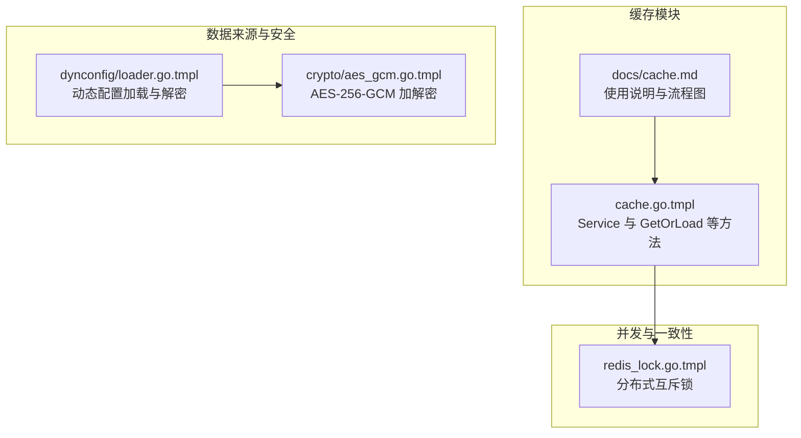
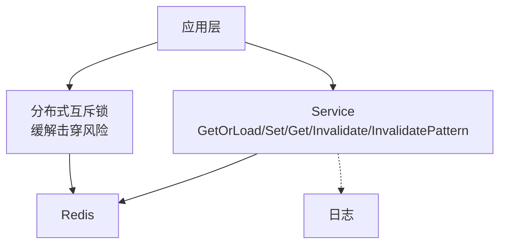
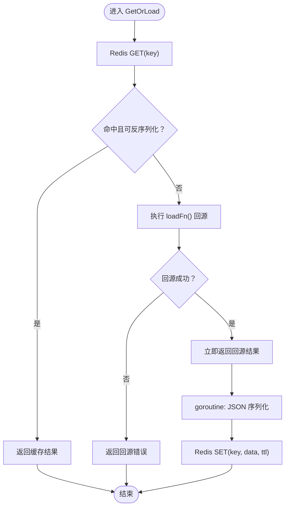
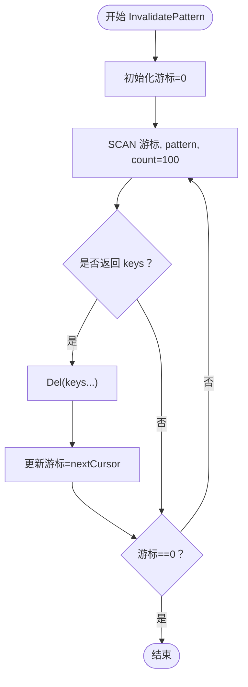
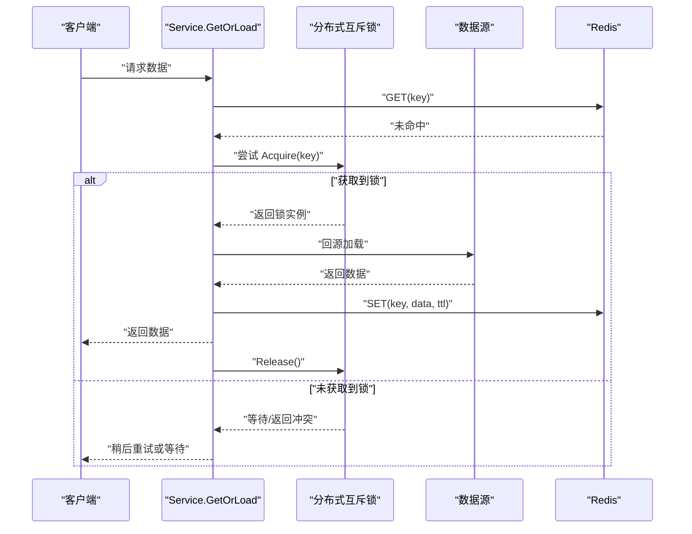
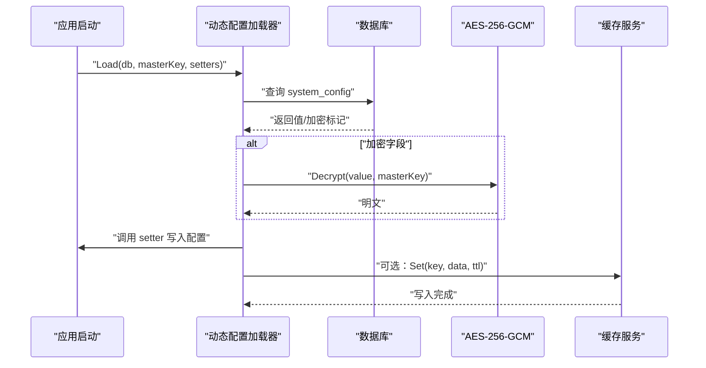
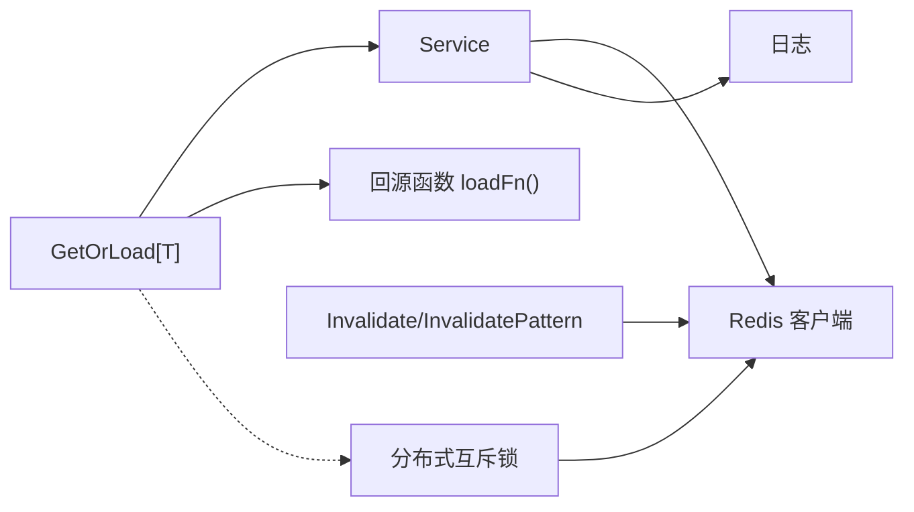

# 缓存模块

<cite>
**本文引用的文件**
- [cache.go.tmpl](file://templates/files/pkg-platform-core/cache/cache.go.tmpl)
- [cache.md](file://templates/files/pkg-platform-core/docs/cache.md)
- [redis_lock.go.tmpl](file://templates/files/pkg-platform-core/lock/redis_lock.go.tmpl)
- [loader.go.tmpl](file://templates/files/pkg-platform-core/dynconfig/loader.go.tmpl)
- [aes_gcm.go.tmpl](file://templates/files/pkg-platform-core/crypto/aes_gcm.go.tmpl)
</cite>

## 目录
1. [简介](#简介)
2. [项目结构](#项目结构)
3. [核心组件](#核心组件)
4. [架构总览](#架构总览)
5. [详细组件分析](#详细组件分析)
6. [依赖关系分析](#依赖关系分析)
7. [性能考量](#性能考量)
8. [故障排查指南](#故障排查指南)
9. [结论](#结论)
10. [附录](#附录)

## 简介
本文件系统性阐述平台核心库中“缓存模块”的设计与实现，围绕 Cache-Aside 模式、泛型接口、异步回填、通配符失效、并发控制与一致性保障进行深入解析。文档同时给出最佳实践、性能优化建议与故障处理方案，并提供与数据库的交互模式与一致性机制说明。

## 项目结构
缓存模块位于 pkg-platform-core 子目录下，核心文件包括：
- cache/cache.go.tmpl：缓存服务主体，提供 GetOrLoad、Set、Get、Invalidate、InvalidatePattern 等能力
- docs/cache.md：缓存模块使用说明与流程图
- lock/redis_lock.go.tmpl：基于 Redis 的分布式互斥锁，用于缓解缓存击穿
- dynconfig/loader.go.tmpl：动态配置加载器，展示如何在启动阶段从数据库读取并解密配置，为缓存提供数据来源
- crypto/aes_gcm.go.tmpl：AES-256-GCM 加密/解密工具，与 Python 端兼容，用于保护敏感配置

图表来源
- [cache.go.tmpl:1-93](file://templates/files/pkg-platform-core/cache/cache.go.tmpl#L1-L93)
- [docs/cache.md:1-61](file://templates/files/pkg-platform-core/docs/cache.md#L1-L61)
- [redis_lock.go.tmpl:1-49](file://templates/files/pkg-platform-core/lock/redis_lock.go.tmpl#L1-L49)
- [loader.go.tmpl:1-136](file://templates/files/pkg-platform-core/dynconfig/loader.go.tmpl#L1-L136)
- [aes_gcm.go.tmpl:1-72](file://templates/files/pkg-platform-core/crypto/aes_gcm.go.tmpl#L1-L72)

章节来源
- [cache.go.tmpl:1-93](file://templates/files/pkg-platform-core/cache/cache.go.tmpl#L1-L93)
- [docs/cache.md:1-61](file://templates/files/pkg-platform-core/docs/cache.md#L1-L61)

## 核心组件
- Service：封装 Redis 客户端，提供缓存读写与失效能力
- GetOrLoad[T]：泛型缓存读取函数，支持“先查缓存、未命中则回源、异步回填”
- Set/Get：直接覆盖式写入与原始字节读取
- Invalidate/InvalidatePattern：单键失效与通配符批量失效（使用 SCAN 避免阻塞）

章节来源
- [cache.go.tmpl:18-93](file://templates/files/pkg-platform-core/cache/cache.go.tmpl#L18-L93)

## 架构总览
缓存模块采用 Cache-Aside 模式，结合异步回填与通配符扫描，形成“低延迟读取 + 安全失效”的整体架构。

图表来源
- [cache.go.tmpl:18-93](file://templates/files/pkg-platform-core/cache/cache.go.tmpl#L18-L93)
- [redis_lock.go.tmpl:20-49](file://templates/files/pkg-platform-core/lock/redis_lock.go.tmpl#L20-L49)

## 详细组件分析

### Service 与接口规范
- 结构体字段
  - rdb：底层 Redis 客户端指针
- 关键方法
  - NewService：构造 Service 实例
  - Set：覆盖式写入（字节切片 + TTL）
  - Get：读取原始字节，未命中返回特定错误
  - Invalidate：删除指定 key
  - InvalidatePattern：基于 SCAN 的通配符批量删除
- 设计要点
  - 不预设 key 命名规范，由调用方自行组织（建议 cache:<实体>:<标识>）
  - 异步回填：GetOrLoad 在回源后通过 goroutine 写回缓存，不影响主流程

章节来源
- [cache.go.tmpl:18-93](file://templates/files/pkg-platform-core/cache/cache.go.tmpl#L18-L93)

### GetOrLoad 泛型流程
- 流程说明
  - 先从 Redis 获取缓存，命中则 JSON 反序列化后返回
  - 未命中则执行回源函数 loadFn 获取数据
  - 立即返回回源结果，随后在后台 goroutine 中 JSON 序列化并写回 Redis
  - 回填失败仅记录告警日志，不影响主流程
- 注意事项
  - 反序列化失败视为 miss，触发回源
  - 若回源返回零值，不会缓存空字符串
  - JSON 字段类型需满足可序列化要求（例如 time.Time 序列化为 RFC3339 字符串）

图表来源
- [cache.go.tmpl:28-58](file://templates/files/pkg-platform-core/cache/cache.go.tmpl#L28-L58)

章节来源
- [cache.go.tmpl:28-58](file://templates/files/pkg-platform-core/cache/cache.go.tmpl#L28-L58)
- [docs/cache.md:32-43](file://templates/files/pkg-platform-core/docs/cache.md#L32-L43)

### 失效策略与通配符扫描
- 单键失效：Invalidate 直接删除指定 key
- 批量失效：InvalidatePattern 使用 SCAN 遍历匹配 key 并删除，避免 KEYS 阻塞
- 生产安全：SCAN 以游标分批扫描，适合大键空间场景

图表来源
- [cache.go.tmpl:75-92](file://templates/files/pkg-platform-core/cache/cache.go.tmpl#L75-L92)

章节来源
- [cache.go.tmpl:70-92](file://templates/files/pkg-platform-core/cache/cache.go.tmpl#L70-L92)
- [docs/cache.md:28-30](file://templates/files/pkg-platform-core/docs/cache.md#L28-L30)

### 并发控制与击穿防护
- 问题背景：在高并发场景下，若缓存失效导致大量请求同时回源，可能造成数据库压力骤增（thundering herd）
- 解决方案：在回源函数 loadFn 中使用分布式互斥锁 Acquire，仅允许一个协程回源，其他等待
- 锁特性
  - 基于 Redis SETNX + Lua 原子释放
  - 仅释放当前持有者持有的锁，避免误删
  - 自动过期时间防止死锁

图表来源
- [redis_lock.go.tmpl:20-49](file://templates/files/pkg-platform-core/lock/redis_lock.go.tmpl#L20-L49)
- [cache.go.tmpl:28-58](file://templates/files/pkg-platform-core/cache/cache.go.tmpl#L28-L58)

章节来源
- [redis_lock.go.tmpl:1-49](file://templates/files/pkg-platform-core/lock/redis_lock.go.tmpl#L1-L49)
- [docs/cache.md:57-58](file://templates/files/pkg-platform-core/docs/cache.md#L57-L58)

### 数据来源与一致性
- 动态配置加载：应用启动时从数据库 system_config 表读取配置，必要时使用 AES-256-GCM 解密
- 与缓存的关系：动态配置可作为缓存策略参数或业务数据的来源，确保启动阶段的配置可用
- 一致性保障
  - 启动阶段加载：仅加载一次，非热更新
  - 优雅降级：查询失败或解密失败仅记录日志，不影响启动
  - 与缓存配合：可将解密后的配置写入缓存，提升运行时访问效率

图表来源
- [loader.go.tmpl:64-116](file://templates/files/pkg-platform-core/dynconfig/loader.go.tmpl#L64-L116)
- [aes_gcm.go.tmpl:24-71](file://templates/files/pkg-platform-core/crypto/aes_gcm.go.tmpl#L24-L71)
- [cache.go.tmpl:60-68](file://templates/files/pkg-platform-core/cache/cache.go.tmpl#L60-L68)

章节来源
- [loader.go.tmpl:1-136](file://templates/files/pkg-platform-core/dynconfig/loader.go.tmpl#L1-L136)
- [aes_gcm.go.tmpl:1-72](file://templates/files/pkg-platform-core/crypto/aes_gcm.go.tmpl#L1-L72)
- [cache.go.tmpl:60-68](file://templates/files/pkg-platform-core/cache/cache.go.tmpl#L60-L68)

## 依赖关系分析
- 组件内聚与耦合
  - Service 与 Redis 客户端强耦合，职责清晰：提供缓存读写与失效
  - GetOrLoad 与调用方约定明确：回源函数 loadFn 的输入输出与上下文传递
- 外部依赖
  - Redis 客户端：提供原子操作、SCAN、SET/GET 等基础能力
  - 日志：异步回填失败时记录告警
- 并发与一致性
  - 通过分布式互斥锁降低回源风暴
  - 通过异步回填减少主路径延迟

图表来源
- [cache.go.tmpl:18-93](file://templates/files/pkg-platform-core/cache/cache.go.tmpl#L18-L93)
- [redis_lock.go.tmpl:20-49](file://templates/files/pkg-platform-core/lock/redis_lock.go.tmpl#L20-L49)

章节来源
- [cache.go.tmpl:18-93](file://templates/files/pkg-platform-core/cache/cache.go.tmpl#L18-L93)
- [redis_lock.go.tmpl:1-49](file://templates/files/pkg-platform-core/lock/redis_lock.go.tmpl#L1-L49)

## 性能考量
- 读路径优化
  - 使用异步回填，避免主流程被写回阻塞
  - 优先命中缓存，减少数据库压力
- 写路径优化
  - 批量扫描失效使用 SCAN，避免 KEYS 导致的阻塞
  - 回填失败仅记录日志，不中断主流程
- 并发优化
  - 在回源函数中使用分布式互斥锁，限制同一资源的并发回源数量
- 序列化开销
  - JSON 序列化/反序列化成本与数据大小相关，建议控制缓存对象体积
  - 时间字段序列化为字符串，注意解析与比较逻辑

[本节为通用性能指导，无需列出具体文件来源]

## 故障排查指南
- 缓存未命中
  - 检查 key 是否正确（建议遵循 cache:<实体>:<标识> 规范）
  - 确认 TTL 设置合理，避免过早过期
- 反序列化失败
  - 可能是历史缓存数据格式变化，建议清理对应 key 或升级回源逻辑
- 回源失败
  - 检查回源函数逻辑与外部依赖（数据库/第三方 API）
  - 查看异步回填日志，确认 Redis 写入是否成功
- 失效不生效
  - 确认通配符表达式正确，使用 InvalidatePattern 替代 KEYS
  - 检查 Redis 版本与 SCAN 支持情况
- 击穿风暴
  - 在回源函数中增加分布式互斥锁，避免多实例同时回源
- 启动阶段配置缺失
  - 动态配置加载器会记录告警但不阻断启动，检查数据库与密钥配置

章节来源
- [cache.go.tmpl:28-58](file://templates/files/pkg-platform-core/cache/cache.go.tmpl#L28-L58)
- [cache.go.tmpl:70-92](file://templates/files/pkg-platform-core/cache/cache.go.tmpl#L70-L92)
- [redis_lock.go.tmpl:20-49](file://templates/files/pkg-platform-core/lock/redis_lock.go.tmpl#L20-L49)
- [loader.go.tmpl:64-116](file://templates/files/pkg-platform-core/dynconfig/loader.go.tmpl#L64-L116)

## 结论
缓存模块以 Cache-Aside 为核心，结合泛型接口、异步回填与通配符扫描，提供了高性能、低侵入的缓存能力。通过分布式互斥锁与启动阶段的动态配置加载，进一步增强了系统的稳定性与一致性。建议在高并发场景下配合互斥锁使用，并遵循统一的 key 命名规范与合理的 TTL 策略，以获得最佳效果。

[本节为总结性内容，无需列出具体文件来源]

## 附录

### 接口与使用示例（路径参考）
- 构造缓存服务与使用 GetOrLoad
  - [cache.go.tmpl:23-26](file://templates/files/pkg-platform-core/cache/cache.go.tmpl#L23-L26)
  - [cache.go.tmpl:28-58](file://templates/files/pkg-platform-core/cache/cache.go.tmpl#L28-L58)
- 直接读写与单键失效
  - [cache.go.tmpl:60-68](file://templates/files/pkg-platform-core/cache/cache.go.tmpl#L60-L68)
  - [cache.go.tmpl:70-73](file://templates/files/pkg-platform-core/cache/cache.go.tmpl#L70-L73)
- 通配符批量失效
  - [cache.go.tmpl:75-92](file://templates/files/pkg-platform-core/cache/cache.go.tmpl#L75-L92)
- 分布式互斥锁使用
  - [redis_lock.go.tmpl:30-48](file://templates/files/pkg-platform-core/lock/redis_lock.go.tmpl#L30-L48)
- 动态配置加载与解密
  - [loader.go.tmpl:64-116](file://templates/files/pkg-platform-core/dynconfig/loader.go.tmpl#L64-L116)
  - [aes_gcm.go.tmpl:24-71](file://templates/files/pkg-platform-core/crypto/aes_gcm.go.tmpl#L24-L71)

### 最佳实践清单
- key 命名：统一使用 cache:<实体>:<标识>，便于管理与失效
- TTL 策略：热点数据短 TTL，冷数据长 TTL；对可变数据设置更短 TTL
- 回源幂等：回源函数需具备幂等性，避免重复写入副作用
- 并发控制：高并发场景在回源函数中使用分布式互斥锁
- 异常处理：异步回填失败仅记录日志，不影响主流程
- 一致性：启动阶段加载动态配置，必要时写入缓存；运行时通过失效策略更新

[本节为通用实践建议，无需列出具体文件来源]