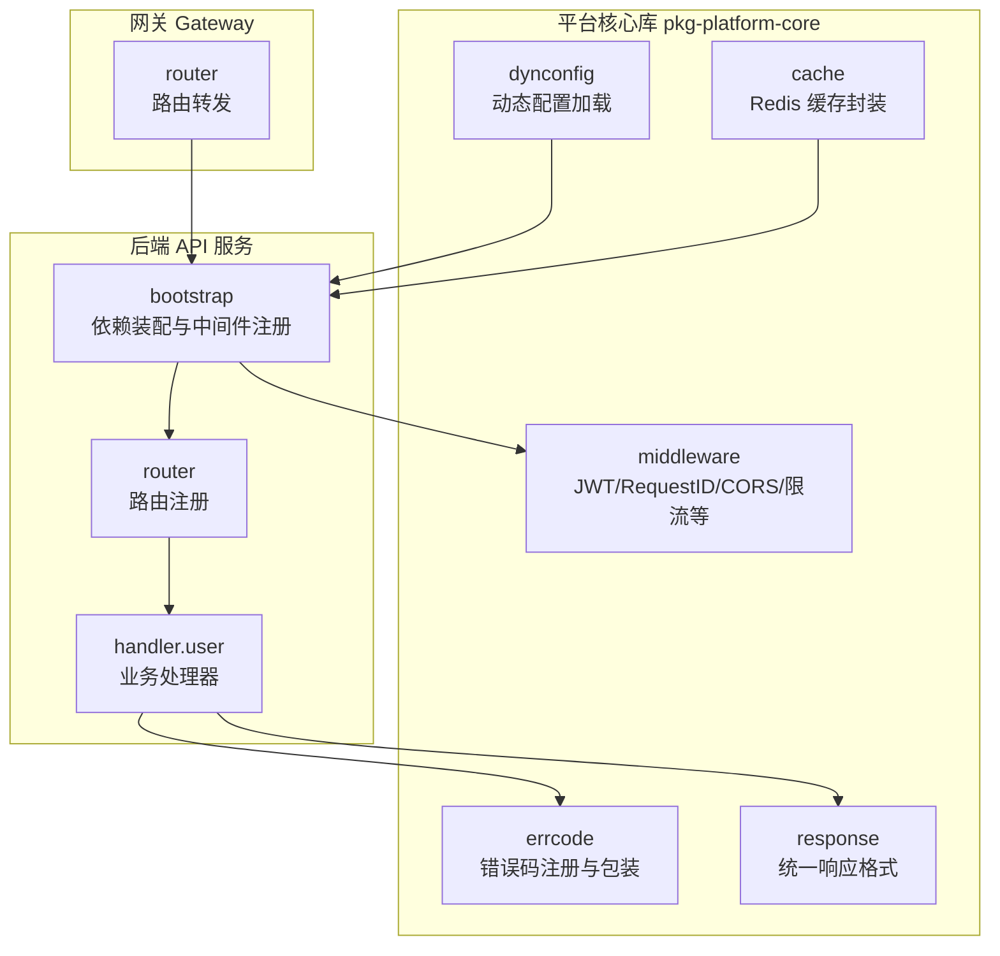
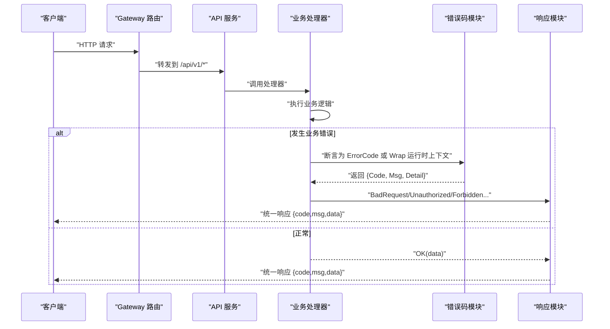
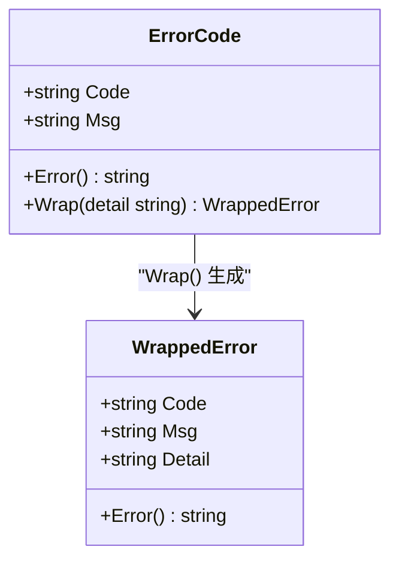
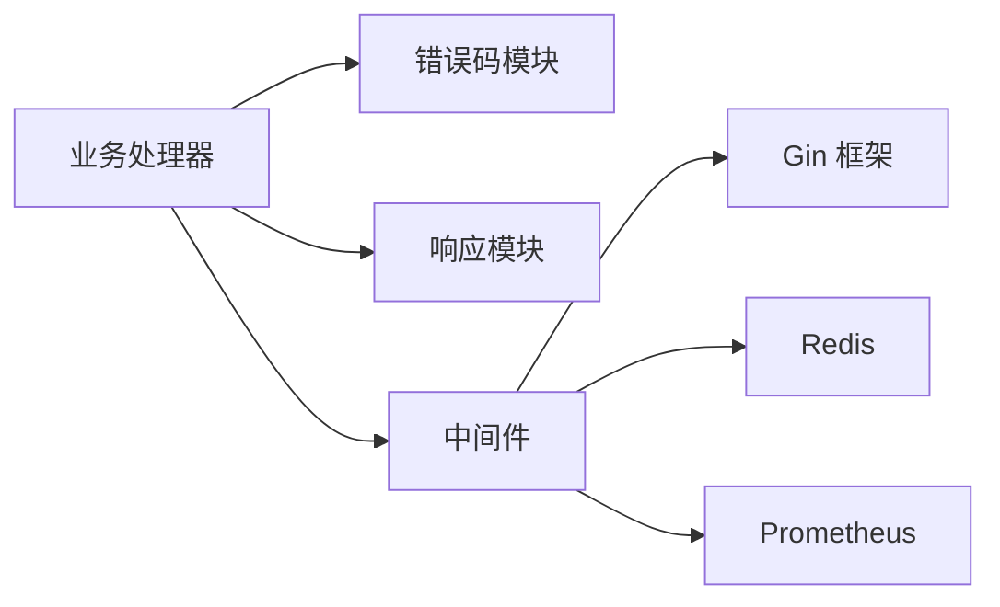

# 错误码模块

<cite>
**本文引用的文件**
- [errcode.go.tmpl](file://templates/files/pkg-platform-core/errcode/errcode.go.tmpl)
- [errcode_test.go.tmpl](file://templates/files/pkg-platform-core/errcode/errcode_test.go.tmpl)
- [errcode.md](file://templates/files/pkg-platform-core/docs/errcode.md)
- [response.go.tmpl](file://templates/files/pkg-platform-core/response/response.go.tmpl)
- [middleware.go.tmpl](file://templates/files/pkg-platform-core/middleware/middleware.go.tmpl)
- [routes.go.tmpl（API 服务）](file://templates/files/backend-api/internal/router/routes.go.tmpl)
- [bootstrap.go.tmpl](file://templates/files/backend-api/internal/app/bootstrap.go.tmpl)
- [user.go.tmpl](file://templates/files/backend-api/internal/handler/user.go.tmpl)
- [routes.go.tmpl（Gateway）](file://templates/files/backend-gateway/internal/router/routes.go.tmpl)
- [loader.go.tmpl](file://templates/files/pkg-platform-core/dynconfig/loader.go.tmpl)
- [cache.go.tmpl](file://templates/files/pkg-platform-core/cache/cache.go.tmpl)
</cite>

## 目录
1. [简介](#简介)
2. [项目结构](#项目结构)
3. [核心组件](#核心组件)
4. [架构总览](#架构总览)
5. [详细组件分析](#详细组件分析)
6. [依赖分析](#依赖分析)
7. [性能考虑](#性能考虑)
8. [故障排查指南](#故障排查指南)
9. [结论](#结论)
10. [附录](#附录)

## 简介
本文件系统性阐述“错误码模块”的设计原则、分类标准、命名规范与实现细节，覆盖错误码定义、错误消息国际化、错误上下文传递机制，并给出最佳实践、日志策略、调试工具、扩展指南、向后兼容与版本演进策略，以及单元测试与错误场景模拟方法。该模块采用六位稳定错误码作为前端国际化的契约，后端仅负责注册与包装运行时上下文，确保前后端解耦与一致性。

## 项目结构
错误码模块位于平台核心库 pkg-platform-core 的 errcode 子包，配套的响应封装 response 与中间件 middleware 在同一核心库中，API 服务与 Gateway 通过这些组件统一对外输出错误信息。下图展示了错误码模块在整体项目中的位置与协作关系。

**图表来源**
- [errcode.go.tmpl:1-84](file://templates/files/pkg-platform-core/errcode/errcode.go.tmpl#L1-L84)
- [response.go.tmpl:1-78](file://templates/files/pkg-platform-core/response/response.go.tmpl#L1-L78)
- [middleware.go.tmpl:1-202](file://templates/files/pkg-platform-core/middleware/middleware.go.tmpl#L1-L202)
- [bootstrap.go.tmpl:1-99](file://templates/files/backend-api/internal/app/bootstrap.go.tmpl#L1-L99)
- [routes.go.tmpl（API 服务）:1-29](file://templates/files/backend-api/internal/router/routes.go.tmpl#L1-L29)
- [routes.go.tmpl（Gateway）:1-57](file://templates/files/backend-gateway/internal/router/routes.go.tmpl#L1-L57)
- [loader.go.tmpl:1-136](file://templates/files/pkg-platform-core/dynconfig/loader.go.tmpl#L1-L136)
- [cache.go.tmpl:1-93](file://templates/files/pkg-platform-core/cache/cache.go.tmpl#L1-L93)

**章节来源**
- [errcode.go.tmpl:1-84](file://templates/files/pkg-platform-core/errcode/errcode.go.tmpl#L1-L84)
- [response.go.tmpl:1-78](file://templates/files/pkg-platform-core/response/response.go.tmpl#L1-L78)
- [middleware.go.tmpl:1-202](file://templates/files/pkg-platform-core/middleware/middleware.go.tmpl#L1-L202)
- [bootstrap.go.tmpl:1-99](file://templates/files/backend-api/internal/app/bootstrap.go.tmpl#L1-L99)
- [routes.go.tmpl（API 服务）:1-29](file://templates/files/backend-api/internal/router/routes.go.tmpl#L1-L29)
- [routes.go.tmpl（Gateway）:1-57](file://templates/files/backend-gateway/internal/router/routes.go.tmpl#L1-L57)
- [loader.go.tmpl:1-136](file://templates/files/pkg-platform-core/dynconfig/loader.go.tmpl#L1-L136)
- [cache.go.tmpl:1-93](file://templates/files/pkg-platform-core/cache/cache.go.tmpl#L1-L93)

## 核心组件
- 错误码类型与包装
  - ErrorCode：包含 Code（六位稳定错误码）、Msg（默认消息，供前端回退显示）。
  - WrappedError：在 ErrorCode 基础上附加 Detail（仅用于服务端日志，不返回给前端）。
  - New：集中注册错误码，建议在各业务包内以全局变量形式声明。
  - Wrap：在不改变 Code/Msg 的前提下挂载运行时上下文。
- 错误码分段与命名规范
  - 系统层 000xxx：JWT/鉴权基础设施/内部错误。
  - 鉴权与注册 100xxx：登录/注册/验证码。
  - 文件与资源 103xxx：上传/下载。
  - 支付与积分 104xxx：扣费/充值。
  - AI 与外部服务 105xxx：LLM/第三方 API。
  - 业务预留 11xxxx~99xxxx：新业务模块自取。
- 与响应层协作
  - handler 层捕获错误后，若能断言为 ErrorCode，则使用 response 包输出统一格式；否则输出内部错误。
  - response 包根据业务错误码选择合适的 HTTP 状态码（400 为主）。
- 上下文传递
  - RequestID 中间件生成并透传 X-Request-ID，便于跨服务串联日志。
  - JWT 中间件注入用户身份头，便于定位错误发生的用户上下文。

**章节来源**
- [errcode.go.tmpl:11-83](file://templates/files/pkg-platform-core/errcode/errcode.go.tmpl#L11-L83)
- [errcode.md:7-16](file://templates/files/pkg-platform-core/docs/errcode.md#L7-L16)
- [response.go.tmpl:26-77](file://templates/files/pkg-platform-core/response/response.go.tmpl#L26-L77)
- [middleware.go.tmpl:24-47](file://templates/files/pkg-platform-core/middleware/middleware.go.tmpl#L24-L47)
- [middleware.go.tmpl:102-163](file://templates/files/pkg-platform-core/middleware/middleware.go.tmpl#L102-L163)

## 架构总览
下图展示了从请求进入网关，到 API 服务处理、错误码包装与响应输出的整体流程。

**图表来源**
- [routes.go.tmpl（Gateway）:20-56](file://templates/files/backend-gateway/internal/router/routes.go.tmpl#L20-L56)
- [routes.go.tmpl（API 服务）:16-28](file://templates/files/backend-api/internal/router/routes.go.tmpl#L16-L28)
- [user.go.tmpl:28-46](file://templates/files/backend-api/internal/handler/user.go.tmpl#L28-L46)
- [errcode.go.tmpl:18-31](file://templates/files/pkg-platform-core/errcode/errcode.go.tmpl#L18-L31)
- [response.go.tmpl:46-77](file://templates/files/pkg-platform-core/response/response.go.tmpl#L46-L77)

## 详细组件分析

### 错误码类型与包装机制
- 设计要点
  - Code 为稳定契约，Msg 仅为回退提示；前端按 Code 做国际化映射。
  - Wrap 不修改 Code/Msg，仅附加 Detail 用于服务端日志与排障。
  - 与 HTTP 状态码解耦：业务错误统一 400 + code，鉴权错误按需返回 401/403，订阅错误返回 406。
- 类关系图

**图表来源**
- [errcode.go.tmpl:11-45](file://templates/files/pkg-platform-core/errcode/errcode.go.tmpl#L11-L45)

**章节来源**
- [errcode.go.tmpl:11-45](file://templates/files/pkg-platform-core/errcode/errcode.go.tmpl#L11-L45)
- [errcode.md:32-48](file://templates/files/pkg-platform-core/docs/errcode.md#L32-L48)

### 错误码注册与使用示例
- 注册方式：在业务包内集中声明全局变量，形成稳定的错误码注册表。
- 使用方式：在 handler 层捕获错误后，断言为 ErrorCode 并通过 response 输出；若为未知错误则输出内部错误。
- 示例路径
  - [errcode.md:20-30](file://templates/files/pkg-platform-core/docs/errcode.md#L20-L30)
  - [errcode.md:50-60](file://templates/files/pkg-platform-core/docs/errcode.md#L50-L60)
  - [response.go.tmpl:46-77](file://templates/files/pkg-platform-core/response/response.go.tmpl#L46-L77)
  - [user.go.tmpl:30-46](file://templates/files/backend-api/internal/handler/user.go.tmpl#L30-L46)

**章节来源**
- [errcode.md:20-30](file://templates/files/pkg-platform-core/docs/errcode.md#L20-L30)
- [errcode.md:50-60](file://templates/files/pkg-platform-core/docs/errcode.md#L50-L60)
- [response.go.tmpl:46-77](file://templates/files/pkg-platform-core/response/response.go.tmpl#L46-L77)
- [user.go.tmpl:30-46](file://templates/files/backend-api/internal/handler/user.go.tmpl#L30-L46)

### 错误上下文传递与日志策略
- RequestID：生成并透传 X-Request-ID，便于跨服务串联日志。
- JWT：注入用户身份头，便于定位错误发生的用户上下文。
- 日志策略
  - Detail 仅用于服务端日志，不返回给前端。
  - 建议在关键路径记录请求 ID、用户 UUID、错误码与上下文参数，便于快速定位问题。
- 示例路径
  - [middleware.go.tmpl:24-47](file://templates/files/pkg-platform-core/middleware/middleware.go.tmpl#L24-L47)
  - [middleware.go.tmpl:102-163](file://templates/files/pkg-platform-core/middleware/middleware.go.tmpl#L102-L163)
  - [bootstrap.go.tmpl:84-90](file://templates/files/backend-api/internal/app/bootstrap.go.tmpl#L84-L90)

**章节来源**
- [middleware.go.tmpl:24-47](file://templates/files/pkg-platform-core/middleware/middleware.go.tmpl#L24-L47)
- [middleware.go.tmpl:102-163](file://templates/files/pkg-platform-core/middleware/middleware.go.tmpl#L102-L163)
- [bootstrap.go.tmpl:84-90](file://templates/files/backend-api/internal/app/bootstrap.go.tmpl#L84-L90)

### 错误处理最佳实践
- 不要直接硬编码错误码到响应体，必须通过注册表输出，确保前端可翻译。
- 不要复用已有错误码，避免破坏前端国际化契约。
- 对于可预期的业务错误，优先使用 ErrorCode；对于不可预期的异常，输出内部错误并记录日志。
- 在 handler 层统一处理错误转换，保持响应格式一致。
- 示例路径
  - [errcode.md:62-67](file://templates/files/pkg-platform-core/docs/errcode.md#L62-L67)
  - [response.go.tmpl:46-77](file://templates/files/pkg-platform-core/response/response.go.tmpl#L46-L77)
  - [user.go.tmpl:30-46](file://templates/files/backend-api/internal/handler/user.go.tmpl#L30-L46)

**章节来源**
- [errcode.md:62-67](file://templates/files/pkg-platform-core/docs/errcode.md#L62-L67)
- [response.go.tmpl:46-77](file://templates/files/pkg-platform-core/response/response.go.tmpl#L46-L77)
- [user.go.tmpl:30-46](file://templates/files/backend-api/internal/handler/user.go.tmpl#L30-L46)

### 单元测试与错误场景模拟
- 测试覆盖点
  - ErrorCode.Error() 输出格式正确。
  - Wrap 生成的 WrappedError 包含 Code 与 Detail，且不影响 Code/Msg。
- 示例路径
  - [errcode_test.go.tmpl:5-19](file://templates/files/pkg-platform-core/errcode/errcode_test.go.tmpl#L5-L19)

**章节来源**
- [errcode_test.go.tmpl:5-19](file://templates/files/pkg-platform-core/errcode/errcode_test.go.tmpl#L5-L19)

### 错误码扩展指南与向后兼容
- 扩展步骤
  - 在业务包内新增全局变量注册错误码。
  - 保持 Code 的稳定性，避免变更；如确需变更，需同步前端国际化映射并进行灰度发布。
- 版本演进策略
  - 新增业务域错误码时，遵循 11xxxx~99xxxx 预留区间，避免与现有域冲突。
  - 对历史错误码进行废弃标记与迁移计划，逐步替换为新的错误码。
- 示例路径
  - [errcode.md:50-60](file://templates/files/pkg-platform-core/docs/errcode.md#L50-L60)
  - [errcode.go.tmpl:51-83](file://templates/files/pkg-platform-core/errcode/errcode.go.tmpl#L51-L83)

**章节来源**
- [errcode.md:50-60](file://templates/files/pkg-platform-core/docs/errcode.md#L50-L60)
- [errcode.go.tmpl:51-83](file://templates/files/pkg-platform-core/errcode/errcode.go.tmpl#L51-L83)

## 依赖分析
- 组件耦合与协作
  - handler 依赖 errcode 与 response，统一输出错误码与响应格式。
  - middleware 为 handler 提供上下文（RequestID、JWT 身份注入）。
  - bootstrap 装配中间件与路由，确保错误处理流程贯穿全链路。
- 外部依赖
  - Gin：HTTP 框架与中间件生态。
  - Redis：缓存与限流等能力（间接影响错误传播）。
  - Prometheus：指标采集，辅助定位性能与错误热点。

**图表来源**
- [user.go.tmpl:6-11](file://templates/files/backend-api/internal/handler/user.go.tmpl#L6-L11)
- [middleware.go.tmpl:12-22](file://templates/files/pkg-platform-core/middleware/middleware.go.tmpl#L12-L22)
- [bootstrap.go.tmpl:84-90](file://templates/files/backend-api/internal/app/bootstrap.go.tmpl#L84-L90)
- [cache.go.tmpl:18-26](file://templates/files/pkg-platform-core/cache/cache.go.tmpl#L18-L26)

**章节来源**
- [user.go.tmpl:6-11](file://templates/files/backend-api/internal/handler/user.go.tmpl#L6-L11)
- [middleware.go.tmpl:12-22](file://templates/files/pkg-platform-core/middleware/middleware.go.tmpl#L12-L22)
- [bootstrap.go.tmpl:84-90](file://templates/files/backend-api/internal/app/bootstrap.go.tmpl#L84-L90)
- [cache.go.tmpl:18-26](file://templates/files/pkg-platform-core/cache/cache.go.tmpl#L18-L26)

## 性能考虑
- 错误码包装为轻量操作，对性能影响可忽略。
- 响应层统一格式减少分支判断成本。
- 建议在高并发场景下结合 RequestID 与日志聚合，避免重复计算与冗余输出。
- 对于外部依赖（如 Redis、数据库）的错误，优先通过错误码模块标准化输出，避免泄露内部实现细节。

## 故障排查指南
- 常见问题
  - 前端显示默认消息而非本地化文案：检查错误码是否在注册表中，前端是否正确映射。
  - Detail 未生效：确认使用 Wrap 附加上下文，且未将 Detail 返回给前端。
  - 401/403/406 与业务错误混用：确保业务错误统一 400 + code。
- 调试工具
  - RequestID：通过 X-Request-ID 在日志中串联请求链路。
  - Prometheus：观察错误码分布与错误率趋势。
  - 动态配置：通过 dynconfig 加载加密配置，注意解密失败的降级行为。
- 示例路径
  - [middleware.go.tmpl:24-47](file://templates/files/pkg-platform-core/middleware/middleware.go.tmpl#L24-L47)
  - [loader.go.tmpl:64-116](file://templates/files/pkg-platform-core/dynconfig/loader.go.tmpl#L64-L116)

**章节来源**
- [middleware.go.tmpl:24-47](file://templates/files/pkg-platform-core/middleware/middleware.go.tmpl#L24-L47)
- [loader.go.tmpl:64-116](file://templates/files/pkg-platform-core/dynconfig/loader.go.tmpl#L64-L116)

## 结论
错误码模块通过六位稳定错误码与统一响应格式，实现了前后端解耦与国际化支持；配合中间件提供的上下文与日志能力，能够高效定位与修复问题。遵循命名规范、扩展指南与最佳实践，可在保障向后兼容的前提下持续演进错误处理体系。

## 附录
- 错误码分段速览
  - 系统层 000xxx：JWT/鉴权基础设施/内部错误
  - 鉴权与注册 100xxx：登录/注册/验证码
  - 文件与资源 103xxx：上传/下载
  - 支付与积分 104xxx：扣费/充值
  - AI 与外部服务 105xxx：LLM/第三方 API
  - 业务预留 11xxxx~99xxxx：新业务模块自取
- 示例路径
  - [errcode.md:7-16](file://templates/files/pkg-platform-core/docs/errcode.md#L7-L16)
  - [errcode.go.tmpl:51-83](file://templates/files/pkg-platform-core/errcode/errcode.go.tmpl#L51-L83)