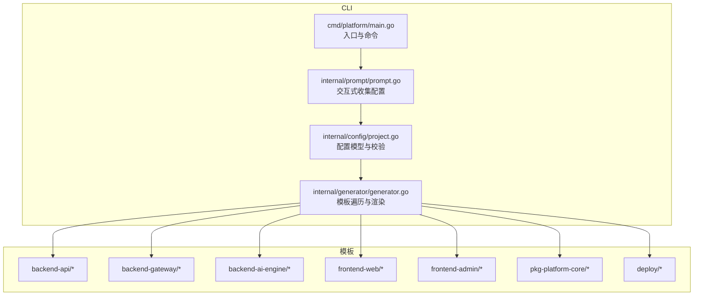
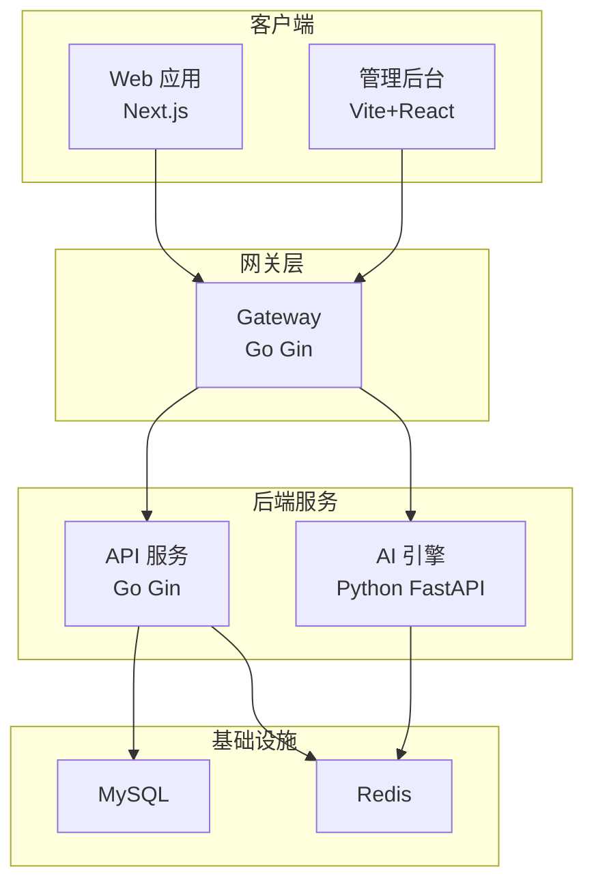
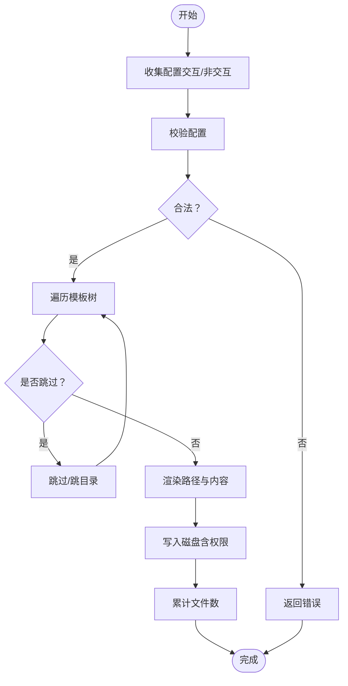
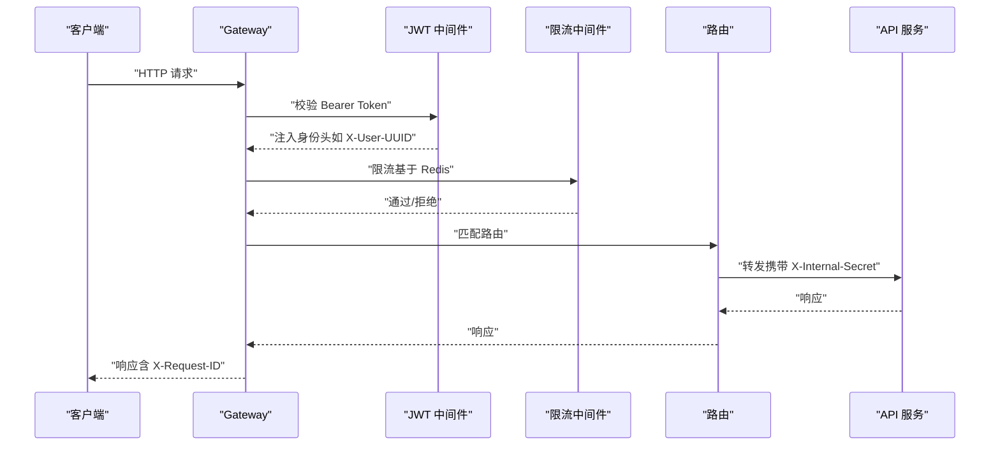
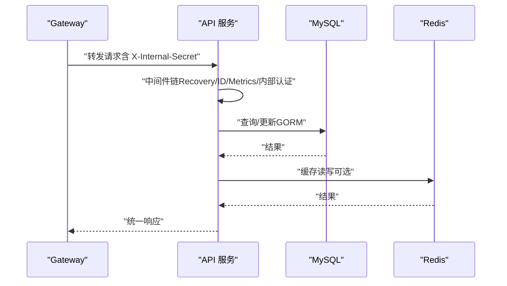
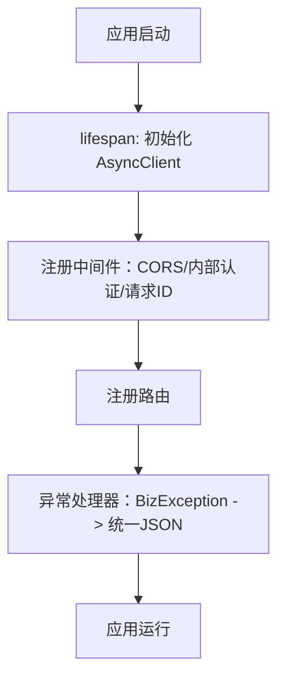
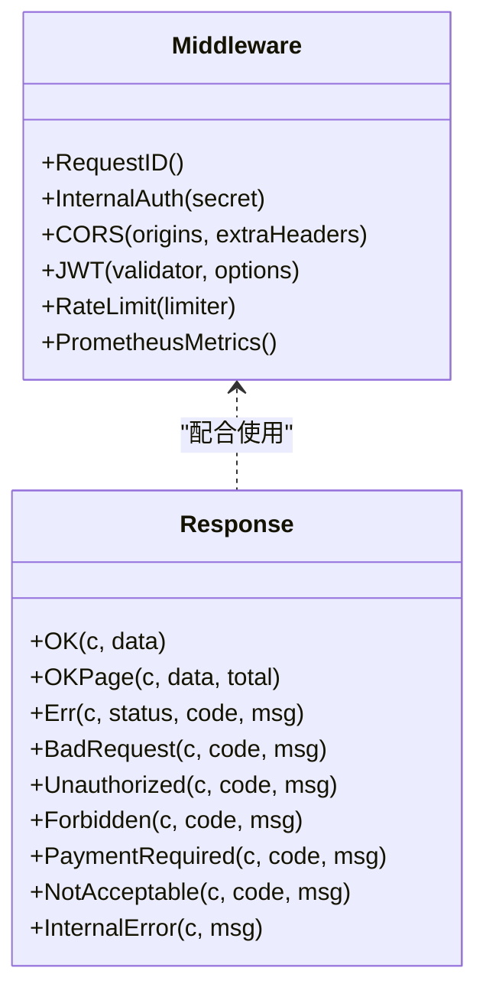
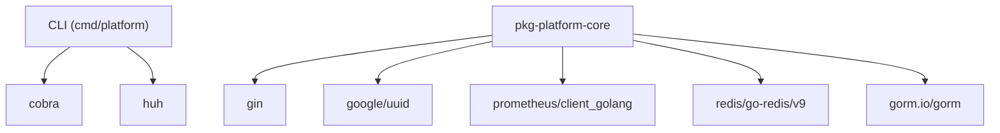

# 生成的组件

<cite>
**本文档引用的文件**
- [cmd/platform/main.go](file://cmd/platform/main.go)
- [internal/config/project.go](file://internal/config/project.go)
- [internal/generator/generator.go](file://internal/generator/generator.go)
- [internal/prompt/prompt.go](file://internal/prompt/prompt.go)
- [go.mod](file://go.mod)
- [templates/files/backend-api/cmd/api/main.go.tmpl](file://templates/files/backend-api/cmd/api/main.go.tmpl)
- [templates/files/backend-api/internal/app/bootstrap.go.tmpl](file://templates/files/backend-api/internal/app/bootstrap.go.tmpl)
- [templates/files/backend-api/internal/config/config.go.tmpl](file://templates/files/backend-api/internal/config/config.go.tmpl)
- [templates/files/backend-api/internal/router/routes.go.tmpl](file://templates/files/backend-api/internal/router/routes.go.tmpl)
- [templates/files/backend-gateway/cmd/gateway/main.go.tmpl](file://templates/files/backend-gateway/cmd/gateway/main.go.tmpl)
- [templates/files/backend-gateway/internal/config/config.go.tmpl](file://templates/files/backend-gateway/internal/config/config.go.tmpl)
- [templates/files/backend-ai-engine/app/main.py.tmpl](file://templates/files/backend-ai-engine/app/main.py.tmpl)
- [templates/files/frontend-web/package.json.tmpl](file://templates/files/frontend-web/package.json.tmpl)
- [templates/files/frontend-admin/package.json.tmpl](file://templates/files/frontend-admin/package.json.tmpl)
- [templates/files/pkg-platform-core/go.mod.tmpl](file://templates/files/pkg-platform-core/go.mod.tmpl)
- [templates/files/pkg-platform-core/middleware/middleware.go.tmpl](file://templates/files/pkg-platform-core/middleware/middleware.go.tmpl)
- [templates/files/pkg-platform-core/response/response.go.tmpl](file://templates/files/pkg-platform-core/response/response.go.tmpl)
- [templates/files/deploy/local/docker-compose-all.yaml.tmpl](file://templates/files/deploy/local/docker-compose-all.yaml.tmpl)
- [templates/files/deploy/k3s/prod.yaml.tmpl](file://templates/files/deploy/k3s/prod.yaml.tmpl)
</cite>

## 目录
1. [简介](#简介)
2. [项目结构](#项目结构)
3. [核心组件](#核心组件)
4. [架构总览](#架构总览)
5. [详细组件分析](#详细组件分析)
6. [依赖分析](#依赖分析)
7. [性能考虑](#性能考虑)
8. [故障排查指南](#故障排查指南)
9. [结论](#结论)
10. [附录](#附录)

## 简介
本项目是一个“全栈微服务脚手架”，通过命令行工具一次性生成一套完整的后端网关、API 服务、AI 引擎、前端 Web 应用与管理后台，以及公共组件库与部署清单。其目标是提供可直接运行、可扩展、可运维的一体化样板工程，覆盖本地开发与 K3s 生产部署两条路径。

## 项目结构
脚手架采用“CLI + 模板 + 嵌入资源”的设计：CLI 负责交互式收集配置、校验与生成；模板位于 templates/files 下，按功能分层组织；生成过程将模板渲染为最终项目，保留 .tmpl 后缀以便二次编辑。

图表来源
- [cmd/platform/main.go:1-98](file://cmd/platform/main.go#L1-L98)
- [internal/prompt/prompt.go:1-131](file://internal/prompt/prompt.go#L1-L131)
- [internal/config/project.go:1-121](file://internal/config/project.go#L1-L121)
- [internal/generator/generator.go:1-158](file://internal/generator/generator.go#L1-L158)

章节来源
- [cmd/platform/main.go:1-98](file://cmd/platform/main.go#L1-L98)
- [internal/prompt/prompt.go:1-131](file://internal/prompt/prompt.go#L1-L131)
- [internal/config/project.go:1-121](file://internal/config/project.go#L1-L121)
- [internal/generator/generator.go:1-158](file://internal/generator/generator.go#L1-L158)

## 核心组件
- CLI 与生成器
  - 负责交互式收集项目配置、校验合法性、遍历模板树、渲染并写入磁盘。
  - 支持非交互模式与输出目录定制。
- 网关服务（Go）
  - 全局中间件链：恢复、CORS、请求 ID、指标、JWT、限流。
  - 将业务路由转发至下游 API/AI Engine，并注入内部认证头。
- API 服务（Go）
  - 三层架构：Handler → Service → Repository。
  - 中间件链：恢复、CORS（信任网关）、请求 ID、指标、内部认证。
  - 内部认证通过 X-Internal-Secret 校验请求来源。
- AI 引擎（Python FastAPI）
  - 生命周期内预建异步 HTTP 客户端，全局异常映射为统一响应。
  - 中间件链：CORS、请求 ID、内部认证。
- 前端应用
  - Web（Next.js）与 Admin（Vite+React），分别定义开发/构建脚本与依赖。
- 核心库（pkg-platform-core，Go）
  - 提供通用中间件：JWT、内部认证、CORS、请求 ID、限流、指标。
  - 提供统一响应格式与错误码约定。
- 部署清单
  - 本地：docker-compose 编排 MySQL 与 Redis。
  - 生产：K3s Deployment + ConfigMap + Secret，支持按特性开关渲染。

章节来源
- [internal/generator/generator.go:1-158](file://internal/generator/generator.go#L1-L158)
- [internal/config/project.go:1-121](file://internal/config/project.go#L1-L121)
- [templates/files/backend-gateway/cmd/gateway/main.go.tmpl:1-92](file://templates/files/backend-gateway/cmd/gateway/main.go.tmpl#L1-L92)
- [templates/files/backend-api/cmd/api/main.go.tmpl:1-56](file://templates/files/backend-api/cmd/api/main.go.tmpl#L1-L56)
- [templates/files/backend-ai-engine/app/main.py.tmpl:1-67](file://templates/files/backend-ai-engine/app/main.py.tmpl#L1-L67)
- [templates/files/pkg-platform-core/middleware/middleware.go.tmpl:1-202](file://templates/files/pkg-platform-core/middleware/middleware.go.tmpl#L1-L202)
- [templates/files/pkg-platform-core/response/response.go.tmpl:1-78](file://templates/files/pkg-platform-core/response/response.go.tmpl#L1-L78)
- [templates/files/deploy/local/docker-compose-all.yaml.tmpl:1-48](file://templates/files/deploy/local/docker-compose-all.yaml.tmpl#L1-L48)
- [templates/files/deploy/k3s/prod.yaml.tmpl:1-151](file://templates/files/deploy/k3s/prod.yaml.tmpl#L1-L151)

## 架构总览
整体系统采用“网关前置 + 微服务后端 + 公共中间件 + 统一响应 + 多环境部署”的架构。网关负责鉴权、限流、CORS 与路由转发；API 服务承载业务逻辑；AI 引擎处理 AI 相关任务；前端通过网关访问后端；公共库提供跨服务一致的中间件与响应格式；部署清单覆盖本地与生产环境。

图表来源
- [templates/files/backend-gateway/cmd/gateway/main.go.tmpl:1-92](file://templates/files/backend-gateway/cmd/gateway/main.go.tmpl#L1-L92)
- [templates/files/backend-api/cmd/api/main.go.tmpl:1-56](file://templates/files/backend-api/cmd/api/main.go.tmpl#L1-L56)
- [templates/files/backend-ai-engine/app/main.py.tmpl:1-67](file://templates/files/backend-ai-engine/app/main.py.tmpl#L1-L67)
- [templates/files/deploy/local/docker-compose-all.yaml.tmpl:1-48](file://templates/files/deploy/local/docker-compose-all.yaml.tmpl#L1-L48)

## 详细组件分析

### CLI 与生成器
- 交互式配置
  - 收集项目名、品牌名、域名、Go 模块路径、端口、特性开关、是否初始化 Git 等。
  - 非交互模式要求显式指定项目名。
- 配置校验
  - 校验项目名格式、必填项与关键端口。
- 模板渲染
  - 遍历嵌入的模板树，按 Features 与 UseCoreLib 决定是否渲染某子树。
  - 路径与内容均可渲染模板变量；.sh 文件赋予执行权限。
- 输出与下一步指引
  - 生成完成后提示切换目录、复制环境变量示例、启动本地脚本。

图表来源
- [internal/prompt/prompt.go:1-131](file://internal/prompt/prompt.go#L1-L131)
- [internal/config/project.go:1-121](file://internal/config/project.go#L1-L121)
- [internal/generator/generator.go:1-158](file://internal/generator/generator.go#L1-L158)

章节来源
- [cmd/platform/main.go:1-98](file://cmd/platform/main.go#L1-L98)
- [internal/prompt/prompt.go:1-131](file://internal/prompt/prompt.go#L1-L131)
- [internal/config/project.go:1-121](file://internal/config/project.go#L1-L121)
- [internal/generator/generator.go:1-158](file://internal/generator/generator.go#L1-L158)

### 网关服务（Go）
- 中间件链
  - Recovery → CORS（信任前端）→ RequestID → PrometheusMetrics → JWT → RateLimit。
  - JWT 在限流之前运行，确保限流能拿到用户标识。
- 路由与转发
  - 业务路由统一由网关转发至 API/AI Engine。
  - 通过 X-Internal-Secret 校验网关身份。
- 配置加载
  - 从环境变量读取端口、JWT 密钥、Redis、下游服务地址、CORS 白名单等。
  - 公开路径前缀与刷新令牌 Cookie 名称可配置。
- 健康检查与指标
  - 提供 /health 与 /metrics。

图表来源
- [templates/files/backend-gateway/cmd/gateway/main.go.tmpl:1-92](file://templates/files/backend-gateway/cmd/gateway/main.go.tmpl#L1-L92)
- [templates/files/backend-gateway/internal/config/config.go.tmpl:1-127](file://templates/files/backend-gateway/internal/config/config.go.tmpl#L1-L127)
- [templates/files/pkg-platform-core/middleware/middleware.go.tmpl:1-202](file://templates/files/pkg-platform-core/middleware/middleware.go.tmpl#L1-L202)

章节来源
- [templates/files/backend-gateway/cmd/gateway/main.go.tmpl:1-92](file://templates/files/backend-gateway/cmd/gateway/main.go.tmpl#L1-L92)
- [templates/files/backend-gateway/internal/config/config.go.tmpl:1-127](file://templates/files/backend-gateway/internal/config/config.go.tmpl#L1-L127)

### API 服务（Go）
- 三层架构
  - Handler → Service → Repository，职责清晰分离。
- 中间件链
  - Recovery → RequestID → PrometheusMetrics → InternalAuth（X-Internal-Secret）。
- 依赖装配
  - 配置 → MySQL → Redis → Repository → Service → Handler → Router。
- 健康检查与指标
  - 提供 /health 与 /metrics。

图表来源
- [templates/files/backend-api/cmd/api/main.go.tmpl:1-56](file://templates/files/backend-api/cmd/api/main.go.tmpl#L1-L56)
- [templates/files/backend-api/internal/app/bootstrap.go.tmpl:1-99](file://templates/files/backend-api/internal/app/bootstrap.go.tmpl#L1-L99)
- [templates/files/backend-api/internal/config/config.go.tmpl:1-82](file://templates/files/backend-api/internal/config/config.go.tmpl#L1-L82)

章节来源
- [templates/files/backend-api/cmd/api/main.go.tmpl:1-56](file://templates/files/backend-api/cmd/api/main.go.tmpl#L1-L56)
- [templates/files/backend-api/internal/app/bootstrap.go.tmpl:1-99](file://templates/files/backend-api/internal/app/bootstrap.go.tmpl#L1-L99)
- [templates/files/backend-api/internal/config/config.go.tmpl:1-82](file://templates/files/backend-api/internal/config/config.go.tmpl#L1-L82)

### AI 引擎（Python FastAPI）
- 生命周期
  - lifespan 内创建 httpx.AsyncClient，复用连接并设置基础 URL 与内部密钥头。
- 中间件链
  - CORS（可选）→ InternalAuthMiddleware → RequestIDMiddleware。
- 异常处理
  - 全局 BizException 映射为统一 JSON 响应。
- 路由
  - include_router(api_router)。

图表来源
- [templates/files/backend-ai-engine/app/main.py.tmpl:1-67](file://templates/files/backend-ai-engine/app/main.py.tmpl#L1-L67)

章节来源
- [templates/files/backend-ai-engine/app/main.py.tmpl:1-67](file://templates/files/backend-ai-engine/app/main.py.tmpl#L1-L67)

### 前端应用
- Web（Next.js）
  - 定义 dev/build/start/lint 脚本，依赖 Next 与 React。
- Admin（Vite+React）
  - 定义 dev/build/preview 脚本，依赖 React、React DOM 与 Vite。

章节来源
- [templates/files/frontend-web/package.json.tmpl:1-25](file://templates/files/frontend-web/package.json.tmpl#L1-L25)
- [templates/files/frontend-admin/package.json.tmpl:1-24](file://templates/files/frontend-admin/package.json.tmpl#L1-L24)

### 核心库（pkg-platform-core，Go）
- 中间件
  - RequestID：生成/透传 X-Request-ID。
  - InternalAuth：校验 X-Internal-Secret（开发可跳过）。
  - CORS：白名单 + Credentials。
  - JWT：Bearer 校验、公开路径白名单、过期处理、注入身份头。
  - RateLimit：Redis 固定窗口限流，fail-open。
  - PrometheusMetrics：指标采集。
- 响应
  - 统一 {code,msg,data} 格式，HTTP 状态码语义明确。

图表来源
- [templates/files/pkg-platform-core/middleware/middleware.go.tmpl:1-202](file://templates/files/pkg-platform-core/middleware/middleware.go.tmpl#L1-L202)
- [templates/files/pkg-platform-core/response/response.go.tmpl:1-78](file://templates/files/pkg-platform-core/response/response.go.tmpl#L1-L78)

章节来源
- [templates/files/pkg-platform-core/middleware/middleware.go.tmpl:1-202](file://templates/files/pkg-platform-core/middleware/middleware.go.tmpl#L1-L202)
- [templates/files/pkg-platform-core/response/response.go.tmpl:1-78](file://templates/files/pkg-platform-core/response/response.go.tmpl#L1-L78)

### 部署与运维
- 本地开发
  - docker-compose 编排 MySQL 与 Redis，应用进程通过脚本在宿主机直接运行，便于热重载与调试。
- 生产部署（K3s）
  - 通过 ConfigMap 注入非敏感配置，Secret 注入敏感信息（JWT/内部密钥/数据库密码）。
  - 按特性开关渲染 AI 引擎、Web、Admin 等 Deployment。
  - 提供健康检查探针与副本数配置。

章节来源
- [templates/files/deploy/local/docker-compose-all.yaml.tmpl:1-48](file://templates/files/deploy/local/docker-compose-all.yaml.tmpl#L1-L48)
- [templates/files/deploy/k3s/prod.yaml.tmpl:1-151](file://templates/files/deploy/k3s/prod.yaml.tmpl#L1-L151)

## 依赖分析
- CLI 依赖
  - cobra：命令行框架。
  - huh：交互式表单。
- 核心库依赖
  - gin、uuid、prometheus、redis、gorm 等。
- 生成器与模板
  - 通过 embed.FS 嵌入模板，运行时无需外部文件。

图表来源
- [go.mod:1-37](file://go.mod#L1-L37)
- [templates/files/pkg-platform-core/go.mod.tmpl:1-12](file://templates/files/pkg-platform-core/go.mod.tmpl#L1-L12)

章节来源
- [go.mod:1-37](file://go.mod#L1-L37)
- [templates/files/pkg-platform-core/go.mod.tmpl:1-12](file://templates/files/pkg-platform-core/go.mod.tmpl#L1-L12)

## 性能考虑
- 网关限流
  - 基于 Redis 的固定窗口限流，fail-open 设计降低故障影响面。
- API 缓存
  - Redis 作为可选缓存层，减少数据库压力。
- AI 引擎连接复用
  - lifespan 内创建 AsyncClient，减少连接开销。
- 指标监控
  - Prometheus 指标采集，便于容量规划与问题定位。

## 故障排查指南
- 网关无法转发
  - 检查下游服务地址与端口、X-Internal-Secret 是否正确。
- JWT 认证失败
  - 确认 JWT_SECRET 已注入 Secret，公开路径配置是否正确。
- API 无法连接数据库/Redis
  - 检查环境变量与容器连通性，确认健康检查状态。
- 本地启动异常
  - 确认端口未被占用，docker-compose 依赖已启动。
- 生成失败
  - 检查配置校验（项目名格式、必填项），查看生成日志。

章节来源
- [internal/config/project.go:91-106](file://internal/config/project.go#L91-L106)
- [templates/files/backend-gateway/internal/config/config.go.tmpl:52-86](file://templates/files/backend-gateway/internal/config/config.go.tmpl#L52-L86)
- [templates/files/backend-api/internal/config/config.go.tmpl:42-65](file://templates/files/backend-api/internal/config/config.go.tmpl#L42-L65)

## 结论
该脚手架以“模板 + 嵌入资源 + 交互式生成”为核心，提供了高内聚、低耦合的微服务样板工程。通过统一的中间件与响应格式，确保跨服务一致性；通过本地与生产两套部署方案，兼顾开发效率与上线质量。建议在实际项目中结合团队规范，补充鉴权策略、埋点与告警体系，并持续迭代模板以适配新的业务场景。

## 附录
- 配置项速览（环境变量）
  - 网关：GATEWAY_PORT、JWT_SECRET、JWT_ACCESS_TOKEN_EXP_SEC、JWT_REFRESH_TOKEN_EXP_DAYS、REDIS_*、API_SERVICE_URL、AI_ENGINE_SERVICE_URL、INTERNAL_API_SECRET、CORS_ORIGINS。
  - API：API_PORT、APP_ENV、MYSQL_*、REDIS_*、INTERNAL_API_SECRET、CONFIG_MASTER_KEY。
  - AI 引擎：AI_ENGINE_PORT、APP_ENV、REDIS_*、INTERNAL_API_SECRET、API_BASE_URL、CORS_ORIGINS。
- 特性开关
  - Features.AIEngine、Features.Web、Features.Admin、UseCoreLib。
- 端口建议
  - 网关、API、AI 引擎、Web、Admin、MySQL、Redis 的默认端口可在配置中调整。