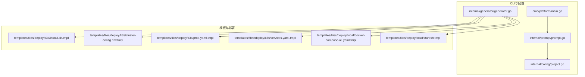
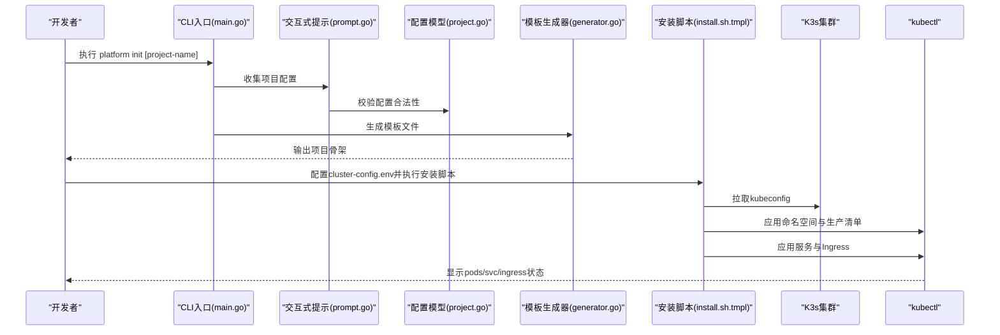
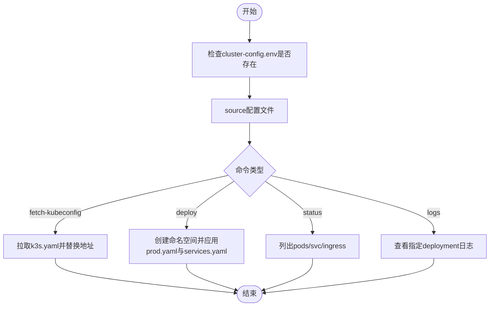
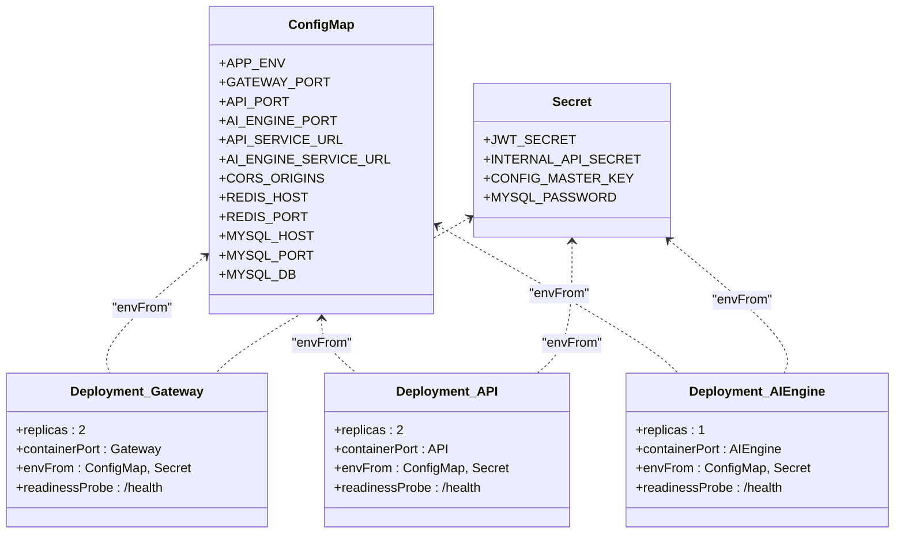
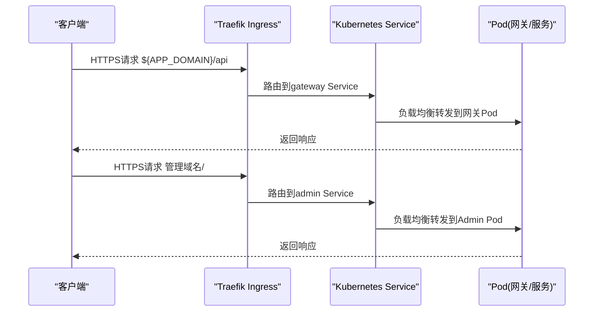
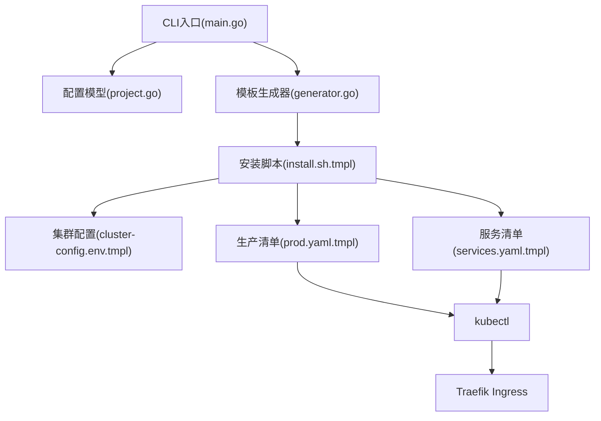

# K3s生产部署

<cite>
**本文档引用的文件**
- [cmd/platform/main.go](file://cmd/platform/main.go)
- [internal/config/project.go](file://internal/config/project.go)
- [internal/generator/generator.go](file://internal/generator/generator.go)
- [internal/prompt/prompt.go](file://internal/prompt/prompt.go)
- [templates/files/deploy/k3s/install.sh.tmpl](file://templates/files/deploy/k3s/install.sh.tmpl)
- [templates/files/deploy/k3s/cluster-config.env.tmpl](file://templates/files/deploy/k3s/cluster-config.env.tmpl)
- [templates/files/deploy/k3s/prod.yaml.tmpl](file://templates/files/deploy/k3s/prod.yaml.tmpl)
- [templates/files/deploy/k3s/services.yaml.tmpl](file://templates/files/deploy/k3s/services.yaml.tmpl)
- [templates/files/deploy/local/docker-compose-all.yaml.tmpl](file://templates/files/deploy/local/docker-compose-all.yaml.tmpl)
- [templates/files/deploy/local/start.sh.tmpl](file://templates/files/deploy/local/start.sh.tmpl)
</cite>

## 目录
1. [简介](#简介)
2. [项目结构](#项目结构)
3. [核心组件](#核心组件)
4. [架构概览](#架构概览)
5. [详细组件分析](#详细组件分析)
6. [依赖关系分析](#依赖关系分析)
7. [性能考虑](#性能考虑)
8. [故障排查指南](#故障排查指南)
9. [结论](#结论)
10. [附录](#附录)

## 简介
本文件面向在K3s Kubernetes集群中部署微服务架构的生产场景，基于脚手架模板提供的部署脚本与配置模板，系统性阐述从集群初始化、节点配置到服务部署的完整流程。文档覆盖生产环境配置文件的结构与参数设置、安装脚本的使用方法、集群管理命令、服务发现与负载均衡、持久化存储与网络策略建议，以及监控、日志收集与故障排查的最佳实践。

## 项目结构
该脚手架以CLI工具为核心，通过模板渲染生成完整的微服务项目骨架，其中包含K3s生产部署所需的YAML清单与自动化脚本。关键结构如下：
- CLI入口与命令定义：负责初始化项目、生成模板与版本信息输出
- 配置模型：定义项目名、品牌名、域名、端口、功能开关等
- 交互式提示：收集用户输入并校验配置合法性
- 模板生成器：遍历嵌入的模板FS，按规则渲染并写入磁盘
- K3s部署模板：包含安装脚本、集群配置、生产部署清单与服务暴露清单
- 本地开发模板：提供docker-compose与本地启动脚本，便于开发调试

**图表来源**
- [cmd/platform/main.go:22-38](file://cmd/platform/main.go#L22-L38)
- [internal/config/project.go:12-41](file://internal/config/project.go#L12-L41)
- [internal/generator/generator.go:33-103](file://internal/generator/generator.go#L33-L103)
- [templates/files/deploy/k3s/install.sh.tmpl:1-59](file://templates/files/deploy/k3s/install.sh.tmpl#L1-L59)
- [templates/files/deploy/k3s/cluster-config.env.tmpl:1-20](file://templates/files/deploy/k3s/cluster-config.env.tmpl#L1-L20)
- [templates/files/deploy/k3s/prod.yaml.tmpl:1-151](file://templates/files/deploy/k3s/prod.yaml.tmpl#L1-L151)
- [templates/files/deploy/k3s/services.yaml.tmpl:1-82](file://templates/files/deploy/k3s/services.yaml.tmpl#L1-L82)
- [templates/files/deploy/local/docker-compose-all.yaml.tmpl:1-47](file://templates/files/deploy/local/docker-compose-all.yaml.tmpl#L1-L47)
- [templates/files/deploy/local/start.sh.tmpl:1-34](file://templates/files/deploy/local/start.sh.tmpl#L1-L34)

**章节来源**
- [cmd/platform/main.go:22-38](file://cmd/platform/main.go#L22-L38)
- [internal/config/project.go:12-41](file://internal/config/project.go#L12-L41)
- [internal/generator/generator.go:33-103](file://internal/generator/generator.go#L33-L103)

## 核心组件
- CLI入口与命令
  - 提供初始化命令与版本命令，初始化流程包含交互式配置收集、配置校验与模板渲染
- 配置模型
  - ProjectConfig：集中定义项目名、品牌名、域名、Go模块路径、端口集合、功能开关、是否使用公共库、是否初始化Git等
  - Ports与Features：分别对端口与模块开关进行聚合，确保模板渲染一致性
- 交互式提示
  - 使用表单收集用户输入，支持端口自定义与模块选择，提供非交互模式
- 模板生成器
  - 遍历嵌入FS，按规则渲染路径与内容，剥离.tmpl后缀，自动赋予可执行权限给脚本文件
- K3s部署模板
  - 安装脚本：封装kubeconfig拉取、命名空间创建、部署清单应用、状态查询与日志查看
  - 集群配置：定义K3s节点SSH连接、镜像仓库、命名空间与应用域名
  - 生产清单：包含ConfigMap、Secret与多Deployment，支持健康探针
  - 服务清单：定义Service与Ingress，结合Traefik实现TLS与入口路由

**章节来源**
- [cmd/platform/main.go:40-86](file://cmd/platform/main.go#L40-L86)
- [internal/config/project.go:12-89](file://internal/config/project.go#L12-L89)
- [internal/prompt/prompt.go:13-104](file://internal/prompt/prompt.go#L13-L104)
- [internal/generator/generator.go:33-103](file://internal/generator/generator.go#L33-L103)
- [templates/files/deploy/k3s/install.sh.tmpl:1-59](file://templates/files/deploy/k3s/install.sh.tmpl#L1-L59)
- [templates/files/deploy/k3s/cluster-config.env.tmpl:1-20](file://templates/files/deploy/k3s/cluster-config.env.tmpl#L1-L20)
- [templates/files/deploy/k3s/prod.yaml.tmpl:1-151](file://templates/files/deploy/k3s/prod.yaml.tmpl#L1-L151)
- [templates/files/deploy/k3s/services.yaml.tmpl:1-82](file://templates/files/deploy/k3s/services.yaml.tmpl#L1-L82)

## 架构概览
下图展示了从CLI初始化到K3s生产部署的整体流程，包括配置收集、模板渲染、安装脚本执行与资源部署：

**图表来源**
- [cmd/platform/main.go:40-86](file://cmd/platform/main.go#L40-L86)
- [internal/prompt/prompt.go:13-104](file://internal/prompt/prompt.go#L13-L104)
- [internal/config/project.go:91-106](file://internal/config/project.go#L91-L106)
- [internal/generator/generator.go:33-103](file://internal/generator/generator.go#L33-L103)
- [templates/files/deploy/k3s/install.sh.tmpl:24-38](file://templates/files/deploy/k3s/install.sh.tmpl#L24-L38)

## 详细组件分析

### 安装脚本组件分析
- 功能职责
  - 拉取kubeconfig：通过SSH从K3s节点复制k3s.yaml至本地，并替换服务器地址
  - 部署：创建命名空间并应用生产清单与服务清单
  - 状态查询：列出命名空间内Pod、Service与Ingress
  - 日志查看：跟踪指定Deployment的日志
- 参数与环境变量
  - 依赖cluster-config.env中的K3s节点SSH信息、镜像仓库、命名空间与应用域名
  - 使用envsubst注入变量，kubectl通过本地kubeconfig访问集群

**图表来源**
- [templates/files/deploy/k3s/install.sh.tmpl:13-59](file://templates/files/deploy/k3s/install.sh.tmpl#L13-L59)
- [templates/files/deploy/k3s/cluster-config.env.tmpl:6-19](file://templates/files/deploy/k3s/cluster-config.env.tmpl#L6-L19)

**章节来源**
- [templates/files/deploy/k3s/install.sh.tmpl:1-59](file://templates/files/deploy/k3s/install.sh.tmpl#L1-L59)
- [templates/files/deploy/k3s/cluster-config.env.tmpl:1-20](file://templates/files/deploy/k3s/cluster-config.env.tmpl#L1-L20)

### 生产部署清单组件分析
- ConfigMap与Secret
  - ConfigMap提供运行时配置（环境、端口、服务URL、CORS、数据库与缓存地址）
  - Secret占位，需在部署前通过kubectl创建敏感信息
- Deployment
  - 网关与API服务：定义副本数、容器端口、环境变量注入与就绪探针
  - AI引擎与Web/Admin服务：根据功能开关条件渲染
- 就绪探针
  - 通过HTTP GET /health进行就绪检查，降低滚动更新风险

**图表来源**
- [templates/files/deploy/k3s/prod.yaml.tmpl:7-41](file://templates/files/deploy/k3s/prod.yaml.tmpl#L7-L41)
- [templates/files/deploy/k3s/prod.yaml.tmpl:42-111](file://templates/files/deploy/k3s/prod.yaml.tmpl#L42-L111)

**章节来源**
- [templates/files/deploy/k3s/prod.yaml.tmpl:1-151](file://templates/files/deploy/k3s/prod.yaml.tmpl#L1-L151)

### 服务与Ingress组件分析
- Service
  - 分别暴露网关、API、AI引擎、Web与Admin服务，端口映射与目标端口一致
- Ingress
  - 使用Traefik作为入口控制器，启用TLS与websecure入口
  - 主机规则：根域名与管理域名；路径规则：/api指向网关，/指向Web（可选），管理域名指向Admin（可选）
  - TLS证书：基于域名申请，Secret名称与清单一致

**图表来源**
- [templates/files/deploy/k3s/services.yaml.tmpl:6-45](file://templates/files/deploy/k3s/services.yaml.tmpl#L6-L45)
- [templates/files/deploy/k3s/services.yaml.tmpl:47-82](file://templates/files/deploy/k3s/services.yaml.tmpl#L47-L82)

**章节来源**
- [templates/files/deploy/k3s/services.yaml.tmpl:1-82](file://templates/files/deploy/k3s/services.yaml.tmpl#L1-L82)

### 本地开发组件分析
- docker-compose
  - 启动MySQL与Redis，挂载数据卷，提供健康检查
- 本地启动脚本
  - 支持启动后端三件套与前端，查看状态与日志，便于开发调试

**章节来源**
- [templates/files/deploy/local/docker-compose-all.yaml.tmpl:1-47](file://templates/files/deploy/local/docker-compose-all.yaml.tmpl#L1-L47)
- [templates/files/deploy/local/start.sh.tmpl:1-34](file://templates/files/deploy/local/start.sh.tmpl#L1-L34)

## 依赖关系分析
- 组件耦合
  - CLI通过配置模型驱动模板生成器，生成K3s部署所需文件
  - 安装脚本依赖cluster-config.env中的环境变量，间接依赖配置模型中的端口与域名
  - 生产清单与服务清单依赖安装脚本的应用流程
- 外部依赖
  - K3s集群与Traefik Ingress控制器
  - 镜像仓库（用于推送与拉取容器镜像）

**图表来源**
- [cmd/platform/main.go:22-38](file://cmd/platform/main.go#L22-L38)
- [internal/config/project.go:12-41](file://internal/config/project.go#L12-L41)
- [internal/generator/generator.go:33-103](file://internal/generator/generator.go#L33-L103)
- [templates/files/deploy/k3s/install.sh.tmpl:15-22](file://templates/files/deploy/k3s/install.sh.tmpl#L15-L22)
- [templates/files/deploy/k3s/prod.yaml.tmpl:1-6](file://templates/files/deploy/k3s/prod.yaml.tmpl#L1-L6)
- [templates/files/deploy/k3s/services.yaml.tmpl:1-4](file://templates/files/deploy/k3s/services.yaml.tmpl#L1-L4)

**章节来源**
- [cmd/platform/main.go:22-38](file://cmd/platform/main.go#L22-L38)
- [internal/generator/generator.go:33-103](file://internal/generator/generator.go#L33-L103)
- [templates/files/deploy/k3s/install.sh.tmpl:15-22](file://templates/files/deploy/k3s/install.sh.tmpl#L15-L22)

## 性能考虑
- 副本数与资源分配
  - 网关与API服务采用2副本，提升可用性与负载分担能力
  - 建议为Deployment配置资源请求与限制，避免资源争抢
- 探针与滚动更新
  - 就绪探针减少滚动更新过程中的流量切换风险
  - 建议配置合理的探针延迟与周期，平衡启动时间与稳定性
- 存储与缓存
  - 数据库与缓存使用独立服务，建议配置持久化卷与备份策略
- 网络与安全
  - Ingress启用TLS与入口控制，建议配合NetworkPolicy限制内部流量
  - 对敏感配置使用Secret并最小权限原则管理

## 故障排查指南
- 安装脚本常见问题
  - 未找到cluster-config.env：确认复制示例配置并填写必要字段
  - kubeconfig拉取失败：检查SSH连接、端口与凭据
  - 命名空间创建失败：确认kubectl权限与集群连通性
- 资源状态检查
  - 使用status命令查看Pod、Service与Ingress状态，定位异常
  - 使用logs命令跟踪特定Deployment日志，结合就绪探针判断健康状况
- 配置与密钥
  - 确认Secret已创建且键名与清单一致
  - 检查ConfigMap中的端口、服务URL与域名配置是否正确
- 网络与入口
  - 确认Ingress注解与入口控制器配置，验证TLS证书颁发状态
  - 检查域名解析与DNS记录，确保与APP_DOMAIN一致

**章节来源**
- [templates/files/deploy/k3s/install.sh.tmpl:18-31](file://templates/files/deploy/k3s/install.sh.tmpl#L18-L31)
- [templates/files/deploy/k3s/prod.yaml.tmpl:25-40](file://templates/files/deploy/k3s/prod.yaml.tmpl#L25-L40)
- [templates/files/deploy/k3s/services.yaml.tmpl:47-82](file://templates/files/deploy/k3s/services.yaml.tmpl#L47-L82)

## 结论
本脚手架提供了从CLI初始化到K3s生产部署的完整路径，通过模板化配置与自动化脚本，简化了微服务在K3s上的部署流程。结合本文档的服务发现、负载均衡、持久化存储与网络策略建议，以及监控与日志收集的最佳实践，可在生产环境中实现稳定、可观测与可维护的微服务架构。

## 附录
- 初始化项目
  - 执行初始化命令，按提示填写项目配置，生成项目骨架
- 准备集群
  - 在K3s节点上准备Traefik与必要的存储/网络插件
- 配置与部署
  - 填写cluster-config.env，执行安装脚本拉取kubeconfig并部署
  - 在部署前创建Secret，确保敏感信息安全
- 运维与监控
  - 使用status与logs命令进行日常运维
  - 建立日志收集与指标采集体系，结合告警策略保障生产稳定