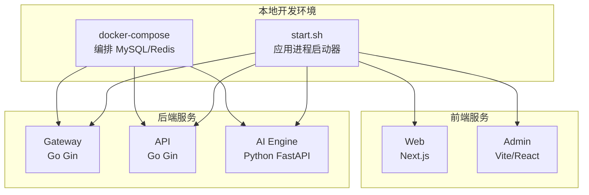
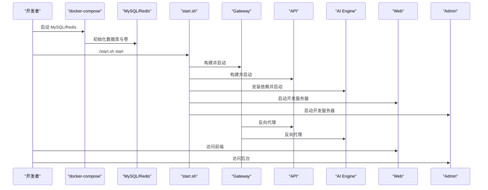
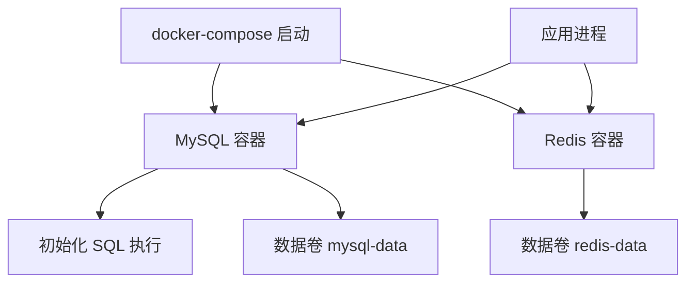
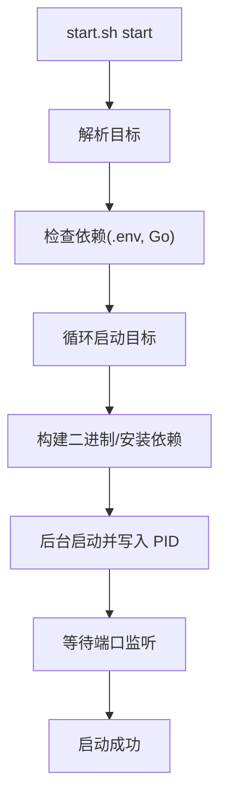
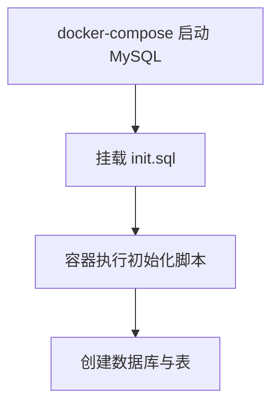
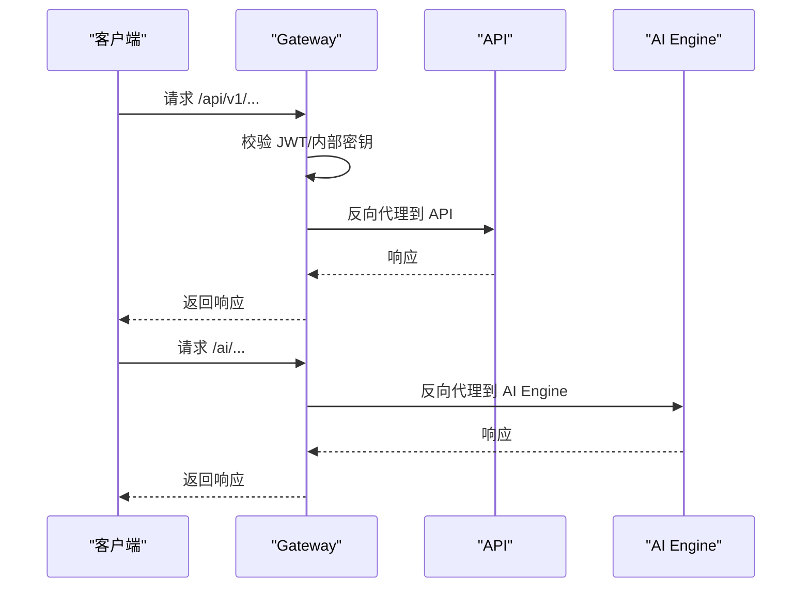
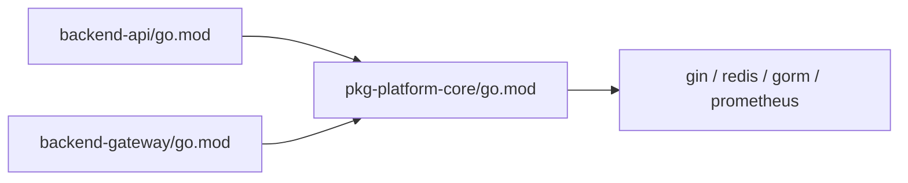

# 本地开发部署

<cite>
**本文引用的文件**
- [README.md](file://README.md)
- [cmd/platform/main.go](file://cmd/platform/main.go)
- [internal/config/project.go](file://internal/config/project.go)
- [templates/files/deploy/local/docker-compose-all.yaml.tmpl](file://templates/files/deploy/local/docker-compose-all.yaml.tmpl)
- [templates/files/deploy/local/start.sh.tmpl](file://templates/files/deploy/local/start.sh.tmpl)
- [templates/files/database/init.sql.tmpl](file://templates/files/database/init.sql.tmpl)
- [templates/files/backend-api/Dockerfile.tmpl](file://templates/files/backend-api/Dockerfile.tmpl)
- [templates/files/backend-gateway/Dockerfile.tmpl](file://templates/files/backend-gateway/Dockerfile.tmpl)
- [templates/files/backend-ai-engine/Dockerfile.tmpl](file://templates/files/backend-ai-engine/Dockerfile.tmpl)
- [templates/files/frontend-admin/package.json.tmpl](file://templates/files/frontend-admin/package.json.tmpl)
- [templates/files/frontend-web/package.json.tmpl](file://templates/files/frontend-web/package.json.tmpl)
- [templates/files/backend-api/go.mod.tmpl](file://templates/files/backend-api/go.mod.tmpl)
- [templates/files/backend-gateway/go.mod.tmpl](file://templates/files/backend-gateway/go.mod.tmpl)
- [templates/files/backend-api/internal/config/config.go.tmpl](file://templates/files/backend-api/internal/config/config.go.tmpl)
- [templates/files/backend-gateway/internal/config/config.go.tmpl](file://templates/files/backend-gateway/internal/config/config.go.tmpl)
- [templates/files/backend-ai-engine/app/config.py.tmpl](file://templates/files/backend-ai-engine/app/config.py.tmpl)
- [templates/files/pkg-platform-core/go.mod.tmpl](file://templates/files/pkg-platform-core/go.mod.tmpl)
</cite>

## 目录
1. [简介](#简介)
2. [项目结构](#项目结构)
3. [核心组件](#核心组件)
4. [架构总览](#架构总览)
5. [详细组件分析](#详细组件分析)
6. [依赖分析](#依赖分析)
7. [性能考虑](#性能考虑)
8. [故障排查指南](#故障排查指南)
9. [结论](#结论)
10. [附录](#附录)

## 简介
本文件面向本地开发环境部署，指导你使用 docker-compose 与自研一键启动脚本，在本地机器上快速拉起完整的微服务架构：API 网关、后端 API、AI 引擎、Web 前端与管理后台，并完成数据库初始化、环境变量配置、服务启动与停止流程。文档同时解释 docker-compose 配置结构、服务间依赖关系、API 网关路由与鉴权、以及前端服务的本地调试方法。

## 项目结构
该脚手架通过 CLI 生成包含以下关键目录与文件的项目骨架：
- 后端网关：Go Gin，负责鉴权、CORS、限流与反向代理
- 后端 API：Go Gin，提供业务接口，读写数据库与缓存
- AI 引擎：Python FastAPI，只读访问上游 API，编排推理
- 前端 Web：Next.js 15 应用
- 前端 Admin：Vite + React 后台
- 本地部署：docker-compose 编排 MySQL 与 Redis，start.sh 负责应用进程的构建与启动
- 数据库初始化：init.sql 创建通用基础表与系统配置表

图表来源
- [templates/files/deploy/local/docker-compose-all.yaml.tmpl:1-48](file://templates/files/deploy/local/docker-compose-all.yaml.tmpl#L1-L48)
- [templates/files/deploy/local/start.sh.tmpl:1-242](file://templates/files/deploy/local/start.sh.tmpl#L1-L242)

章节来源
- [README.md:21-48](file://README.md#L21-L48)
- [cmd/platform/main.go:76-80](file://cmd/platform/main.go#L76-L80)

## 核心组件
- docker-compose 编排：仅编排 MySQL 与 Redis，便于持久化与健康检查
- start.sh 启动器：在宿主机直接运行后端三件套与前端，支持热重载与调试
- 环境变量：通过 .env 文件集中注入，覆盖默认端口与连接参数
- 数据库初始化：首次启动时自动执行 init.sql，创建用户、积分、系统配置、提示词与管理后台账号等表

章节来源
- [templates/files/deploy/local/docker-compose-all.yaml.tmpl:1-48](file://templates/files/deploy/local/docker-compose-all.yaml.tmpl#L1-L48)
- [templates/files/deploy/local/start.sh.tmpl:1-242](file://templates/files/deploy/local/start.sh.tmpl#L1-L242)
- [templates/files/database/init.sql.tmpl:1-124](file://templates/files/database/init.sql.tmpl#L1-L124)

## 架构总览
本地开发采用“容器化基础设施 + 宿主机应用进程”的混合模式：
- 基础设施（MySQL/Redis）由 docker-compose 管理，挂载卷实现数据持久化与初始化 SQL
- 应用进程（网关/API/AI 引擎/Web/Admin）由 start.sh 在宿主机构建并运行，便于热重载与断点调试
- 网关负责鉴权、CORS、限流与反向代理，将请求转发至下游 API 与 AI 引擎

图表来源
- [templates/files/deploy/local/docker-compose-all.yaml.tmpl:1-48](file://templates/files/deploy/local/docker-compose-all.yaml.tmpl#L1-L48)
- [templates/files/deploy/local/start.sh.tmpl:110-146](file://templates/files/deploy/local/start.sh.tmpl#L110-L146)
- [templates/files/backend-gateway/internal/config/config.go.tmpl:77-84](file://templates/files/backend-gateway/internal/config/config.go.tmpl#L77-L84)

## 详细组件分析

### docker-compose 配置与依赖关系
- 服务定义
  - mysql：设置字符集与校对规则，暴露宿主机端口映射，挂载初始化 SQL 与数据卷，配置健康检查
  - redis：开启 AOF 持久化，暴露端口映射，挂载数据卷，配置健康检查
- 卷管理：mysql-data 与 redis-data 用于持久化
- 依赖关系：应用进程通过 localhost 访问容器暴露的服务，无需网络别名

图表来源
- [templates/files/deploy/local/docker-compose-all.yaml.tmpl:9-48](file://templates/files/deploy/local/docker-compose-all.yaml.tmpl#L9-L48)

章节来源
- [templates/files/deploy/local/docker-compose-all.yaml.tmpl:1-48](file://templates/files/deploy/local/docker-compose-all.yaml.tmpl#L1-L48)

### 启动脚本使用方法
- 基本用法
  - 启动全部：./deploy/local/start.sh start
  - 仅启动后端：./deploy/local/start.sh start backend
  - 停止全部：./deploy/local/start.sh stop all
  - 查看状态：./deploy/local/start.sh status
  - 查看日志：./deploy/local/start.sh logs gateway
- 目标与分组
  - 单服务：gateway、api、ai-engine、web、admin
  - 组：all、backend、web
- 端口与进程
  - 自动检测端口占用并清理旧进程
  - 以 PID 文件记录进程，等待端口监听成功
- 环境变量
  - 通过 .env 注入，脚本在启动时 source 环境变量

图表来源
- [templates/files/deploy/local/start.sh.tmpl:204-239](file://templates/files/deploy/local/start.sh.tmpl#L204-L239)
- [templates/files/deploy/local/start.sh.tmpl:60-108](file://templates/files/deploy/local/start.sh.tmpl#L60-L108)

章节来源
- [templates/files/deploy/local/start.sh.tmpl:1-242](file://templates/files/deploy/local/start.sh.tmpl#L1-L242)

### 数据库初始化
- 初始化 SQL 创建以下表：
  - 用户主表、积分流水、第三方登录绑定、系统提示词、系统配置、管理后台账号
- 初始化流程
  - docker-compose 将 init.sql 挂载到 /docker-entrypoint-initdb.d，容器启动时自动执行
  - 首次启动后，数据库中存在项目名对应的数据库与上述表

图表来源
- [templates/files/database/init.sql.tmpl:1-124](file://templates/files/database/init.sql.tmpl#L1-L124)
- [templates/files/deploy/local/docker-compose-all.yaml.tmpl:20-22](file://templates/files/deploy/local/docker-compose-all.yaml.tmpl#L20-L22)

章节来源
- [templates/files/database/init.sql.tmpl:1-124](file://templates/files/database/init.sql.tmpl#L1-L124)

### API 网关配置与路由
- 网关负责：
  - JWT 解析与校验
  - CORS 配置（允许 Web 与 Admin 前端）
  - 反向代理到 API 与 AI 引擎
  - 内部鉴权（X-Internal-Secret）
- 关键配置项
  - 服务端口、JWT 密钥、Redis 连接、下游服务地址、CORS 允许来源
- 默认行为
  - 对 /health、/api/v1/auth、/oauth2/、/login/oauth2/、/internal/、/admin 等路径放行公共访问

图表来源
- [templates/files/backend-gateway/internal/config/config.go.tmpl:52-86](file://templates/files/backend-gateway/internal/config/config.go.tmpl#L52-L86)
- [templates/files/backend-gateway/internal/config/config.go.tmpl:77-84](file://templates/files/backend-gateway/internal/config/config.go.tmpl#L77-L84)

章节来源
- [templates/files/backend-gateway/internal/config/config.go.tmpl:1-127](file://templates/files/backend-gateway/internal/config/config.go.tmpl#L1-L127)

### 后端 API 配置与连接
- 连接参数
  - MySQL 主机、端口、用户、密码、数据库名
  - Redis 主机、端口、密码、DB
  - 内部 API 密钥、加密主密钥
- 端口与环境
  - 通过环境变量覆盖默认端口与运行环境

章节来源
- [templates/files/backend-api/internal/config/config.go.tmpl:1-82](file://templates/files/backend-api/internal/config/config.go.tmpl#L1-L82)

### AI 引擎配置
- 运行参数
  - 端口、运行环境
  - 内部鉴权密钥
  - 上游 API 基础地址（默认指向本地 API）
  - CORS 来源（默认为空）

章节来源
- [templates/files/backend-ai-engine/app/config.py.tmpl:1-31](file://templates/files/backend-ai-engine/app/config.py.tmpl#L1-L31)

### 前端服务本地调试
- Web（Next.js）
  - 开发端口来自模板变量，启动命令为 next dev
  - 通过网关代理访问后端 API
- Admin（Vite/React）
  - 开发端口来自模板变量，启动命令为 vite
  - 通过网关代理访问后端 API 与 AI 引擎
- 网关 CORS
  - 默认允许 Web 与 Admin 的本地端口来源

章节来源
- [templates/files/frontend-web/package.json.tmpl:1-25](file://templates/files/frontend-web/package.json.tmpl#L1-L25)
- [templates/files/frontend-admin/package.json.tmpl:1-24](file://templates/files/frontend-admin/package.json.tmpl#L1-L24)
- [templates/files/backend-gateway/internal/config/config.go.tmpl:82-84](file://templates/files/backend-gateway/internal/config/config.go.tmpl#L82-L84)

### Dockerfile 结构与镜像
- 网关与 API：基于 distroless 静态镜像，多阶段构建 Go 二进制，暴露模板端口
- AI 引擎：基于 Python slim，多阶段安装依赖，使用 uvicorn 启动
- 前端：在宿主机运行，不使用容器

章节来源
- [templates/files/backend-api/Dockerfile.tmpl:1-14](file://templates/files/backend-api/Dockerfile.tmpl#L1-L14)
- [templates/files/backend-gateway/Dockerfile.tmpl:1-14](file://templates/files/backend-gateway/Dockerfile.tmpl#L1-L14)
- [templates/files/backend-ai-engine/Dockerfile.tmpl:1-14](file://templates/files/backend-ai-engine/Dockerfile.tmpl#L1-L14)

## 依赖分析
- 语言与框架
  - Go 1.22+：Gin、GORM、Prometheus、gRPC/HTTP 客户端
  - Python 3.11+：FastAPI、httpx
  - Next.js 15 / React 19 / Vite
- 模块依赖
  - 后端 API 与网关可选引入 pkg-platform-core 作为公共组件库
  - replace 指令将模块替换为本地路径，便于开发调试

图表来源
- [templates/files/backend-api/go.mod.tmpl:1-16](file://templates/files/backend-api/go.mod.tmpl#L1-L16)
- [templates/files/backend-gateway/go.mod.tmpl:1-16](file://templates/files/backend-gateway/go.mod.tmpl#L1-L16)
- [templates/files/pkg-platform-core/go.mod.tmpl:1-12](file://templates/files/pkg-platform-core/go.mod.tmpl#L1-L12)

章节来源
- [templates/files/backend-api/go.mod.tmpl:1-16](file://templates/files/backend-api/go.mod.tmpl#L1-L16)
- [templates/files/backend-gateway/go.mod.tmpl:1-16](file://templates/files/backend-gateway/go.mod.tmpl#L1-L16)
- [templates/files/pkg-platform-core/go.mod.tmpl:1-12](file://templates/files/pkg-platform-core/go.mod.tmpl#L1-L12)

## 性能考虑
- 宿主机运行应用进程：便于热重载与断点调试，减少容器重启成本
- 容器化基础设施：MySQL/Redis 以轻量镜像运行，卷持久化避免重复初始化
- 网关代理：集中处理鉴权与限流，降低下游服务耦合
- 建议
  - 本地开发优先使用宿主机进程，生产部署使用容器镜像
  - 合理设置 Redis 与 MySQL 的资源限制，避免宿主机资源争用

## 故障排查指南
- 未找到 .env
  - 症状：启动失败，提示未找到 .env
  - 处理：复制示例文件并根据需要调整端口与连接参数
- Go 未安装
  - 症状：启动失败，提示未安装 Go
  - 处理：安装 Go 1.22+ 并确保在 PATH 中
- 端口冲突
  - 症状：服务启动超时或端口被占用
  - 处理：start.sh 会尝试清理旧进程并等待端口可用，也可手动释放端口
- 数据库未初始化
  - 症状：应用连接数据库失败或缺少基础表
  - 处理：确认 docker-compose 已启动且 init.sql 已执行，检查卷与容器日志
- 网关鉴权失败
  - 症状：返回鉴权错误
  - 处理：确认 JWT_SECRET 与内部密钥配置正确，检查网关日志

章节来源
- [templates/files/deploy/local/start.sh.tmpl:60-66](file://templates/files/deploy/local/start.sh.tmpl#L60-L66)
- [templates/files/deploy/local/start.sh.tmpl:92-107](file://templates/files/deploy/local/start.sh.tmpl#L92-L107)
- [templates/files/deploy/local/docker-compose-all.yaml.tmpl:20-28](file://templates/files/deploy/local/docker-compose-all.yaml.tmpl#L20-L28)
- [templates/files/backend-gateway/internal/config/config.go.tmpl:58-84](file://templates/files/backend-gateway/internal/config/config.go.tmpl#L58-L84)

## 结论
通过 docker-compose 与自研启动脚本，你可以快速搭建一套完整的微服务本地开发环境。容器化基础设施保证了数据库与缓存的稳定运行，宿主机上的应用进程则提供了高效的开发体验。遵循本文档的步骤与最佳实践，可以顺利完成环境准备、服务启动与停止、数据库初始化、API 网关配置以及前端调试。

## 附录
- 快速开始
  - 安装 CLI 并生成项目骨架
  - 复制并编辑 .env
  - 启动基础设施与应用进程
- 常用命令
  - 启动：./deploy/local/start.sh start
  - 停止：./deploy/local/start.sh stop all
  - 查看状态：./deploy/local/start.sh status
  - 查看日志：./deploy/local/start.sh logs gateway

章节来源
- [README.md:21-48](file://README.md#L21-L48)
- [cmd/platform/main.go:76-80](file://cmd/platform/main.go#L76-L80)