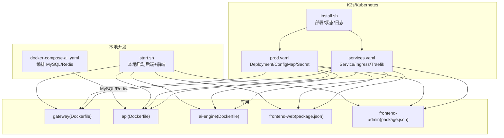
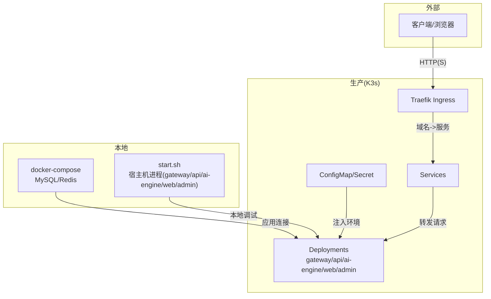
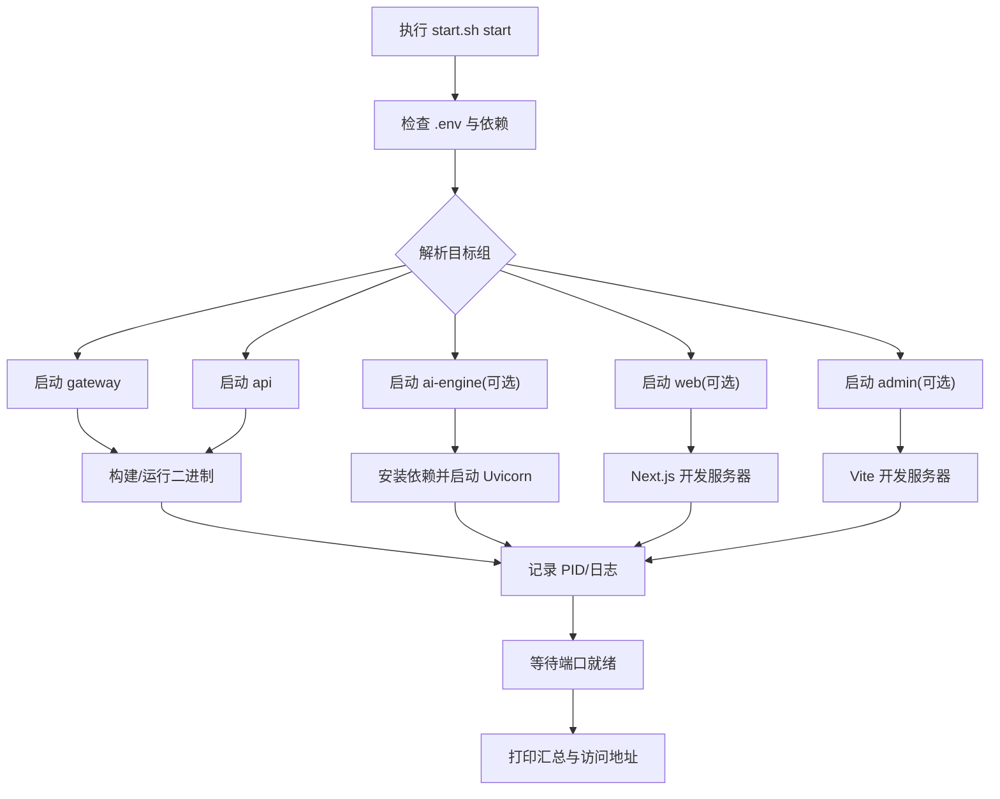
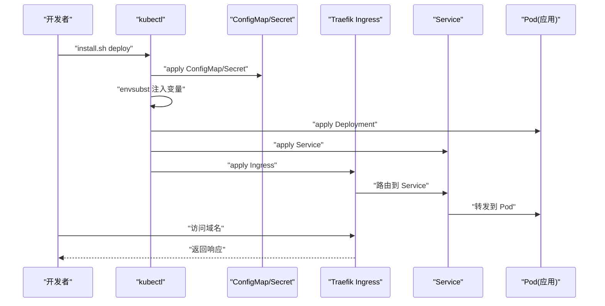
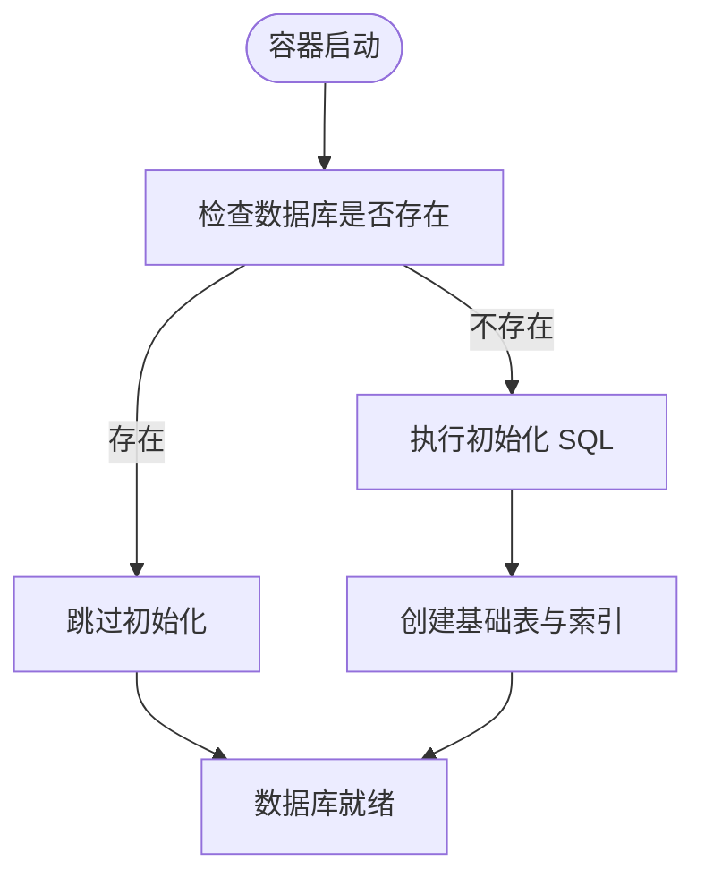
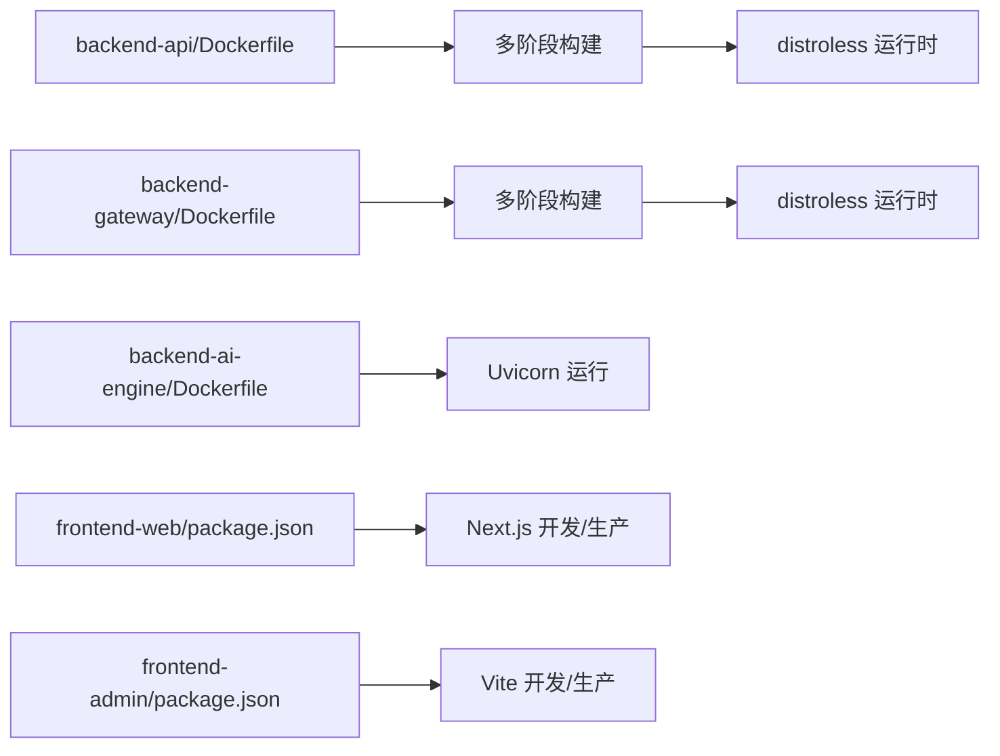
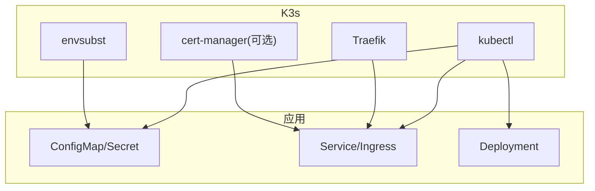

# 部署指南

<cite>
**本文引用的文件**
- [cmd/platform/main.go](file://cmd/platform/main.go)
- [internal/config/project.go](file://internal/config/project.go)
- [templates/files/deploy/local/docker-compose-all.yaml.tmpl](file://templates/files/deploy/local/docker-compose-all.yaml.tmpl)
- [templates/files/deploy/local/start.sh.tmpl](file://templates/files/deploy/local/start.sh.tmpl)
- [templates/files/deploy/k3s/prod.yaml.tmpl](file://templates/files/deploy/k3s/prod.yaml.tmpl)
- [templates/files/deploy/k3s/services.yaml.tmpl](file://templates/files/deploy/k3s/services.yaml.tmpl)
- [templates/files/deploy/k3s/install.sh.tmpl](file://templates/files/deploy/k3s/install.sh.tmpl)
- [templates/files/backend-api/Dockerfile.tmpl](file://templates/files/backend-api/Dockerfile.tmpl)
- [templates/files/backend-gateway/Dockerfile.tmpl](file://templates/files/backend-gateway/Dockerfile.tmpl)
- [templates/files/backend-ai-engine/Dockerfile.tmpl](file://templates/files/backend-ai-engine/Dockerfile.tmpl)
- [templates/files/frontend-web/package.json.tmpl](file://templates/files/frontend-web/package.json.tmpl)
- [templates/files/frontend-admin/package.json.tmpl](file://templates/files/frontend-admin/package.json.tmpl)
- [templates/files/database/init.sql.tmpl](file://templates/files/database/init.sql.tmpl)
</cite>

## 目录
1. [简介](#简介)
2. [项目结构](#项目结构)
3. [核心组件](#核心组件)
4. [架构总览](#架构总览)
5. [详细组件分析](#详细组件分析)
6. [依赖分析](#依赖分析)
7. [性能考虑](#性能考虑)
8. [故障排查指南](#故障排查指南)
9. [结论](#结论)
10. [附录](#附录)

## 简介
本指南面向本地开发与生产环境（K3s/Kubernetes）的部署与运维，覆盖以下主题：
- 本地开发环境：Docker Compose 编排数据库与缓存，应用服务在宿主机以可热重载方式启动。
- 生产环境：K3s 集群部署，使用 ConfigMap/Secret 注入配置，Traefik Ingress 对外暴露服务。
- 最佳实践：镜像构建、健康检查、探针、日志与监控、故障恢复策略。

## 项目结构
该脚手架生成包含以下子项目与部署模板：
- 后端网关：Go 语言实现，负责路由与鉴权。
- 后端 API：Go 语言实现，提供业务接口。
- AI 引擎：Python Uvicorn 应用，提供模型推理服务。
- 前端 Web：Next.js 应用。
- 前端 Admin：React Vite 应用。
- 数据库：MySQL 初始化 SQL。
- 部署模板：本地 docker-compose 与 K3s YAML、安装/部署脚本。

**图表来源**
- [templates/files/deploy/local/docker-compose-all.yaml.tmpl:1-48](file://templates/files/deploy/local/docker-compose-all.yaml.tmpl#L1-L48)
- [templates/files/deploy/local/start.sh.tmpl:1-242](file://templates/files/deploy/local/start.sh.tmpl#L1-L242)
- [templates/files/deploy/k3s/prod.yaml.tmpl:1-151](file://templates/files/deploy/k3s/prod.yaml.tmpl#L1-L151)
- [templates/files/deploy/k3s/services.yaml.tmpl:1-82](file://templates/files/deploy/k3s/services.yaml.tmpl#L1-L82)
- [templates/files/deploy/k3s/install.sh.tmpl:1-59](file://templates/files/deploy/k3s/install.sh.tmpl#L1-L59)
- [templates/files/backend-api/Dockerfile.tmpl:1-14](file://templates/files/backend-api/Dockerfile.tmpl#L1-L14)
- [templates/files/backend-gateway/Dockerfile.tmpl:1-14](file://templates/files/backend-gateway/Dockerfile.tmpl#L1-L14)
- [templates/files/backend-ai-engine/Dockerfile.tmpl:1-14](file://templates/files/backend-ai-engine/Dockerfile.tmpl#L1-L14)
- [templates/files/frontend-web/package.json.tmpl:1-25](file://templates/files/frontend-web/package.json.tmpl#L1-L25)
- [templates/files/frontend-admin/package.json.tmpl:1-24](file://templates/files/frontend-admin/package.json.tmpl#L1-L24)

**章节来源**
- [cmd/platform/main.go:1-98](file://cmd/platform/main.go#L1-L98)
- [internal/config/project.go:1-121](file://internal/config/project.go#L1-L121)

## 核心组件
- 项目配置与校验：定义项目名、品牌、域名、端口、功能开关、Go 模块路径等，并进行格式校验。
- 本地编排：MySQL/Redis 通过 Compose 启动；应用服务由脚本在宿主机启动，便于热重载与调试。
- K3s 部署：使用 ConfigMap/Secret 注入环境变量；Traefik Ingress 将域名映射到各服务；支持 HTTPS 证书自动签发。
- 健康检查：数据库与缓存均配置健康检查探针；Kubernetes 使用就绪探针保障流量接入时机。
- 构建镜像：后端网关与 API 使用多阶段构建，产物精简；AI 引擎使用 Python slim 基础镜像。

**章节来源**
- [internal/config/project.go:12-121](file://internal/config/project.go#L12-L121)
- [templates/files/deploy/local/docker-compose-all.yaml.tmpl:1-48](file://templates/files/deploy/local/docker-compose-all.yaml.tmpl#L1-L48)
- [templates/files/deploy/local/start.sh.tmpl:1-242](file://templates/files/deploy/local/start.sh.tmpl#L1-L242)
- [templates/files/deploy/k3s/prod.yaml.tmpl:1-151](file://templates/files/deploy/k3s/prod.yaml.tmpl#L1-L151)
- [templates/files/deploy/k3s/services.yaml.tmpl:1-82](file://templates/files/deploy/k3s/services.yaml.tmpl#L1-L82)
- [templates/files/backend-api/Dockerfile.tmpl:1-14](file://templates/files/backend-api/Dockerfile.tmpl#L1-L14)
- [templates/files/backend-gateway/Dockerfile.tmpl:1-14](file://templates/files/backend-gateway/Dockerfile.tmpl#L1-L14)
- [templates/files/backend-ai-engine/Dockerfile.tmpl:1-14](file://templates/files/backend-ai-engine/Dockerfile.tmpl#L1-L14)

## 架构总览
下图展示本地与生产两种部署形态的组件关系与数据流。

**图表来源**
- [templates/files/deploy/local/docker-compose-all.yaml.tmpl:1-48](file://templates/files/deploy/local/docker-compose-all.yaml.tmpl#L1-L48)
- [templates/files/deploy/local/start.sh.tmpl:1-242](file://templates/files/deploy/local/start.sh.tmpl#L1-L242)
- [templates/files/deploy/k3s/prod.yaml.tmpl:1-151](file://templates/files/deploy/k3s/prod.yaml.tmpl#L1-L151)
- [templates/files/deploy/k3s/services.yaml.tmpl:1-82](file://templates/files/deploy/k3s/services.yaml.tmpl#L1-L82)

## 详细组件分析

### 本地开发环境（Docker Compose + 宿主机应用）
- 启动顺序
  1) 启动数据库与缓存：使用 Compose 启动 MySQL 与 Redis，并挂载初始化 SQL 与持久化卷。
  2) 启动应用服务：通过脚本在宿主机启动网关、API、AI 引擎、Web、Admin，便于热重载与调试。
- 关键特性
  - Compose 中为 MySQL/Redis 配置健康检查，确保容器可用后再接入应用。
  - 脚本自动检测端口占用、记录日志、管理 PID，支持分组启动/停止/查看状态/查看日志。
  - 应用二进制在本地构建，减少容器重建成本，提升迭代效率。
- 健康检查与探针
  - Compose 中对 MySQL/Redis 进行健康检查。
  - 应用服务在 K3s 部署中使用就绪探针，避免流量接入到未完全启动的服务。

**图表来源**
- [templates/files/deploy/local/start.sh.tmpl:1-242](file://templates/files/deploy/local/start.sh.tmpl#L1-L242)
- [templates/files/deploy/local/docker-compose-all.yaml.tmpl:1-48](file://templates/files/deploy/local/docker-compose-all.yaml.tmpl#L1-L48)

**章节来源**
- [templates/files/deploy/local/docker-compose-all.yaml.tmpl:1-48](file://templates/files/deploy/local/docker-compose-all.yaml.tmpl#L1-L48)
- [templates/files/deploy/local/start.sh.tmpl:1-242](file://templates/files/deploy/local/start.sh.tmpl#L1-L242)

### K3s/Kubernetes 部署（ConfigMap/Secret/Ingress）
- 部署清单
  - ConfigMap：注入运行时配置（端口、CORS、数据库/缓存地址、服务间 URL）。
  - Secret：注入敏感信息（JWT 密钥、内部 API 密钥、配置主密钥、数据库密码）。
  - Deployment：按需部署 gateway、api、ai-engine、web、admin，设置副本数与就绪探针。
  - Service/Ingress：对外暴露服务，Traefik 自动处理 TLS 与入口。
- 安装与运维脚本
  - 获取 kubeconfig、部署、查看状态、查看日志。
  - 通过 envsubst 注入变量（镜像仓库、域名等）。
- 健康检查与探针
  - ConfigMap/Secret 注入后，Kubernetes Deployment 使用 HTTP 就绪探针，确保只有健康实例接收流量。

**图表来源**
- [templates/files/deploy/k3s/install.sh.tmpl:1-59](file://templates/files/deploy/k3s/install.sh.tmpl#L1-L59)
- [templates/files/deploy/k3s/prod.yaml.tmpl:1-151](file://templates/files/deploy/k3s/prod.yaml.tmpl#L1-L151)
- [templates/files/deploy/k3s/services.yaml.tmpl:1-82](file://templates/files/deploy/k3s/services.yaml.tmpl#L1-L82)

**章节来源**
- [templates/files/deploy/k3s/prod.yaml.tmpl:1-151](file://templates/files/deploy/k3s/prod.yaml.tmpl#L1-L151)
- [templates/files/deploy/k3s/services.yaml.tmpl:1-82](file://templates/files/deploy/k3s/services.yaml.tmpl#L1-L82)
- [templates/files/deploy/k3s/install.sh.tmpl:1-59](file://templates/files/deploy/k3s/install.sh.tmpl#L1-L59)

### 数据库初始化与表结构
- 初始化 SQL 包含通用基础表：用户、积分流水、第三方登录、系统提示词、系统配置、管理后台账号。
- 业务表可在初始化 SQL 末尾追加。
- Compose 启动时挂载初始化脚本，首次启动自动创建数据库与表。

**图表来源**
- [templates/files/database/init.sql.tmpl:1-124](file://templates/files/database/init.sql.tmpl#L1-L124)
- [templates/files/deploy/local/docker-compose-all.yaml.tmpl:20-22](file://templates/files/deploy/local/docker-compose-all.yaml.tmpl#L20-L22)

**章节来源**
- [templates/files/database/init.sql.tmpl:1-124](file://templates/files/database/init.sql.tmpl#L1-L124)

### 镜像构建与运行
- 后端网关与 API：多阶段构建，产物精简，使用 distroless 非 root 用户运行。
- AI 引擎：Python slim 基础镜像，使用 Uvicorn 启动，暴露指定端口。
- 前端：Next.js 与 Vite 分别提供开发与生产构建脚本。

**图表来源**
- [templates/files/backend-api/Dockerfile.tmpl:1-14](file://templates/files/backend-api/Dockerfile.tmpl#L1-L14)
- [templates/files/backend-gateway/Dockerfile.tmpl:1-14](file://templates/files/backend-gateway/Dockerfile.tmpl#L1-L14)
- [templates/files/backend-ai-engine/Dockerfile.tmpl:1-14](file://templates/files/backend-ai-engine/Dockerfile.tmpl#L1-L14)
- [templates/files/frontend-web/package.json.tmpl:1-25](file://templates/files/frontend-web/package.json.tmpl#L1-L25)
- [templates/files/frontend-admin/package.json.tmpl:1-24](file://templates/files/frontend-admin/package.json.tmpl#L1-L24)

**章节来源**
- [templates/files/backend-api/Dockerfile.tmpl:1-14](file://templates/files/backend-api/Dockerfile.tmpl#L1-L14)
- [templates/files/backend-gateway/Dockerfile.tmpl:1-14](file://templates/files/backend-gateway/Dockerfile.tmpl#L1-L14)
- [templates/files/backend-ai-engine/Dockerfile.tmpl:1-14](file://templates/files/backend-ai-engine/Dockerfile.tmpl#L1-L14)
- [templates/files/frontend-web/package.json.tmpl:1-25](file://templates/files/frontend-web/package.json.tmpl#L1-L25)
- [templates/files/frontend-admin/package.json.tmpl:1-24](file://templates/files/frontend-admin/package.json.tmpl#L1-L24)

## 依赖分析
- 组件耦合
  - 应用服务依赖 ConfigMap/Secret 注入的运行时配置与敏感信息。
  - Ingress 依赖 Traefik 与域名配置，将请求路由到对应 Service。
  - Compose 依赖 MySQL/Redis 的健康检查，确保应用启动前基础设施可用。
- 外部依赖
  - K3s 集群、kubectl、envsubst、Traefik、cert-manager（可选）。
  - 本地开发依赖：Go、Python、Node.js、Docker、Docker Compose。

**图表来源**
- [templates/files/deploy/k3s/install.sh.tmpl:1-59](file://templates/files/deploy/k3s/install.sh.tmpl#L1-L59)
- [templates/files/deploy/k3s/prod.yaml.tmpl:1-151](file://templates/files/deploy/k3s/prod.yaml.tmpl#L1-L151)
- [templates/files/deploy/k3s/services.yaml.tmpl:1-82](file://templates/files/deploy/k3s/services.yaml.tmpl#L1-L82)

**章节来源**
- [templates/files/deploy/k3s/install.sh.tmpl:1-59](file://templates/files/deploy/k3s/install.sh.tmpl#L1-L59)

## 性能考虑
- 本地开发
  - 使用宿主机直接运行应用，避免容器重建带来的编译开销，提升迭代速度。
  - Compose 中的健康检查可避免应用过早接入流量。
- 生产环境
  - 多阶段构建减小镜像体积，缩短拉取时间。
  - 就绪探针确保流量只进入已启动完成的 Pod。
  - Ingress 使用 Traefik，结合证书自动签发，降低运维复杂度。
- 数据层
  - 初始化 SQL 提前建立索引，减少运行期查询压力。
  - 持久化卷确保数据安全与高可用。

[本节为通用建议，无需特定文件引用]

## 故障排查指南
- 本地启动失败
  - 检查 .env 是否存在且完整；确认端口未被占用；查看对应服务的日志文件。
  - 使用 status 查看各服务 PID 与端口状态；使用 logs 查看最近日志。
- Compose 健康检查失败
  - 确认 MySQL/Redis 初始化脚本与卷挂载正确；查看容器日志定位错误。
- K3s 部署问题
  - 使用 install.sh status 查看 Pods/SVC/Ingress 状态；使用 install.sh logs <deployment> 查看日志。
  - 确认 ConfigMap/Secret 已创建且值正确；确认 NAMESPACE 与域名配置。
- Ingress 无法访问
  - 检查 Traefik 与证书配置；确认域名解析与 Ingress 规则匹配。

**章节来源**
- [templates/files/deploy/local/start.sh.tmpl:172-183](file://templates/files/deploy/local/start.sh.tmpl#L172-L183)
- [templates/files/deploy/k3s/install.sh.tmpl:40-47](file://templates/files/deploy/k3s/install.sh.tmpl#L40-L47)

## 结论
本指南提供了从本地开发到生产 K3s 部署的完整路径，涵盖编排、镜像构建、配置注入、健康检查与故障排查。建议在本地快速迭代，生产使用 K3s 与 Traefik，配合 ConfigMap/Secret 与就绪探针，确保稳定与可观测性。

[本节为总结，无需特定文件引用]

## 附录

### 本地开发环境部署步骤
- 准备工作
  - 安装 Docker、Docker Compose、Go、Python、Node.js。
  - 生成项目后，复制本地环境示例文件为实际 .env。
- 启动数据库与缓存
  - 进入 deploy/local，使用 Compose 启动 MySQL 与 Redis。
- 启动应用服务
  - 使用 start.sh 按需启动 gateway、api、ai-engine、web、admin。
- 访问服务
  - 根据脚本输出的访问地址进行测试。

**章节来源**
- [cmd/platform/main.go:77-80](file://cmd/platform/main.go#L77-L80)
- [templates/files/deploy/local/docker-compose-all.yaml.tmpl:1-48](file://templates/files/deploy/local/docker-compose-all.yaml.tmpl#L1-L48)
- [templates/files/deploy/local/start.sh.tmpl:1-242](file://templates/files/deploy/local/start.sh.tmpl#L1-L242)

### 生产环境（K3s）部署步骤
- 准备工作
  - 准备 K3s 集群与 kubectl；在集群中创建 ConfigMap/Secret。
  - 准备 cluster-config.env，配置 NAMESPACE、K3S 节点信息等。
- 获取 kubeconfig
  - 使用 install.sh fetch-kubeconfig 从 K3s 节点拉取并修正 kubeconfig。
- 部署
  - 使用 install.sh deploy 应用 prod.yaml 与 services.yaml。
- 验证
  - 使用 install.sh status 查看 Pods/SVC/Ingress；使用 install.sh logs <deployment> 查看日志。
- 访问
  - 通过域名访问，Traefik 自动处理 HTTPS。

**章节来源**
- [templates/files/deploy/k3s/install.sh.tmpl:1-59](file://templates/files/deploy/k3s/install.sh.tmpl#L1-L59)
- [templates/files/deploy/k3s/prod.yaml.tmpl:1-151](file://templates/files/deploy/k3s/prod.yaml.tmpl#L1-L151)
- [templates/files/deploy/k3s/services.yaml.tmpl:1-82](file://templates/files/deploy/k3s/services.yaml.tmpl#L1-L82)

### 监控与日志管理
- 本地
  - start.sh 将各服务日志输出到 .dev-logs，使用 logs 子命令实时查看。
- 生产
  - 建议集成日志收集（如 Fluent Bit/Fluentd）、指标导出（Prometheus）与告警（Alertmanager）。
  - 使用 Kubernetes 原生资源（HPA、PodDisruptionBudget）提升弹性与韧性。

**章节来源**
- [templates/files/deploy/local/start.sh.tmpl:230-233](file://templates/files/deploy/local/start.sh.tmpl#L230-L233)

### 故障恢复策略
- 本地
  - 使用 stop/restart 子命令控制服务；必要时清理 PID 文件与端口占用。
- 生产
  - 通过 Deployment 副本数与滚动更新策略实现自愈；结合探针与 HPA 提升可用性。
  - 使用备份与快照策略保护数据库与缓存数据。

**章节来源**
- [templates/files/deploy/local/start.sh.tmpl:148-170](file://templates/files/deploy/local/start.sh.tmpl#L148-L170)
- [templates/files/deploy/k3s/prod.yaml.tmpl:48-86](file://templates/files/deploy/k3s/prod.yaml.tmpl#L48-L86)