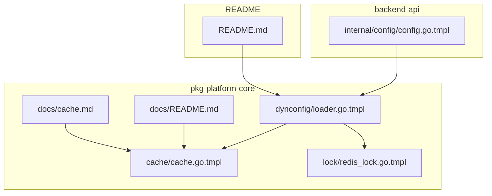
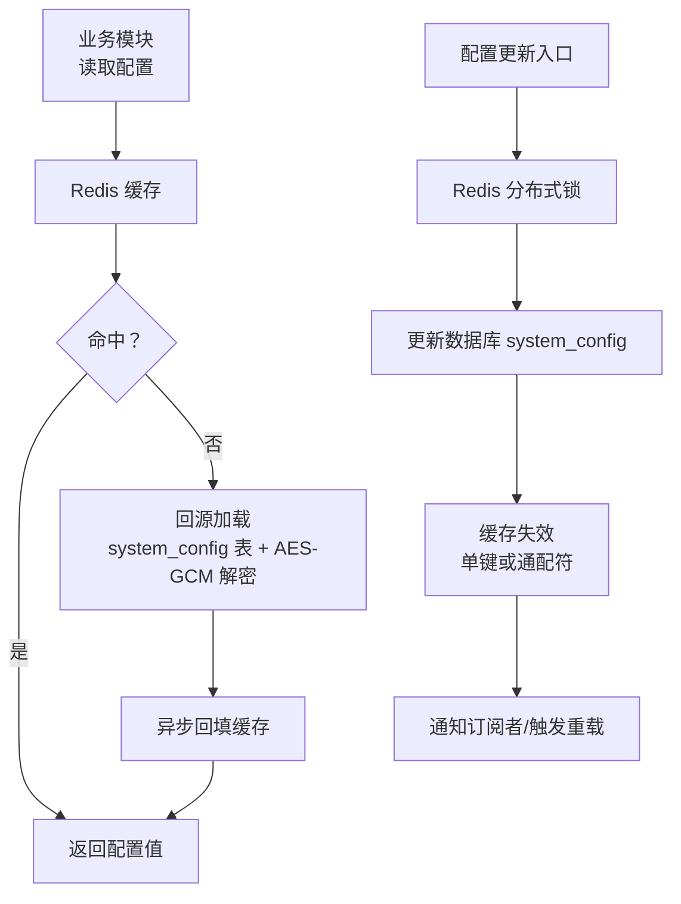
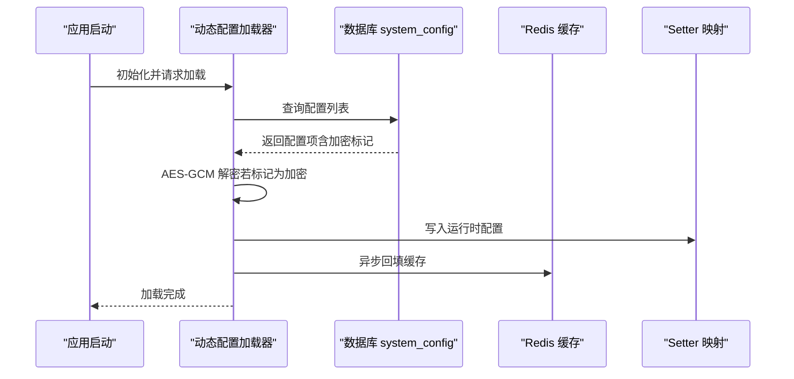
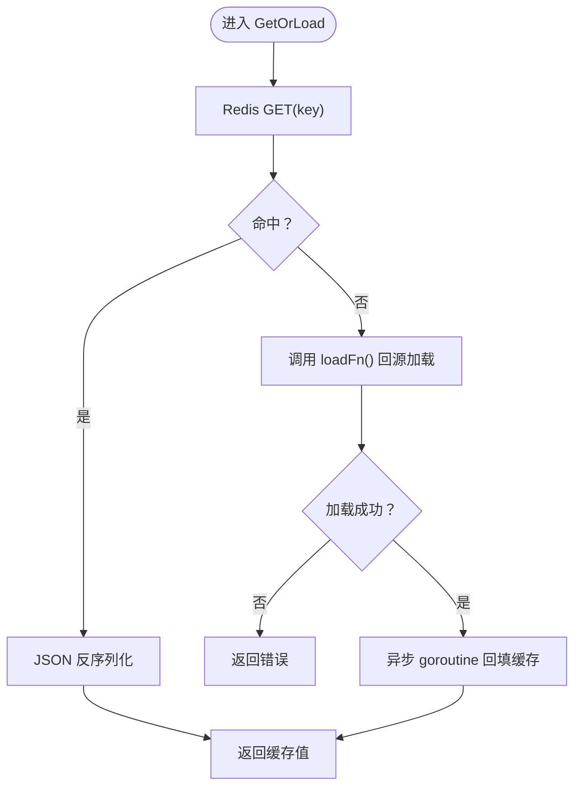
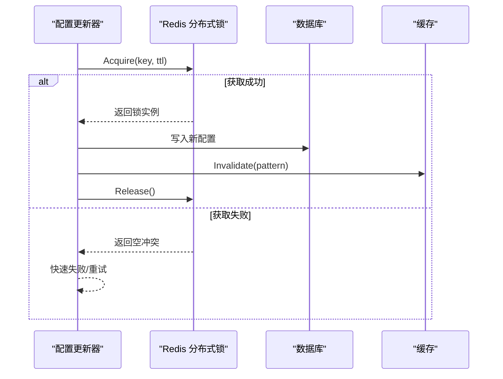
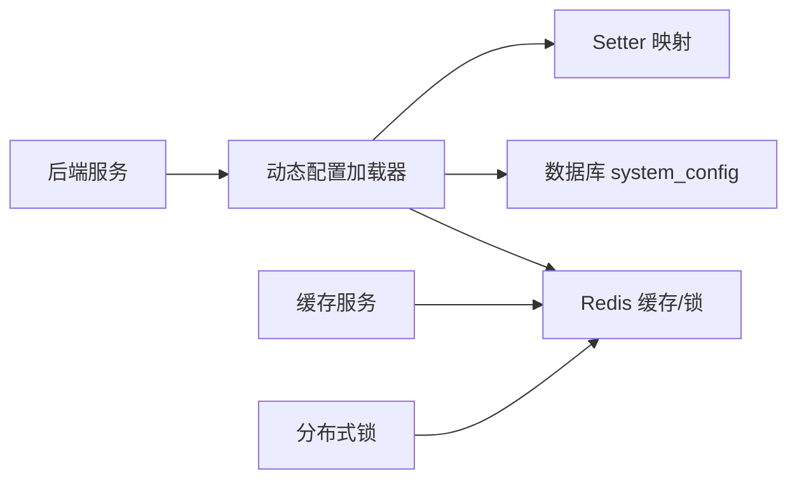

# 动态配置

<cite>
**本文引用的文件**
- [loader.go.tmpl](file://templates/files/pkg-platform-core/dynconfig/loader.go.tmpl)
- [cache.go.tmpl](file://templates/files/pkg-platform-core/cache/cache.go.tmpl)
- [redis_lock.go.tmpl](file://templates/files/pkg-platform-core/lock/redis_lock.go.tmpl)
- [config.go.tmpl](file://templates/files/backend-api/internal/config/config.go.tmpl)
- [README.md](file://templates/files/pkg-platform-core/docs/README.md)
- [cache.md](file://templates/files/pkg-platform-core/docs/cache.md)
- [README.md](file://templates/files/README.md)
</cite>

## 目录
1. [简介](#简介)
2. [项目结构](#项目结构)
3. [核心组件](#核心组件)
4. [架构总览](#架构总览)
5. [详细组件分析](#详细组件分析)
6. [依赖关系分析](#依赖关系分析)
7. [性能考量](#性能考量)
8. [故障排除指南](#故障排除指南)
9. [结论](#结论)
10. [附录](#附录)

## 简介
本文件系统性阐述平台动态配置子系统的设计与实现，重点覆盖以下方面：
- 动态配置的加载机制与回源策略
- 缓存策略与失效模式（单键与通配符）
- 实时更新与版本控制、回滚思路
- 配置源管理与变更监听机制
- 并发访问控制与一致性保障
- 性能优化与最佳实践
- 使用场景、集成示例与故障排除

该系统以 Redis 作为缓存层，以数据库（system_config 表）为权威回源，结合分布式互斥锁与缓存失效策略，实现高可用、低延迟的动态配置读取与热更新。

## 项目结构
动态配置相关代码位于模板工程的 pkg-platform-core 子模块中，核心文件如下：
- 动态配置加载器：dynconfig/loader.go.tmpl
- 缓存服务：cache/cache.go.tmpl
- 分布式锁：lock/redis_lock.go.tmpl
- 后端服务中的配置注入示例：backend-api/internal/config/config.go.tmpl
- 文档：docs/cache.md、docs/README.md
- 顶层 README 对动态配置的定位与使用说明

**图表来源**
- [loader.go.tmpl](file://templates/files/pkg-platform-core/dynconfig/loader.go.tmpl)
- [cache.go.tmpl](file://templates/files/pkg-platform-core/cache/cache.go.tmpl)
- [redis_lock.go.tmpl](file://templates/files/pkg-platform-core/lock/redis_lock.go.tmpl)
- [config.go.tmpl](file://templates/files/backend-api/internal/config/config.go.tmpl)
- [README.md](file://templates/files/pkg-platform-core/docs/README.md)
- [cache.md](file://templates/files/pkg-platform-core/docs/cache.md)
- [README.md](file://templates/files/README.md)

**章节来源**
- [README.md](file://templates/files/README.md)
- [README.md](file://templates/files/pkg-platform-core/docs/README.md)

## 核心组件
- 动态配置加载器（dynconfig/loader.go.tmpl）
  - 职责：在应用启动时从数据库 system_config 表加载配置，进行 AES-GCM 解密，并通过 setter 映射写入各模块的运行时配置。
  - 关键点：支持多配置项批量加载与解密，确保敏感凭据安全；通过外部注入的 setter 实现“写入运行时”的解耦。
- 缓存服务（cache/cache.go.tmpl）
  - 职责：提供 Cache-Aside 模式，包含泛型 GetOrLoad、直接 Set/Get、单键与通配符失效等能力。
  - 关键点：miss 时回源加载，成功后异步回填缓存，不阻塞主流程；通配符失效采用 SCAN 避免阻塞。
- 分布式锁（lock/redis_lock.go.tmpl）
  - 职责：提供基于 Redis SETNX + Lua 原子释放的分布式互斥锁，用于配置更新过程中的串行化与一致性。
  - 关键点：仅释放自身持有的锁，避免误删；支持自动过期，防止死锁。
- 后端服务配置注入（backend-api/internal/config/config.go.tmpl）
  - 职责：演示如何在业务服务中注入 masterKey 与 setter 映射，完成动态配置的加载与使用。

**章节来源**
- [loader.go.tmpl](file://templates/files/pkg-platform-core/dynconfig/loader.go.tmpl)
- [cache.go.tmpl](file://templates/files/pkg-platform-core/cache/cache.go.tmpl)
- [redis_lock.go.tmpl](file://templates/files/pkg-platform-core/lock/redis_lock.go.tmpl)
- [config.go.tmpl](file://templates/files/backend-api/internal/config/config.go.tmpl)

## 架构总览
动态配置系统采用“缓存优先 + 数据库回源 + 分布式锁串行化更新”的架构，读路径强调低延迟，写路径强调一致性和安全性。

**图表来源**
- [loader.go.tmpl](file://templates/files/pkg-platform-core/dynconfig/loader.go.tmpl)
- [cache.go.tmpl](file://templates/files/pkg-platform-core/cache/cache.go.tmpl)
- [redis_lock.go.tmpl](file://templates/files/pkg-platform-core/lock/redis_lock.go.tmpl)

## 详细组件分析

### 动态配置加载器（dynconfig/loader.go.tmpl）
- 工作原理
  - 启动时扫描/拉取 system_config 表配置，对标记为加密的配置项执行 AES-GCM 解密。
  - 通过外部传入的 setter 映射，将配置写入到各模块的运行时存储（例如全局变量、单例对象或上下文）。
  - 支持增量更新：仅对变更项执行解密与写入，减少不必要的开销。
- 配置源管理
  - 权威源：数据库 system_config 表，包含配置键、值、加密标记、版本号等元数据。
  - 缓存源：Redis，键空间建议以 cache:config:<key> 命名，TTL 通常为数分钟。
- 变更监听机制
  - 仓库未提供内置的变更监听器。推荐方案：
    - 数据库层：触发器或变更日志（CDC）+ 消息队列，推送变更事件。
    - 应用层：定时轮询或基于锁的单实例更新，配合缓存失效。
- 版本控制与回滚
  - 版本字段可用于识别最新配置；回滚可通过写入历史版本或对比差异后恢复。
  - 由于当前模板未内置版本回滚逻辑，建议在业务侧维护版本映射与回滚策略。

**图表来源**
- [loader.go.tmpl](file://templates/files/pkg-platform-core/dynconfig/loader.go.tmpl)
- [cache.go.tmpl](file://templates/files/pkg-platform-core/cache/cache.go.tmpl)

**章节来源**
- [loader.go.tmpl](file://templates/files/pkg-platform-core/dynconfig/loader.go.tmpl)

### 缓存策略（cache/cache.go.tmpl）
- Cache-Aside 模式
  - 读：先查 Redis，命中则直接返回；未命中则回源加载，成功后异步回填缓存。
  - 写：提供直接 Set/Get；支持单键失效与通配符失效（SCAN 遍历，避免阻塞）。
- 失效策略
  - 单键失效：适用于定向刷新某个配置项。
  - 通配符失效：适用于批量刷新（如 cache:config:*），常用于广播式配置变更。
- 性能特性
  - miss 时不阻塞主流程，回填在后台 goroutine 中进行，降低尾延迟。
  - 反序列化失败视为 miss，保证一致性。

**图表来源**
- [cache.go.tmpl](file://templates/files/pkg-platform-core/cache/cache.go.tmpl)

**章节来源**
- [cache.go.tmpl](file://templates/files/pkg-platform-core/cache/cache.go.tmpl)
- [cache.md](file://templates/files/pkg-platform-core/docs/cache.md)

### 分布式锁（lock/redis_lock.go.tmpl）
- 用途
  - 在配置更新期间，确保同一时刻只有一个实例执行写库与回填缓存，避免竞态与脏写。
- 原理
  - 使用 SETNX 获取锁，Lua 脚本原子释放，仅删除持有者 value 匹配的键。
  - 自动过期防止死锁，适合短时串行化更新。
- 并发控制
  - 更新前加锁，更新后释放；失败时快速返回，避免阻塞其他实例。

**图表来源**
- [redis_lock.go.tmpl](file://templates/files/pkg-platform-core/lock/redis_lock.go.tmpl)

**章节来源**
- [redis_lock.go.tmpl](file://templates/files/pkg-platform-core/lock/redis_lock.go.tmpl)

### 后端服务集成示例（backend-api/internal/config/config.go.tmpl）
- 作用
  - 展示如何在业务服务中注入 masterKey 与 setter 映射，完成动态配置的加载与使用。
- 关键点
  - masterKey 用于 AES-GCM 解密；
  - setter 映射将配置键映射到具体模块的写入接口，便于集中管理。

**章节来源**
- [config.go.tmpl](file://templates/files/backend-api/internal/config/config.go.tmpl)

## 依赖关系分析
- 组件耦合
  - 动态配置加载器依赖缓存服务与分布式锁，用于高效读取与安全更新。
  - 后端服务通过 setter 注入与加载器解耦，提升可测试性与扩展性。
- 外部依赖
  - Redis：缓存与分布式锁；
  - 数据库：system_config 表作为权威源；
  - AES-GCM：敏感配置的解密。
- 潜在环路
  - 当前模板未发现循环依赖；建议在业务侧避免在 setter 中引入对加载器的反向依赖。

**图表来源**
- [loader.go.tmpl](file://templates/files/pkg-platform-core/dynconfig/loader.go.tmpl)
- [cache.go.tmpl](file://templates/files/pkg-platform-core/cache/cache.go.tmpl)
- [redis_lock.go.tmpl](file://templates/files/pkg-platform-core/lock/redis_lock.go.tmpl)
- [config.go.tmpl](file://templates/files/backend-api/internal/config/config.go.tmpl)

**章节来源**
- [loader.go.tmpl](file://templates/files/pkg-platform-core/dynconfig/loader.go.tmpl)
- [cache.go.tmpl](file://templates/files/pkg-platform-core/cache/cache.go.tmpl)
- [redis_lock.go.tmpl](file://templates/files/pkg-platform-core/lock/redis_lock.go.tmpl)
- [config.go.tmpl](file://templates/files/backend-api/internal/config/config.go.tmpl)

## 性能考量
- 读路径
  - 优先命中缓存，miss 时回源加载，异步回填，避免阻塞主流程。
  - 建议合理设置 TTL，平衡新鲜度与缓存命中率。
- 写路径
  - 使用分布式锁串行化更新，避免多实例并发写入导致的抖动。
  - 批量失效采用通配符扫描，避免一次性删除大量键造成阻塞。
- 安全与一致性
  - 敏感配置使用 AES-GCM 加密存储，解密仅在加载器内执行。
  - setter 写入应具备幂等性，避免重复写入引发副作用。

[本节为通用性能指导，无需特定文件引用]

## 故障排除指南
- 读取不到配置
  - 检查 Redis 是否连通与键是否存在；确认缓存是否被误失效。
  - 若缓存 miss，检查回源加载是否成功（数据库连接、权限、system_config 表内容）。
- 配置更新未生效
  - 确认更新流程是否加锁并正确执行了缓存失效。
  - 检查通配符失效是否覆盖到目标键空间。
- 并发冲突
  - 若出现频繁“获取锁失败”，考虑增加重试间隔或降低更新频率。
  - 检查锁的 TTL 设置，避免过短导致锁提前过期。
- 解密失败
  - 确认 masterKey 正确且与存储时一致；
  - 检查配置项的加密标记与实际值是否匹配。

**章节来源**
- [cache.go.tmpl](file://templates/files/pkg-platform-core/cache/cache.go.tmpl)
- [redis_lock.go.tmpl](file://templates/files/pkg-platform-core/lock/redis_lock.go.tmpl)
- [loader.go.tmpl](file://templates/files/pkg-platform-core/dynconfig/loader.go.tmpl)

## 结论
该动态配置系统通过“缓存优先 + 数据库回源 + 分布式锁”实现了高性能、强一致性的配置读取与更新。结合模板化的缓存与锁实现，开发者可以快速集成并扩展到各类业务场景。建议在生产环境中补充变更监听、版本回滚与可观测性指标，以进一步增强系统的稳定性与可运维性。

[本节为总结性内容，无需特定文件引用]

## 附录

### 使用场景与集成步骤
- 使用场景
  - 运行期开关（功能开关、实验性功能）、限流阈值、第三方凭据等。
- 集成步骤
  - 在业务服务中注入 masterKey 与 setter 映射；
  - 应用启动时调用加载器初始化配置；
  - 读取配置时优先使用缓存，miss 时回源；
  - 更新配置时加锁，写库后失效相关缓存键。

**章节来源**
- [config.go.tmpl](file://templates/files/backend-api/internal/config/config.go.tmpl)
- [loader.go.tmpl](file://templates/files/pkg-platform-core/dynconfig/loader.go.tmpl)
- [README.md](file://templates/files/README.md)

### 最佳实践清单
- 键命名规范：cache:config:<key>，便于统一失效与监控。
- TTL 设定：根据配置更新频率与一致性要求选择合适 TTL。
- 失效策略：优先单键失效，必要时使用通配符扫描。
- 更新流程：加锁 -> 写库 -> 失效 -> 通知（可选）。
- 安全：敏感配置必须加密存储，解密仅在加载器内执行。

**章节来源**
- [cache.md](file://templates/files/pkg-platform-core/docs/cache.md)
- [loader.go.tmpl](file://templates/files/pkg-platform-core/dynconfig/loader.go.tmpl)