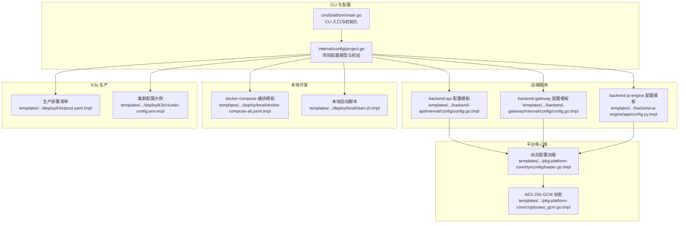
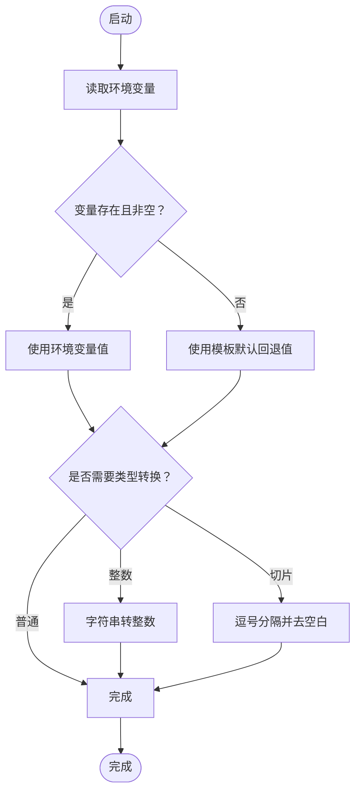
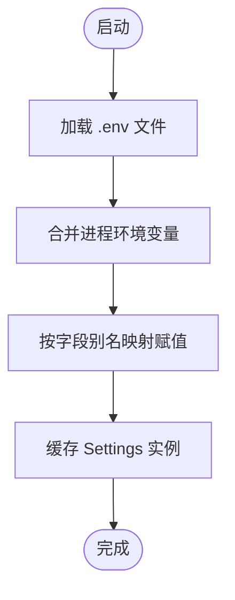
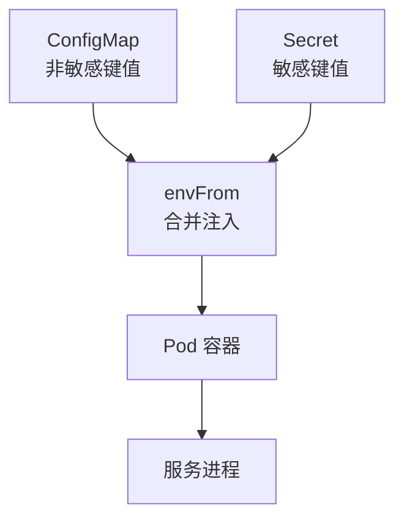
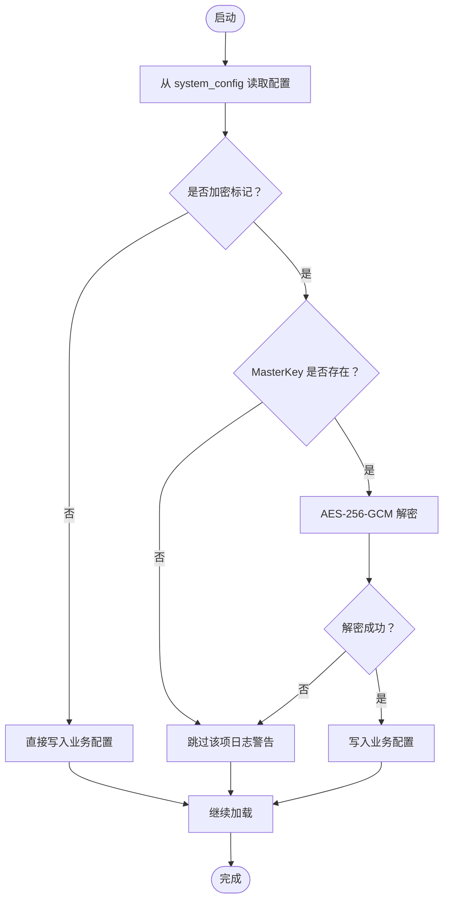
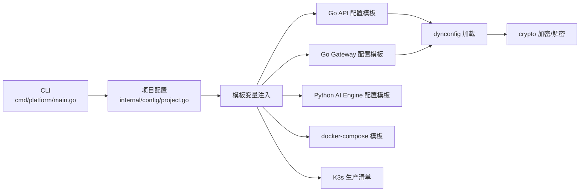

# 环境变量管理

<cite>
**本文档引用的文件**
- [cmd/platform/main.go](file://cmd/platform/main.go)
- [internal/config/project.go](file://internal/config/project.go)
- [templates/files/backend-api/internal/config/config.go.tmpl](file://templates/files/backend-api/internal/config/config.go.tmpl)
- [templates/files/backend-gateway/internal/config/config.go.tmpl](file://templates/files/backend-gateway/internal/config/config.go.tmpl)
- [templates/files/backend-ai-engine/app/config.py.tmpl](file://templates/files/backend-ai-engine/app/config.py.tmpl)
- [templates/files/deploy/local/docker-compose-all.yaml.tmpl](file://templates/files/deploy/local/docker-compose-all.yaml.tmpl)
- [templates/files/deploy/local/start.sh.tmpl](file://templates/files/deploy/local/start.sh.tmpl)
- [templates/files/deploy/k3s/prod.yaml.tmpl](file://templates/files/deploy/k3s/prod.yaml.tmpl)
- [templates/files/deploy/k3s/cluster-config.env.tmpl](file://templates/files/deploy/k3s/cluster-config.env.tmpl)
- [templates/files/pkg-platform-core/dynconfig/loader.go.tmpl](file://templates/files/pkg-platform-core/dynconfig/loader.go.tmpl)
- [templates/files/pkg-platform-core/crypto/aes_gcm.go.tmpl](file://templates/files/pkg-platform-core/crypto/aes_gcm.go.tmpl)
</cite>

## 目录
1. [简介](#简介)
2. [项目结构](#项目结构)
3. [核心组件](#核心组件)
4. [架构总览](#架构总览)
5. [详细组件分析](#详细组件分析)
6. [依赖关系分析](#依赖关系分析)
7. [性能考虑](#性能考虑)
8. [故障排查指南](#故障排查指南)
9. [结论](#结论)
10. [附录](#附录)

## 简介
本文件系统性阐述该脚手架工程中的“环境变量管理”体系，覆盖以下主题：
- 环境变量的定义、优先级与解析机制
- 开发、测试、生产三类环境的配置策略
- 容器化部署中的环境变量传递、Secret 管理与配置注入
- 安全存储、加密传输与访问控制
- 最佳实践、命名规范与调试技巧

## 项目结构
该工程采用“模板驱动 + 本地/容器双环境”的方式生成项目骨架，并在模板中内置了环境变量读取与注入逻辑。关键位置如下：
- CLI 入口与初始化流程：用于生成项目并提示用户填写基础配置
- 各语言服务的配置加载模板：Go 与 Python 服务均通过环境变量读取配置
- 本地开发编排与启动脚本：通过 .env 文件注入环境变量
- K3s 生产部署清单：通过 ConfigMap/Secret 注入非敏感与敏感配置
- 平台核心库：提供动态配置加载与 AES-256-GCM 加密能力



图表来源
- [cmd/platform/main.go:1-98](file://cmd/platform/main.go#L1-L98)
- [internal/config/project.go:1-121](file://internal/config/project.go#L1-L121)
- [templates/files/backend-api/internal/config/config.go.tmpl:1-82](file://templates/files/backend-api/internal/config/config.go.tmpl#L1-L82)
- [templates/files/backend-gateway/internal/config/config.go.tmpl:1-127](file://templates/files/backend-gateway/internal/config/config.go.tmpl#L1-L127)
- [templates/files/backend-ai-engine/app/config.py.tmpl:1-31](file://templates/files/backend-ai-engine/app/config.py.tmpl#L1-L31)
- [templates/files/deploy/local/docker-compose-all.yaml.tmpl:1-48](file://templates/files/deploy/local/docker-compose-all.yaml.tmpl#L1-L48)
- [templates/files/deploy/local/start.sh.tmpl:1-242](file://templates/files/deploy/local/start.sh.tmpl#L1-L242)
- [templates/files/deploy/k3s/prod.yaml.tmpl:1-151](file://templates/files/deploy/k3s/prod.yaml.tmpl#L1-L151)
- [templates/files/deploy/k3s/cluster-config.env.tmpl:1-20](file://templates/files/deploy/k3s/cluster-config.env.tmpl#L1-L20)
- [templates/files/pkg-platform-core/dynconfig/loader.go.tmpl:1-136](file://templates/files/pkg-platform-core/dynconfig/loader.go.tmpl#L1-L136)
- [templates/files/pkg-platform-core/crypto/aes_gcm.go.tmpl:1-72](file://templates/files/pkg-platform-core/crypto/aes_gcm.go.tmpl#L1-L72)

章节来源
- [cmd/platform/main.go:1-98](file://cmd/platform/main.go#L1-L98)
- [internal/config/project.go:1-121](file://internal/config/project.go#L1-L121)

## 核心组件
- CLI 与项目配置：CLI 负责引导用户输入并生成项目；项目配置模型包含端口、特性开关、模块路径等，这些值将注入到各模板中，间接决定环境变量的默认值与可用范围。
- 服务配置加载：
  - Go 服务通过模板函数读取环境变量，提供默认回退值与类型转换（整数、切片等）。
  - Python 服务通过 Pydantic Settings 从 .env 文件读取环境变量。
- 本地开发：通过 .env 文件与启动脚本将变量注入到进程；docker-compose 模板用于数据库等依赖服务的环境注入。
- 生产部署：通过 K3s 清单将非敏感配置注入 ConfigMap，敏感配置注入 Secret；envFrom 将两者合并注入容器。

章节来源
- [internal/config/project.go:61-89](file://internal/config/project.go#L61-L89)
- [templates/files/backend-api/internal/config/config.go.tmpl:42-82](file://templates/files/backend-api/internal/config/config.go.tmpl#L42-L82)
- [templates/files/backend-gateway/internal/config/config.go.tmpl:52-127](file://templates/files/backend-gateway/internal/config/config.go.tmpl#L52-L127)
- [templates/files/backend-ai-engine/app/config.py.tmpl:9-31](file://templates/files/backend-ai-engine/app/config.py.tmpl#L9-L31)
- [templates/files/deploy/local/start.sh.tmpl:108-146](file://templates/files/deploy/local/start.sh.tmpl#L108-L146)
- [templates/files/deploy/local/docker-compose-all.yaml.tmpl:17-28](file://templates/files/deploy/local/docker-compose-all.yaml.tmpl#L17-L28)
- [templates/files/deploy/k3s/prod.yaml.tmpl:57-59](file://templates/files/deploy/k3s/prod.yaml.tmpl#L57-L59)

## 架构总览
下图展示了从 CLI 到服务运行时的环境变量流通过程，以及本地与生产的差异化注入方式。

```mermaid
sequenceDiagram
participant CLI as "CLI<br/>cmd/platform/main.go"
participant CFG as "项目配置<br/>internal/config/project.go"
participant TPL as "模板渲染<br/>各服务/部署模板"
participant DEV as "本地开发<br/>start.sh/.env"
participant K3S as "K3s 部署<br/>ConfigMap/Secret"
participant SVC as "服务进程<br/>Go/Python"
CLI->>CFG : 生成项目配置
CFG-->>TPL : 注入模板变量
TPL-->>DEV : 生成 .env 与编排文件
TPL-->>K3S : 生成部署清单
DEV->>SVC : set -a; source .env; 启动进程
K3S->>SVC : envFrom(ConfigMap/Secret) 注入
SVC-->>SVC : 读取环境变量并初始化
```

图表来源
- [cmd/platform/main.go:48-81](file://cmd/platform/main.go#L48-L81)
- [internal/config/project.go:61-89](file://internal/config/project.go#L61-L89)
- [templates/files/deploy/local/start.sh.tmpl:117](file://templates/files/deploy/local/start.sh.tmpl#L117)
- [templates/files/deploy/k3s/prod.yaml.tmpl:57-59](file://templates/files/deploy/k3s/prod.yaml.tmpl#L57-L59)

## 详细组件分析

### Go 服务配置加载（API/Gateway）
- 读取顺序与优先级
  - 读取顺序：进程环境变量 > 模板默认值（来自项目配置）
  - 优先级：运行时环境变量 > 模板默认值（整型/切片有显式回退）
- 关键实现要点
  - 提供统一的 getEnv/getEnvInt/getEnvSlice/getEnvSecret 函数族
  - 对敏感项（如 JWT_SECRET）采用 panic 强制要求注入，防止静默失败
  - 对非敏感项提供合理默认值，便于本地快速启动
- 典型键位
  - 服务器端口、应用环境、数据库连接、Redis 连接、内部密钥、CORS 来源等



图表来源
- [templates/files/backend-api/internal/config/config.go.tmpl:42-82](file://templates/files/backend-api/internal/config/config.go.tmpl#L42-L82)
- [templates/files/backend-gateway/internal/config/config.go.tmpl:52-127](file://templates/files/backend-gateway/internal/config/config.go.tmpl#L52-L127)

章节来源
- [templates/files/backend-api/internal/config/config.go.tmpl:42-82](file://templates/files/backend-api/internal/config/config.go.tmpl#L42-L82)
- [templates/files/backend-gateway/internal/config/config.go.tmpl:52-127](file://templates/files/backend-gateway/internal/config/config.go.tmpl#L52-L127)

### Python 服务配置加载（AI Engine）
- 读取方式：Pydantic Settings 通过 env_file 指向 .env 文件
- 读取顺序与优先级
  - 读取顺序：进程环境变量 > .env 文件 > 模板默认值
  - 优先级：运行时环境变量 > .env > 模板默认值
- 关键实现要点
  - 通过 SettingsConfigDict 指定 env_file 与额外字段处理策略
  - 使用 LRU 缓存复用 Settings 实例，减少重复解析开销



图表来源
- [templates/files/backend-ai-engine/app/config.py.tmpl:9-31](file://templates/files/backend-ai-engine/app/config.py.tmpl#L9-L31)

章节来源
- [templates/files/backend-ai-engine/app/config.py.tmpl:9-31](file://templates/files/backend-ai-engine/app/config.py.tmpl#L9-L31)

### 本地开发环境（.env 与启动脚本）
- .env 注入流程
  - 本地启动脚本在启动各服务前，执行 set -a; source .env; set +a，将 .env 中的变量导出到子进程
  - docker-compose 模板通过 environment 字段注入数据库等依赖服务的环境变量
- 优势
  - 无需手动在每个终端导出变量，集中管理
  - 与服务二进制/解释器隔离，避免污染全局 shell 环境

```mermaid
sequenceDiagram
participant SH as "start.sh"
participant ENV as ".env"
participant BIN as "二进制/解释器"
SH->>ENV : source .env
ENV-->>SH : 导出变量
SH->>BIN : set -a; source .env; set +a; 启动
BIN-->>BIN : 读取环境变量初始化
```

图表来源
- [templates/files/deploy/local/start.sh.tmpl:117](file://templates/files/deploy/local/start.sh.tmpl#L117)
- [templates/files/deploy/local/docker-compose-all.yaml.tmpl:17-28](file://templates/files/deploy/local/docker-compose-all.yaml.tmpl#L17-L28)

章节来源
- [templates/files/deploy/local/start.sh.tmpl:108-146](file://templates/files/deploy/local/start.sh.tmpl#L108-L146)
- [templates/files/deploy/local/docker-compose-all.yaml.tmpl:17-28](file://templates/files/deploy/local/docker-compose-all.yaml.tmpl#L17-L28)

### 生产环境（K3s ConfigMap/Secret 注入）
- 非敏感配置：通过 ConfigMap 注入（如端口、服务地址、CORS 来源等）
- 敏感配置：通过 Secret 注入（如 JWT_SECRET、INTERNAL_API_SECRET、CONFIG_MASTER_KEY、数据库密码等）
- 注入方式：envFrom 同时引用 ConfigMap 与 Secret，形成最终容器环境变量
- 部署前准备：模板注释明确要求提前创建 Secret



图表来源
- [templates/files/deploy/k3s/prod.yaml.tmpl:8-41](file://templates/files/deploy/k3s/prod.yaml.tmpl#L8-L41)
- [templates/files/deploy/k3s/prod.yaml.tmpl:57-59](file://templates/files/deploy/k3s/prod.yaml.tmpl#L57-L59)

章节来源
- [templates/files/deploy/k3s/prod.yaml.tmpl:1-151](file://templates/files/deploy/k3s/prod.yaml.tmpl#L1-L151)

### 动态配置与安全存储（MasterKey + AES-256-GCM）
- 动态配置加载
  - 应用启动时从 system_config 表读取配置项，加密项使用 MasterKey 解密
  - 优雅降级：缺失或解密失败不阻断启动，仅记录日志并跳过
  - 仅启动时加载一次，不支持热更新
- 加密实现
  - 使用 AES-256-GCM，密文格式为 base64(nonce_12 + ciphertext + tag_16)
  - 密钥派生：SHA-256 派生固定 32 字节密钥
  - Go 与 Python 端对齐，保证跨语言一致性



图表来源
- [templates/files/pkg-platform-core/dynconfig/loader.go.tmpl:64-116](file://templates/files/pkg-platform-core/dynconfig/loader.go.tmpl#L64-L116)
- [templates/files/pkg-platform-core/crypto/aes_gcm.go.tmpl:24-71](file://templates/files/pkg-platform-core/crypto/aes_gcm.go.tmpl#L24-L71)

章节来源
- [templates/files/pkg-platform-core/dynconfig/loader.go.tmpl:1-136](file://templates/files/pkg-platform-core/dynconfig/loader.go.tmpl#L1-L136)
- [templates/files/pkg-platform-core/crypto/aes_gcm.go.tmpl:1-72](file://templates/files/pkg-platform-core/crypto/aes_gcm.go.tmpl#L1-L72)

## 依赖关系分析
- CLI 与模板：CLI 生成项目配置，模板将配置变量注入到各服务与部署清单
- 服务与环境：Go/Python 服务均依赖环境变量进行初始化；本地通过 .env，生产通过 ConfigMap/Secret
- 平台核心库：dynconfig 依赖数据库与 MasterKey；crypto 为对称加解密实现



图表来源
- [cmd/platform/main.go:48-81](file://cmd/platform/main.go#L48-L81)
- [internal/config/project.go:61-89](file://internal/config/project.go#L61-L89)
- [templates/files/pkg-platform-core/dynconfig/loader.go.tmpl:64-116](file://templates/files/pkg-platform-core/dynconfig/loader.go.tmpl#L64-L116)
- [templates/files/pkg-platform-core/crypto/aes_gcm.go.tmpl:24-71](file://templates/files/pkg-platform-core/crypto/aes_gcm.go.tmpl#L24-L71)

章节来源
- [cmd/platform/main.go:1-98](file://cmd/platform/main.go#L1-L98)
- [internal/config/project.go:1-121](file://internal/config/project.go#L1-L121)

## 性能考虑
- 环境变量读取成本极低，通常可忽略
- Python Settings 使用 LRU 缓存复用配置实例，避免重复解析
- Go 侧通过统一的 getEnv* 函数族减少分支判断与重复解析
- 动态配置仅在启动时加载，避免运行期频繁 IO

## 故障排查指南
- 症状：服务启动报错提示缺少敏感密钥
  - 排查：确认是否在 K3s Secret 或本地 .env 中正确注入；检查 envFrom 是否同时引用了 ConfigMap 与 Secret
  - 参考：Gateway 模板对敏感项采用 panic 强制要求注入
- 症状：数据库/Redis 连接失败
  - 排查：核对环境变量键位（主机、端口、密码、DB 索引）是否与模板默认一致；确认本地 .env 或生产 Secret 是否覆盖
- 症状：CORS 或上游服务地址异常
  - 排查：核对 CORS_ORIGINS 与服务地址变量；确认本地 .env 与生产 ConfigMap 的值
- 症状：动态配置未生效或解密失败
  - 排查：确认 MasterKey 是否注入；确认 system_config 表中加密标记与密文格式；查看启动日志中的跳过/警告信息
- 调试技巧
  - 本地：在启动脚本中临时 echo 环境变量，确认 .env 注入链路
  - 生产：使用 kubectl exec 进入 Pod，打印环境变量与关键配置项
  - 动态配置：在业务初始化阶段打印已加载的键值，验证解密与写入流程

章节来源
- [templates/files/backend-gateway/internal/config/config.go.tmpl:95-101](file://templates/files/backend-gateway/internal/config/config.go.tmpl#L95-L101)
- [templates/files/deploy/k3s/prod.yaml.tmpl:25-41](file://templates/files/deploy/k3s/prod.yaml.tmpl#L25-L41)
- [templates/files/pkg-platform-core/dynconfig/loader.go.tmpl:78-116](file://templates/files/pkg-platform-core/dynconfig/loader.go.tmpl#L78-L116)

## 结论
该工程通过“模板 + 环境变量”的组合，实现了跨语言、跨环境的一致配置管理：
- 本地开发以 .env 为中心，简单直观
- 生产环境以 ConfigMap/Secret 为核心，安全可控
- 平台核心库提供了动态配置与对称加密能力，满足高安全场景需求
- 建议在团队内统一命名规范与注入流程，配合 CI/CD 自动化，进一步提升可靠性与可维护性

## 附录

### 环境变量优先级与解析机制
- 读取顺序
  - Python：进程环境变量 > .env > 模板默认值
  - Go：进程环境变量 > 模板默认值（整数/切片有显式回退）
- 解析细节
  - 整数：字符串转整数失败则回退
  - 切片：逗号分隔并去除空白
  - 敏感项：未注入时 Gateway 模板会直接导致启动失败

章节来源
- [templates/files/backend-ai-engine/app/config.py.tmpl:9-31](file://templates/files/backend-ai-engine/app/config.py.tmpl#L9-L31)
- [templates/files/backend-api/internal/config/config.go.tmpl:74-81](file://templates/files/backend-api/internal/config/config.go.tmpl#L74-L81)
- [templates/files/backend-gateway/internal/config/config.go.tmpl:112-126](file://templates/files/backend-gateway/internal/config/config.go.tmpl#L112-L126)

### 不同环境的配置策略
- 开发（local）
  - 使用 .env 注入变量；docker-compose 注入数据库等依赖服务的环境
  - 通过启动脚本 set -a; source .env; set +a 将变量导出到子进程
- 测试（建议沿用开发策略）
  - 可复用 .env；若需隔离，可新增 .env.test 并在脚本中切换
- 生产（k3s）
  - 非敏感：ConfigMap
  - 敏感：Secret
  - 通过 envFrom 合并注入；部署前确保 Secret 已创建

章节来源
- [templates/files/deploy/local/start.sh.tmpl:117](file://templates/files/deploy/local/start.sh.tmpl#L117)
- [templates/files/deploy/local/docker-compose-all.yaml.tmpl:17-28](file://templates/files/deploy/local/docker-compose-all.yaml.tmpl#L17-L28)
- [templates/files/deploy/k3s/prod.yaml.tmpl:57-59](file://templates/files/deploy/k3s/prod.yaml.tmpl#L57-L59)

### 容器化部署中的环境变量传递与 Secret 管理
- 传递方式：envFrom 同时引用 ConfigMap 与 Secret
- Secret 管理：部署前使用 kubectl 创建，键位包含 JWT_SECRET、INTERNAL_API_SECRET、CONFIG_MASTER_KEY、MYSQL_PASSWORD 等
- 访问控制：通过 Kubernetes RBAC 限制对 Secret 的读取权限

章节来源
- [templates/files/deploy/k3s/prod.yaml.tmpl:25-41](file://templates/files/deploy/k3s/prod.yaml.tmpl#L25-L41)

### 安全存储、加密传输与访问控制
- 动态配置加密：AES-256-GCM，密文格式 base64(nonce_12 + ciphertext + tag_16)
- 密钥派生：SHA-256，Go 与 Python 端对齐
- 传输与存储：密文存储于 system_config 表；传输通过网络层 TLS 保护
- 访问控制：仅授予必要人员创建/编辑 Secret 的权限；MasterKey 严格保密

章节来源
- [templates/files/pkg-platform-core/crypto/aes_gcm.go.tmpl:24-71](file://templates/files/pkg-platform-core/crypto/aes_gcm.go.tmpl#L24-L71)
- [templates/files/pkg-platform-core/dynconfig/loader.go.tmpl:64-116](file://templates/files/pkg-platform-core/dynconfig/loader.go.tmpl#L64-L116)

### 最佳实践与命名规范
- 命名规范
  - 采用大写蛇形命名（如 APP_ENV、API_PORT、JWT_SECRET）
  - 敏感项统一前缀（如 INTERNAL_、CONFIG_、JWT_）
- 注入策略
  - 非敏感项放入 ConfigMap；敏感项放入 Secret
  - 本地 .env 仅存放开发所需变量；生产通过 Secret 管理
- 版本与变更
  - 变更 ConfigMap/Secret 后需滚动重启相关 Pod
  - 动态配置仅启动时生效，不支持热更新

### 调试技巧
- 本地调试
  - 在启动脚本中 echo 环境变量，确认 .env 注入链路
  - 使用 docker-compose logs 查看依赖服务健康状态
- 生产调试
  - kubectl exec 进入 Pod，打印环境变量与关键配置项
  - 查看应用启动日志，关注 dynconfig 的加载/跳过/解密失败信息