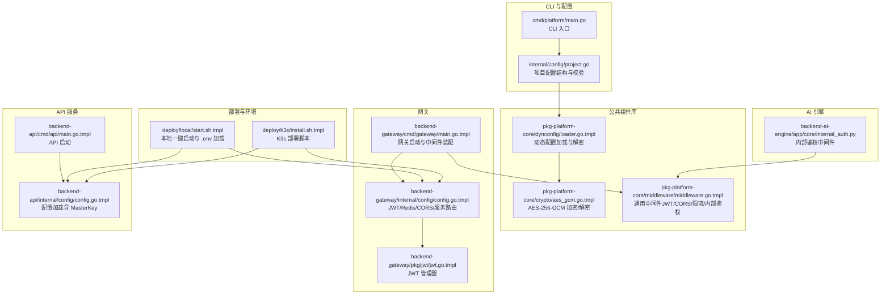
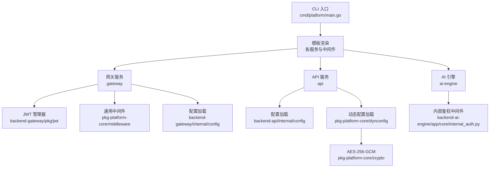
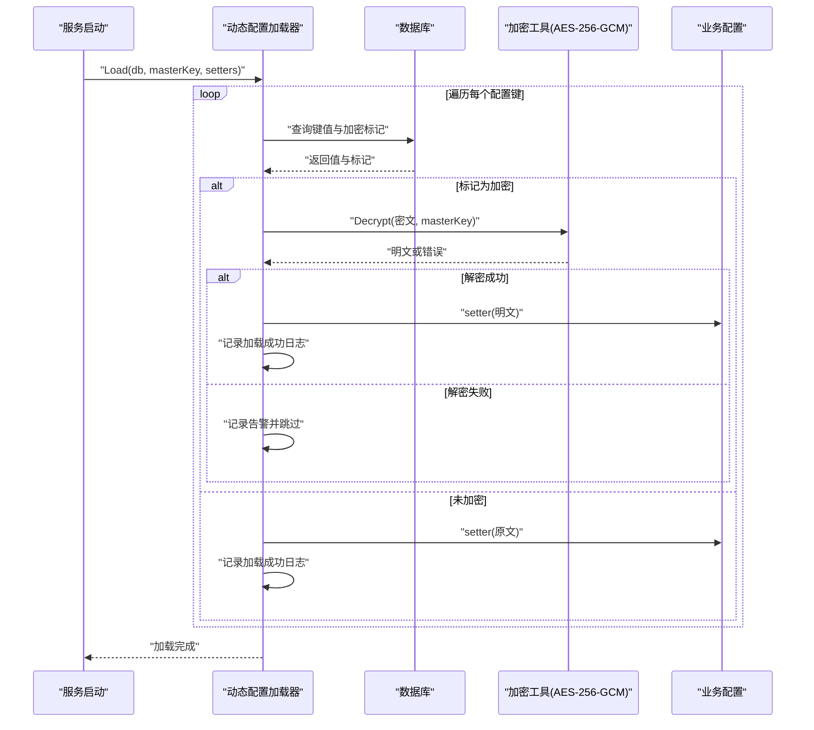
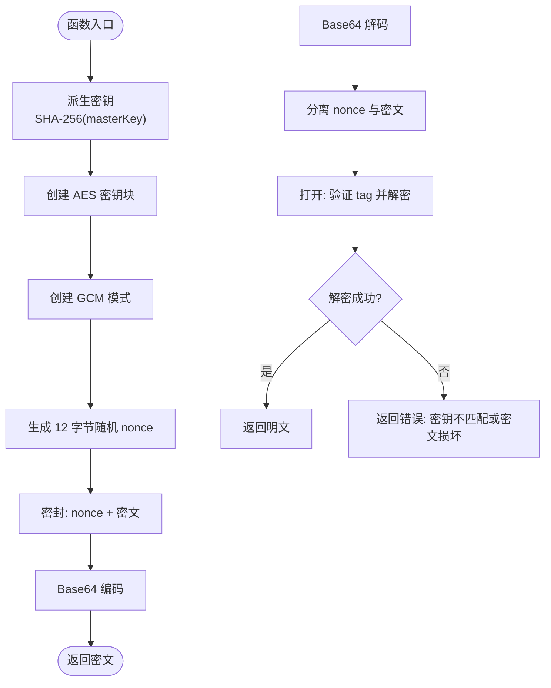
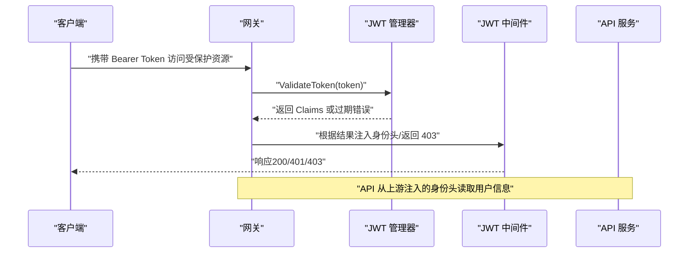
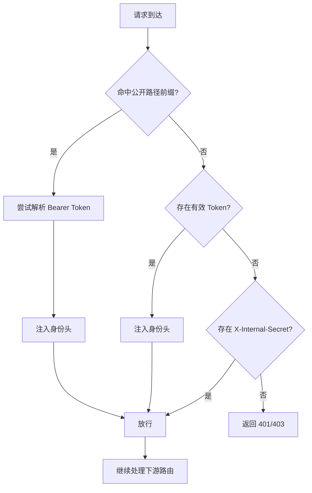
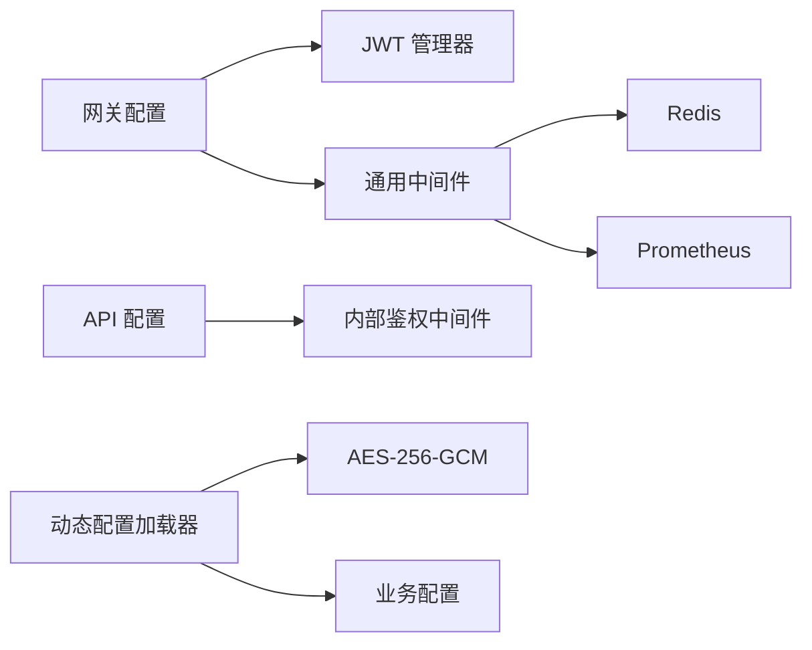

# 配置安全

<cite>
**本文引用的文件**
- [cmd/platform/main.go](file://cmd/platform/main.go)
- [internal/config/project.go](file://internal/config/project.go)
- [templates/files/pkg-platform-core/crypto/aes_gcm.go.tmpl](file://templates/files/pkg-platform-core/crypto/aes_gcm.go.tmpl)
- [templates/files/pkg-platform-core/dynconfig/loader.go.tmpl](file://templates/files/pkg-platform-core/dynconfig/loader.go.tmpl)
- [templates/files/pkg-platform-core/middleware/middleware.go.tmpl](file://templates/files/pkg-platform-core/middleware/middleware.go.tmpl)
- [templates/files/backend-gateway/pkg/jwt/jwt.go.tmpl](file://templates/files/backend-gateway/pkg/jwt/jwt.go.tmpl)
- [templates/files/backend-gateway/internal/config/config.go.tmpl](file://templates/files/backend-gateway/internal/config/config.go.tmpl)
- [templates/files/backend-api/internal/config/config.go.tmpl](file://templates/files/backend-api/internal/config/config.go.tmpl)
- [templates/files/backend-api/cmd/api/main.go.tmpl](file://templates/files/backend-api/cmd/api/main.go.tmpl)
- [templates/files/backend-gateway/cmd/gateway/main.go.tmpl](file://templates/files/backend-gateway/cmd/gateway/main.go.tmpl)
- [templates/files/backend-ai-engine/app/core/internal_auth.py](file://templates/files/backend-ai-engine/app/core/internal_auth.py)
- [templates/files/deploy/local/start.sh.tmpl](file://templates/files/deploy/local/start.sh.tmpl)
- [templates/files/deploy/k3s/install.sh.tmpl](file://templates/files/deploy/k3s/install.sh.tmpl)
</cite>

## 目录
1. [简介](#简介)
2. [项目结构](#项目结构)
3. [核心组件](#核心组件)
4. [架构总览](#架构总览)
5. [详细组件分析](#详细组件分析)
6. [依赖分析](#依赖分析)
7. [性能考虑](#性能考虑)
8. [故障排查指南](#故障排查指南)
9. [结论](#结论)
10. [附录](#附录)

## 简介
本文件聚焦于配置安全管理，围绕以下主题展开：配置文件的安全存储、传输加密与访问控制；敏感配置的加密处理、密钥管理与安全轮换策略；JWT 令牌配置、认证授权与会话管理；配置审计日志、违规检测与安全监控；以及实施指南、威胁模型分析与合规性要求。  
本项目通过“模板渲染 + 动态配置加载 + 中间件安全防护”的方式，提供可落地的配置安全实践。

## 项目结构
该项目采用“脚手架 + 模板 + 生成物”的结构。CLI 入口负责收集项目配置并通过模板渲染生成后端网关、API、AI 引擎、前端工程与部署脚本。安全相关的关键实现集中在公共组件库中的动态配置加载、加密工具、JWT 管理器与通用中间件。

图表来源
- [cmd/platform/main.go:1-98](file://cmd/platform/main.go#L1-L98)
- [internal/config/project.go:1-121](file://internal/config/project.go#L1-L121)
- [templates/files/pkg-platform-core/dynconfig/loader.go.tmpl:1-136](file://templates/files/pkg-platform-core/dynconfig/loader.go.tmpl#L1-L136)
- [templates/files/pkg-platform-core/crypto/aes_gcm.go.tmpl:1-72](file://templates/files/pkg-platform-core/crypto/aes_gcm.go.tmpl#L1-L72)
- [templates/files/pkg-platform-core/middleware/middleware.go.tmpl:1-202](file://templates/files/pkg-platform-core/middleware/middleware.go.tmpl#L1-L202)
- [templates/files/backend-gateway/internal/config/config.go.tmpl:1-127](file://templates/files/backend-gateway/internal/config/config.go.tmpl#L1-L127)
- [templates/files/backend-gateway/pkg/jwt/jwt.go.tmpl:1-88](file://templates/files/backend-gateway/pkg/jwt/jwt.go.tmpl#L1-L88)
- [templates/files/backend-gateway/cmd/gateway/main.go.tmpl:1-92](file://templates/files/backend-gateway/cmd/gateway/main.go.tmpl#L1-L92)
- [templates/files/backend-api/internal/config/config.go.tmpl:1-82](file://templates/files/backend-api/internal/config/config.go.tmpl#L1-L82)
- [templates/files/backend-api/cmd/api/main.go.tmpl:1-56](file://templates/files/backend-api/cmd/api/main.go.tmpl#L1-L56)
- [templates/files/backend-ai-engine/app/core/internal_auth.py:1-34](file://templates/files/backend-ai-engine/app/core/internal_auth.py#L1-L34)
- [templates/files/deploy/local/start.sh.tmpl:1-242](file://templates/files/deploy/local/start.sh.tmpl#L1-L242)
- [templates/files/deploy/k3s/install.sh.tmpl:1-59](file://templates/files/deploy/k3s/install.sh.tmpl#L1-L59)

章节来源
- [cmd/platform/main.go:1-98](file://cmd/platform/main.go#L1-L98)
- [internal/config/project.go:1-121](file://internal/config/project.go#L1-L121)
- [templates/files/deploy/local/start.sh.tmpl:1-242](file://templates/files/deploy/local/start.sh.tmpl#L1-L242)
- [templates/files/deploy/k3s/install.sh.tmpl:1-59](file://templates/files/deploy/k3s/install.sh.tmpl#L1-L59)

## 核心组件
- 动态配置加载与解密：应用启动时从数据库表加载配置，对标记为加密的值使用主密钥进行 AES-256-GCM 解密，并通过 setter 回调写入业务配置。若缺失或解密失败，系统记录告警并优雅降级，不影响启动。
- 加密工具：提供派生密钥与对称加密/解密能力，密文格式包含随机 nonce 与 tag，确保机密性与完整性。
- JWT 管理器：签发短期访问令牌与长期刷新令牌，支持过期检测与错误区分；网关中间件负责 Bearer 校验、公开路径白名单、过期返回 403 等。
- 通用中间件：提供内部鉴权（X-Internal-Secret）、CORS 白名单、请求 ID、限流与指标采集等，贯穿网关与 API 服务。
- 配置加载：网关与 API 服务均从环境变量读取配置，网关对敏感密钥进行严格校验（缺失时直接 panic），API 服务暴露 MasterKey 以配合动态配置解密。
- 内部鉴权：AI 引擎与通用中间件行为对齐，支持开发环境跳过与恒定时间比较，保护私域路由免受外部访问。

章节来源
- [templates/files/pkg-platform-core/dynconfig/loader.go.tmpl:1-136](file://templates/files/pkg-platform-core/dynconfig/loader.go.tmpl#L1-L136)
- [templates/files/pkg-platform-core/crypto/aes_gcm.go.tmpl:1-72](file://templates/files/pkg-platform-core/crypto/aes_gcm.go.tmpl#L1-L72)
- [templates/files/backend-gateway/pkg/jwt/jwt.go.tmpl:1-88](file://templates/files/backend-gateway/pkg/jwt/jwt.go.tmpl#L1-L88)
- [templates/files/pkg-platform-core/middleware/middleware.go.tmpl:1-202](file://templates/files/pkg-platform-core/middleware/middleware.go.tmpl#L1-L202)
- [templates/files/backend-gateway/internal/config/config.go.tmpl:1-127](file://templates/files/backend-gateway/internal/config/config.go.tmpl#L1-L127)
- [templates/files/backend-api/internal/config/config.go.tmpl:1-82](file://templates/files/backend-api/internal/config/config.go.tmpl#L1-L82)
- [templates/files/backend-ai-engine/app/core/internal_auth.py:1-34](file://templates/files/backend-ai-engine/app/core/internal_auth.py#L1-L34)

## 架构总览
下图展示配置安全在系统中的关键流转：CLI 收集项目配置 → 模板渲染生成各服务 → 网关与 API 从环境变量加载配置 → 网关签发/校验 JWT → 动态配置通过 MasterKey 解密并注入业务配置 → 内部鉴权与 CORS 等中间件统一防护。

图表来源
- [cmd/platform/main.go:1-98](file://cmd/platform/main.go#L1-L98)
- [templates/files/backend-gateway/pkg/jwt/jwt.go.tmpl:1-88](file://templates/files/backend-gateway/pkg/jwt/jwt.go.tmpl#L1-L88)
- [templates/files/pkg-platform-core/middleware/middleware.go.tmpl:1-202](file://templates/files/pkg-platform-core/middleware/middleware.go.tmpl#L1-L202)
- [templates/files/backend-api/internal/config/config.go.tmpl:1-82](file://templates/files/backend-api/internal/config/config.go.tmpl#L1-L82)
- [templates/files/backend-gateway/internal/config/config.go.tmpl:1-127](file://templates/files/backend-gateway/internal/config/config.go.tmpl#L1-L127)
- [templates/files/pkg-platform-core/dynconfig/loader.go.tmpl:1-136](file://templates/files/pkg-platform-core/dynconfig/loader.go.tmpl#L1-L136)
- [templates/files/pkg-platform-core/crypto/aes_gcm.go.tmpl:1-72](file://templates/files/pkg-platform-core/crypto/aes_gcm.go.tmpl#L1-L72)
- [templates/files/backend-ai-engine/app/core/internal_auth.py:1-34](file://templates/files/backend-ai-engine/app/core/internal_auth.py#L1-L34)

## 详细组件分析

### 动态配置加载与解密（启动时一次性加载）
- 设计要点
  - 仅在应用启动时加载一次，非热更新。
  - 对标记为加密的值使用主密钥通过 AES-256-GCM 解密。
  - 优雅降级：缺失或解密失败不阻止启动，仅记录日志告警。
  - 业务方提供 setter 映射，框架负责拉取数据、解密与回调写入。
- 关键流程
  - 读取配置项 → 判断是否加密 → 若加密且主密钥可用则解密 → 调用对应 setter → 记录日志。
- 安全影响
  - 将敏感配置存储在数据库中并加密，降低明文泄露风险。
  - 主密钥缺失时跳过解密，避免因密钥问题导致服务不可用，但需配合审计与告警。

图表来源
- [templates/files/pkg-platform-core/dynconfig/loader.go.tmpl:64-116](file://templates/files/pkg-platform-core/dynconfig/loader.go.tmpl#L64-L116)
- [templates/files/pkg-platform-core/crypto/aes_gcm.go.tmpl:46-71](file://templates/files/pkg-platform-core/crypto/aes_gcm.go.tmpl#L46-L71)

章节来源
- [templates/files/pkg-platform-core/dynconfig/loader.go.tmpl:1-136](file://templates/files/pkg-platform-core/dynconfig/loader.go.tmpl#L1-L136)
- [templates/files/pkg-platform-core/crypto/aes_gcm.go.tmpl:1-72](file://templates/files/pkg-platform-core/crypto/aes_gcm.go.tmpl#L1-L72)

### 加密工具（AES-256-GCM）
- 设计要点
  - 使用 SHA-256 将任意长度 masterKey 派生为 32 字节 AES 密钥。
  - 密文格式包含 12 字节随机 nonce 与 16 字节 tag，整体经 Base64 编码。
  - 加解密失败时返回明确错误，便于上层区分密钥不匹配或密文损坏。
- 安全影响
  - 机密性与完整性保障，适合存储敏感配置。
  - 与 Python 端实现对齐，便于跨语言解密。

图表来源
- [templates/files/pkg-platform-core/crypto/aes_gcm.go.tmpl:18-71](file://templates/files/pkg-platform-core/crypto/aes_gcm.go.tmpl#L18-L71)

章节来源
- [templates/files/pkg-platform-core/crypto/aes_gcm.go.tmpl:1-72](file://templates/files/pkg-platform-core/crypto/aes_gcm.go.tmpl#L1-L72)

### JWT 令牌配置、认证与会话管理
- 网关侧
  - JWT 管理器：签发短期访问令牌与长期刷新令牌，支持过期时间配置与错误区分。
  - 中间件：Bearer 校验、公开路径白名单、过期返回 403、注入身份头（X-User-UUID/X-Member-Level）。
- API 侧
  - 从上游网关注入的身份头读取用户 UUID，结合内部鉴权保护私域路由。
- 会话管理
  - 短期访问令牌用于常规接口访问；刷新令牌用于在过期时换取新的访问令牌。
  - 中间件根据是否存在特定前缀的 Cookie 来判断是否触发前端自动刷新流程。

图表来源
- [templates/files/backend-gateway/pkg/jwt/jwt.go.tmpl:39-87](file://templates/files/backend-gateway/pkg/jwt/jwt.go.tmpl#L39-L87)
- [templates/files/pkg-platform-core/middleware/middleware.go.tmpl:124-163](file://templates/files/pkg-platform-core/middleware/middleware.go.tmpl#L124-L163)
- [templates/files/backend-api/cmd/api/main.go.tmpl:1-56](file://templates/files/backend-api/cmd/api/main.go.tmpl#L1-L56)

章节来源
- [templates/files/backend-gateway/pkg/jwt/jwt.go.tmpl:1-88](file://templates/files/backend-gateway/pkg/jwt/jwt.go.tmpl#L1-L88)
- [templates/files/pkg-platform-core/middleware/middleware.go.tmpl:1-202](file://templates/files/pkg-platform-core/middleware/middleware.go.tmpl#L1-L202)
- [templates/files/backend-api/cmd/api/main.go.tmpl:1-56](file://templates/files/backend-api/cmd/api/main.go.tmpl#L1-L56)

### 访问控制与内部鉴权
- 内部鉴权（X-Internal-Secret）
  - 网关与 API 之间通过 X-Internal-Secret 校验，保护 /internal/* 私域路由。
  - 开发环境可为空，生产环境必须配置；使用恒定时间比较防止时序攻击。
- CORS 白名单
  - 仅允许配置的 Origin，开启 AllowCredentials，提升跨域安全性。
- 公开路径白名单
  - 对健康检查、认证等路径放行，但仍尝试解析 token 注入身份头。

图表来源
- [templates/files/pkg-platform-core/middleware/middleware.go.tmpl:49-100](file://templates/files/pkg-platform-core/middleware/middleware.go.tmpl#L49-L100)
- [templates/files/backend-ai-engine/app/core/internal_auth.py:16-33](file://templates/files/backend-ai-engine/app/core/internal_auth.py#L16-L33)

章节来源
- [templates/files/pkg-platform-core/middleware/middleware.go.tmpl:1-202](file://templates/files/pkg-platform-core/middleware/middleware.go.tmpl#L1-L202)
- [templates/files/backend-ai-engine/app/core/internal_auth.py:1-34](file://templates/files/backend-ai-engine/app/core/internal_auth.py#L1-L34)

### 配置存储与传输加密
- 存储
  - 敏感配置存储在数据库表中，标记为加密项。
- 传输
  - 网关与 API 通过 HTTPS（由部署与反向代理保障）传输，避免明文泄露。
- 访问控制
  - 仅网关与 API 服务具备读取权限；AI 引擎通过内部鉴权中间件限制外部访问。
- 解密时机
  - 应用启动时一次性解密并注入业务配置，运行时不再持有明文。

章节来源
- [templates/files/pkg-platform-core/dynconfig/loader.go.tmpl:1-136](file://templates/files/pkg-platform-core/dynconfig/loader.go.tmpl#L1-L136)
- [templates/files/backend-gateway/internal/config/config.go.tmpl:1-127](file://templates/files/backend-gateway/internal/config/config.go.tmpl#L1-L127)
- [templates/files/backend-api/internal/config/config.go.tmpl:1-82](file://templates/files/backend-api/internal/config/config.go.tmpl#L1-L82)

### 密钥管理与安全轮换策略
- 密钥类型
  - JWT 密钥：用于签发与校验访问/刷新令牌。
  - MasterKey：用于动态配置表中敏感值的解密。
- 安全轮换步骤
  - 生成新密钥并更新环境变量与密钥管理系统。
  - 更新动态配置表中敏感值（使用新密钥重新加密）。
  - 重启服务以加载新密钥；旧密钥保留一段时间以便解密历史令牌或过渡期使用。
  - 完成过渡后回收旧密钥。
- 最佳实践
  - 密钥最小化暴露：仅在必要进程内可见。
  - 使用只读权限的密钥管理服务（如 KMS/HashiCorp Vault）。
  - 审计与告警：记录密钥轮换事件与异常访问。

章节来源
- [templates/files/backend-gateway/internal/config/config.go.tmpl:23-29](file://templates/files/backend-gateway/internal/config/config.go.tmpl#L23-L29)
- [templates/files/backend-api/internal/config/config.go.tmpl:14-16](file://templates/files/backend-api/internal/config/config.go.tmpl#L14-L16)
- [templates/files/pkg-platform-core/dynconfig/loader.go.tmpl:78-116](file://templates/files/pkg-platform-core/dynconfig/loader.go.tmpl#L78-L116)

### 配置审计日志、违规检测与安全监控
- 审计日志
  - 动态配置加载器记录加载成功/失败与跳过的项，便于追踪敏感配置状态。
  - 中间件记录请求 ID、路径与响应状态，辅助定位异常。
- 违规检测
  - JWT 中间件区分过期与无效 token，便于前端触发刷新或提示登录。
  - 内部鉴权中间件拒绝无效的 X-Internal-Secret，防止越权访问。
- 安全监控
  - Prometheus 指标采集中间件暴露请求总量、时延与并发等指标，结合告警系统监控异常流量与错误率。

章节来源
- [templates/files/pkg-platform-core/dynconfig/loader.go.tmpl:82-116](file://templates/files/pkg-platform-core/dynconfig/loader.go.tmpl#L82-L116)
- [templates/files/pkg-platform-core/middleware/middleware.go.tmpl:124-163](file://templates/files/pkg-platform-core/middleware/middleware.go.tmpl#L124-L163)
- [templates/files/backend-gateway/cmd/gateway/main.go.tmpl:52-59](file://templates/files/backend-gateway/cmd/gateway/main.go.tmpl#L52-L59)

## 依赖分析
- 组件耦合
  - 网关依赖 JWT 管理器与通用中间件；API 依赖内部鉴权中间件；AI 引擎与通用中间件行为对齐。
  - 动态配置加载器依赖加密工具与数据库连接；API 服务依赖动态配置加载器以获得解密后的敏感配置。
- 外部依赖
  - Redis 用于限流与缓存；Prometheus 用于指标采集。
- 潜在风险
  - 密钥管理不当可能导致解密失败或令牌伪造。
  - CORS 配置不当可能引入跨域风险。
  - 内部鉴权密钥泄露会导致私域路由被外部访问。

图表来源
- [templates/files/backend-gateway/internal/config/config.go.tmpl:52-86](file://templates/files/backend-gateway/internal/config/config.go.tmpl#L52-L86)
- [templates/files/backend-gateway/pkg/jwt/jwt.go.tmpl:31-37](file://templates/files/backend-gateway/pkg/jwt/jwt.go.tmpl#L31-L37)
- [templates/files/pkg-platform-core/middleware/middleware.go.tmpl:12-22](file://templates/files/pkg-platform-core/middleware/middleware.go.tmpl#L12-L22)
- [templates/files/pkg-platform-core/dynconfig/loader.go.tmpl:66-116](file://templates/files/pkg-platform-core/dynconfig/loader.go.tmpl#L66-L116)
- [templates/files/pkg-platform-core/crypto/aes_gcm.go.tmpl:18-44](file://templates/files/pkg-platform-core/crypto/aes_gcm.go.tmpl#L18-L44)
- [templates/files/backend-api/internal/config/config.go.tmpl:42-65](file://templates/files/backend-api/internal/config/config.go.tmpl#L42-L65)

章节来源
- [templates/files/backend-gateway/internal/config/config.go.tmpl:1-127](file://templates/files/backend-gateway/internal/config/config.go.tmpl#L1-L127)
- [templates/files/pkg-platform-core/middleware/middleware.go.tmpl:1-202](file://templates/files/pkg-platform-core/middleware/middleware.go.tmpl#L1-L202)
- [templates/files/pkg-platform-core/dynconfig/loader.go.tmpl:1-136](file://templates/files/pkg-platform-core/dynconfig/loader.go.tmpl#L1-L136)
- [templates/files/pkg-platform-core/crypto/aes_gcm.go.tmpl:1-72](file://templates/files/pkg-platform-core/crypto/aes_gcm.go.tmpl#L1-L72)
- [templates/files/backend-api/internal/config/config.go.tmpl:1-82](file://templates/files/backend-api/internal/config/config.go.tmpl#L1-L82)

## 性能考虑
- 启动时一次性加载动态配置，避免运行时频繁 IO。
- AES-256-GCM 加解密成本低，适合启动阶段使用。
- 中间件链顺序合理：鉴权与限流在路由之前，有利于早期拒绝无效请求。
- Redis 限流与指标采集对性能影响可控，建议在高并发场景下评估限流阈值与指标采样。

## 故障排查指南
- 动态配置加载失败
  - 检查数据库连接与表结构；确认加密标记与密文格式正确；核对 MasterKey 是否设置。
  - 观察日志中“跳过未就绪凭据”与“解密失败”的告警信息。
- JWT 校验失败
  - 确认网关与 API 的 JWT 密钥一致；检查令牌过期时间与签名算法。
  - 若出现“Access token expired”，前端应触发刷新流程。
- 内部鉴权失败
  - 确认 X-Internal-Secret 是否正确传递；开发环境可临时关闭以定位问题。
- CORS 问题
  - 核对 AllowedOrigins 配置；确保前端与后端域名一致。
- 启动失败
  - 网关对敏感密钥缺失会直接 panic；API 的 MasterKey 缺失会跳过解密但不影响启动。

章节来源
- [templates/files/pkg-platform-core/dynconfig/loader.go.tmpl:78-116](file://templates/files/pkg-platform-core/dynconfig/loader.go.tmpl#L78-L116)
- [templates/files/pkg-platform-core/middleware/middleware.go.tmpl:140-163](file://templates/files/pkg-platform-core/middleware/middleware.go.tmpl#L140-L163)
- [templates/files/backend-gateway/internal/config/config.go.tmpl:95-101](file://templates/files/backend-gateway/internal/config/config.go.tmpl#L95-L101)

## 结论
本项目通过“模板化生成 + 动态配置解密 + 中间件统一防护”的组合，构建了可落地的配置安全体系。建议在生产环境中强化密钥管理、完善审计与告警、定期轮换密钥并进行渗透测试与合规性评估，以持续提升系统的安全性与稳定性。

## 附录
- 实施指南
  - 使用只读权限的密钥管理服务存储 JWT 密钥与 MasterKey。
  - 在 CI/CD 中自动化密钥注入与轮换流程。
  - 对敏感配置进行最小化暴露与访问控制。
- 威胁模型
  - 密钥泄露：通过密钥轮换与最小权限原则缓解。
  - 中间人攻击：通过 HTTPS 与 CORS 白名单降低风险。
  - 越权访问：通过内部鉴权与公开路径白名单控制。
- 合规性要求
  - 数据分类分级与加密存储；日志与审计留痕；访问最小权限与职责分离。