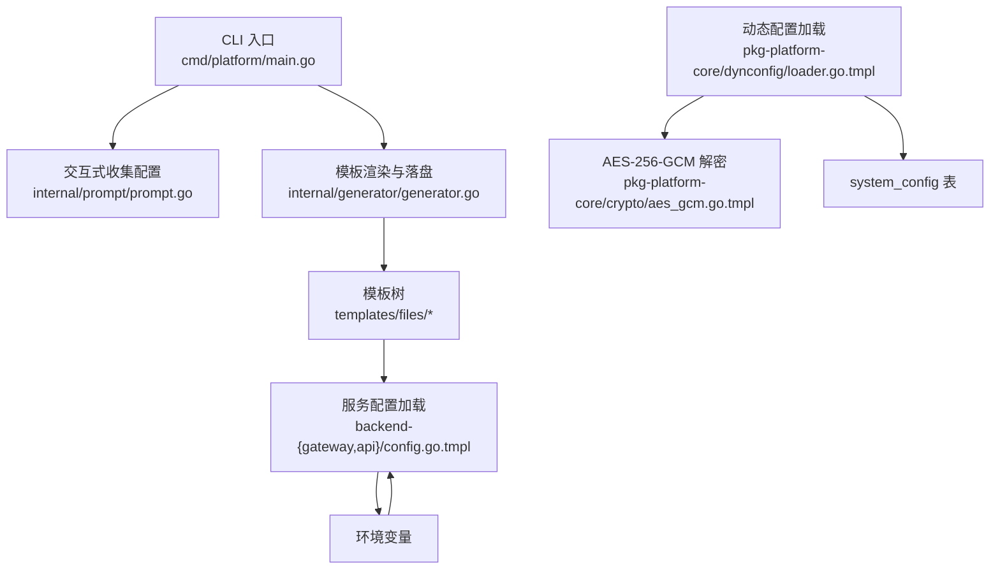
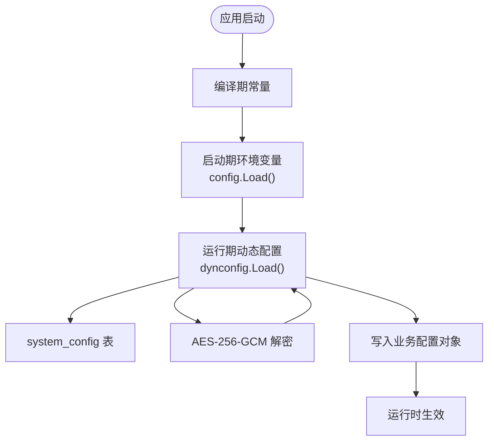
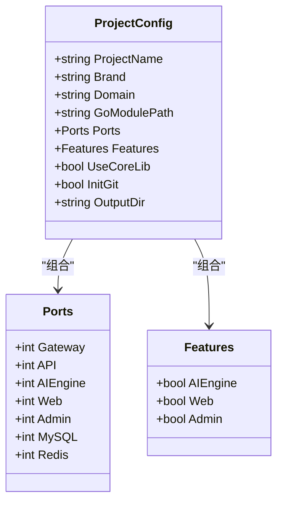
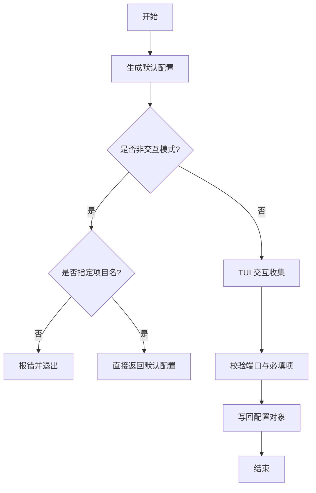
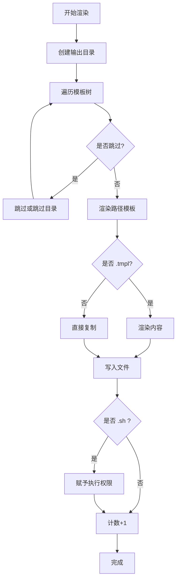
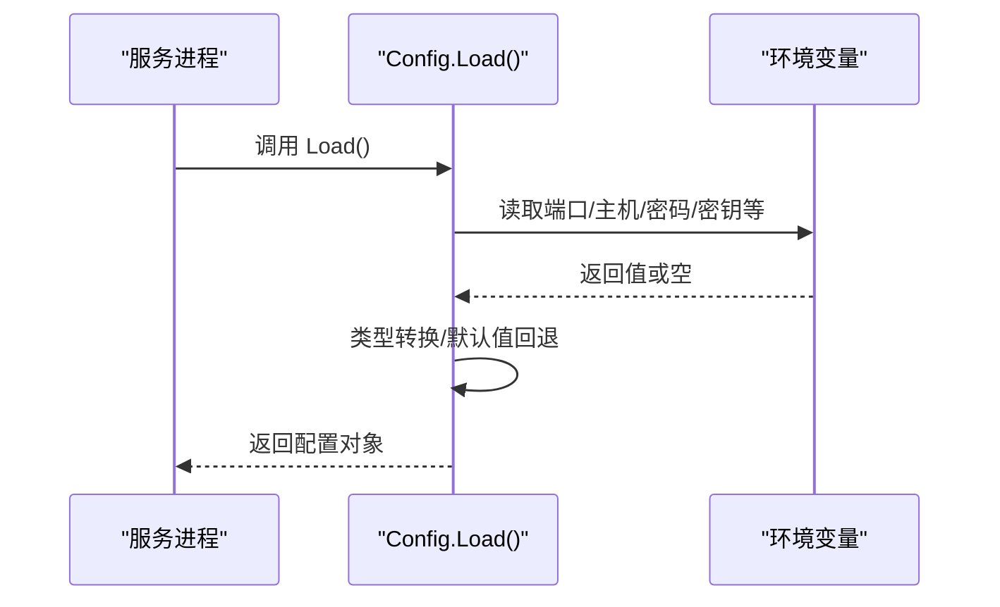
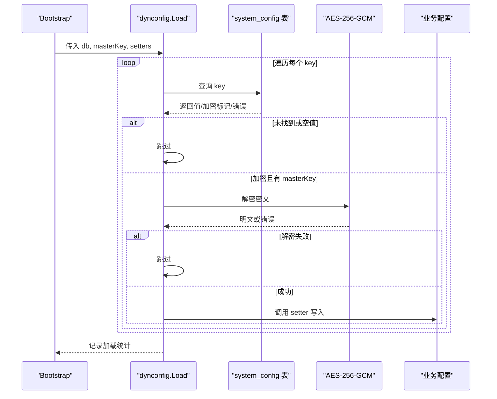
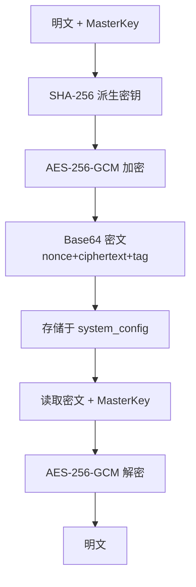
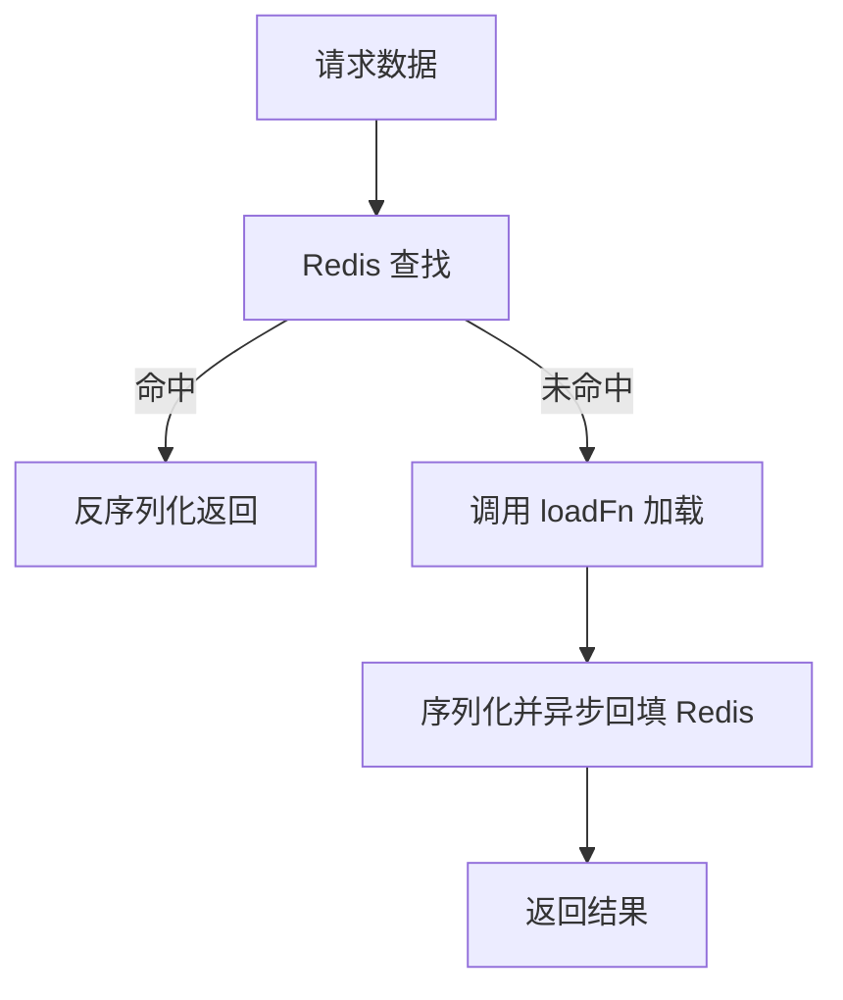
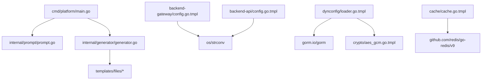

# 配置管理

<cite>
**本文档引用的文件**
- [cmd/platform/main.go](file://cmd/platform/main.go)
- [internal/config/project.go](file://internal/config/project.go)
- [internal/generator/generator.go](file://internal/generator/generator.go)
- [internal/prompt/prompt.go](file://internal/prompt/prompt.go)
- [templates/files/backend-api/internal/config/config.go.tmpl](file://templates/files/backend-api/internal/config/config.go.tmpl)
- [templates/files/backend-gateway/internal/config/config.go.tmpl](file://templates/files/backend-gateway/internal/config/config.go.tmpl)
- [templates/files/pkg-platform-core/dynconfig/loader.go.tmpl](file://templates/files/pkg-platform-core/dynconfig/loader.go.tmpl)
- [templates/files/pkg-platform-core/crypto/aes_gcm.go.tmpl](file://templates/files/pkg-platform-core/crypto/aes_gcm.go.tmpl)
- [templates/files/pkg-platform-core/cache/cache.go.tmpl](file://templates/files/pkg-platform-core/cache/cache.go.tmpl)
- [templates/files/pkg-platform-core/docs/dynconfig.md](file://templates/files/pkg-platform-core/docs/dynconfig.md)
- [templates/files/deploy/k3s/cluster-config.env.tmpl](file://templates/files/deploy/k3s/cluster-config.env.tmpl)
- [README.md](file://README.md)
</cite>

## 目录
1. [简介](#简介)
2. [项目结构](#项目结构)
3. [核心组件](#核心组件)
4. [架构总览](#架构总览)
5. [详细组件分析](#详细组件分析)
6. [依赖分析](#依赖分析)
7. [性能考量](#性能考量)
8. [故障排查指南](#故障排查指南)
9. [结论](#结论)
10. [附录](#附录)

## 简介
本项目提供一套“三层配置”体系：编译期常量 → 启动期环境变量 → 运行期数据库动态配置（敏感值加密存储）。通过 CLI 交互收集项目配置，结合模板渲染生成完整工程骨架，并在各服务中以统一方式加载与使用配置。动态配置模块支持启动时从数据库表加载并解密，采用优雅降级策略，保证服务可用性。

## 项目结构
- CLI 入口负责交互式收集配置、校验与生成工程骨架。
- 模板系统通过 text/template + embed.FS 将所有模板内嵌至二进制，按 Features 开关决定渲染哪些子树。
- 各服务（网关、API、AI 引擎）通过各自的 config.Load 从环境变量装配基础配置。
- 动态配置模块在启动时从 system_config 表加载并解密，写入业务配置对象。

图表来源
- [cmd/platform/main.go:22-87](file://cmd/platform/main.go#L22-L87)
- [internal/prompt/prompt.go:14-105](file://internal/prompt/prompt.go#L14-L105)
- [internal/generator/generator.go:33-103](file://internal/generator/generator.go#L33-L103)
- [templates/files/backend-gateway/internal/config/config.go.tmpl:52-86](file://templates/files/backend-gateway/internal/config/config.go.tmpl#L52-L86)
- [templates/files/backend-api/internal/config/config.go.tmpl:42-65](file://templates/files/backend-api/internal/config/config.go.tmpl#L42-L65)
- [templates/files/pkg-platform-core/dynconfig/loader.go.tmpl:66-116](file://templates/files/pkg-platform-core/dynconfig/loader.go.tmpl#L66-L116)
- [templates/files/pkg-platform-core/crypto/aes_gcm.go.tmpl:24-71](file://templates/files/pkg-platform-core/crypto/aes_gcm.go.tmpl#L24-L71)

章节来源
- [README.md:50-57](file://README.md#L50-L57)
- [cmd/platform/main.go:22-87](file://cmd/platform/main.go#L22-L87)
- [internal/prompt/prompt.go:14-105](file://internal/prompt/prompt.go#L14-L105)
- [internal/generator/generator.go:33-103](file://internal/generator/generator.go#L33-L103)

## 核心组件
- 项目配置模型与默认值：定义项目级模板变量、默认端口、特性开关与校验规则。
- 交互式收集：基于 TUI 收集用户输入，支持非交互模式与默认值注入。
- 模板渲染与落盘：遍历模板树，按 Features 开关渲染并写入磁盘。
- 服务配置加载：从环境变量装配服务配置，含整型、切片、必需密钥等处理。
- 动态配置加载：启动时从数据库表加载并解密，写入业务配置，支持自定义表/列名与日志前缀。
- 加密工具：AES-256-GCM 加密/解密，密钥派生与密文格式。
- 缓存与热更新：Cache-Aside 模式 + Redis TTL，支持异步回填与批量失效。

章节来源
- [internal/config/project.go:12-121](file://internal/config/project.go#L12-L121)
- [internal/prompt/prompt.go:14-105](file://internal/prompt/prompt.go#L14-L105)
- [internal/generator/generator.go:23-158](file://internal/generator/generator.go#L23-L158)
- [templates/files/backend-gateway/internal/config/config.go.tmpl:9-127](file://templates/files/backend-gateway/internal/config/config.go.tmpl#L9-L127)
- [templates/files/backend-api/internal/config/config.go.tmpl:8-82](file://templates/files/backend-api/internal/config/config.go.tmpl#L8-L82)
- [templates/files/pkg-platform-core/dynconfig/loader.go.tmpl:29-136](file://templates/files/pkg-platform-core/dynconfig/loader.go.tmpl#L29-L136)
- [templates/files/pkg-platform-core/crypto/aes_gcm.go.tmpl:18-72](file://templates/files/pkg-platform-core/crypto/aes_gcm.go.tmpl#L18-L72)
- [templates/files/pkg-platform-core/cache/cache.go.tmpl:18-93](file://templates/files/pkg-platform-core/cache/cache.go.tmpl#L18-L93)

## 架构总览
三层配置体系与加载路径如下：

图表来源
- [README.md:55](file://README.md#L55)
- [templates/files/backend-gateway/internal/config/config.go.tmpl:52-86](file://templates/files/backend-gateway/internal/config/config.go.tmpl#L52-L86)
- [templates/files/backend-api/internal/config/config.go.tmpl:42-65](file://templates/files/backend-api/internal/config/config.go.tmpl#L42-L65)
- [templates/files/pkg-platform-core/dynconfig/loader.go.tmpl:66-116](file://templates/files/pkg-platform-core/dynconfig/loader.go.tmpl#L66-L116)
- [templates/files/pkg-platform-core/crypto/aes_gcm.go.tmpl:24-71](file://templates/files/pkg-platform-core/crypto/aes_gcm.go.tmpl#L24-L71)

## 详细组件分析

### 项目配置模型与默认值
- 结构体包含项目名、品牌名、域名、Go 模块路径、端口集合、功能开关、是否使用公共库、是否初始化 Git、输出目录等。
- 默认值函数提供合理的初始值，便于交互式收集与非交互模式使用。
- 校验规则确保关键字段格式正确（如 kebab-case）、必要端口大于 0 等。

图表来源
- [internal/config/project.go:13-41](file://internal/config/project.go#L13-L41)
- [internal/config/project.go:43-59](file://internal/config/project.go#L43-L59)
- [internal/config/project.go:62-89](file://internal/config/project.go#L62-L89)

章节来源
- [internal/config/project.go:12-121](file://internal/config/project.go#L12-L121)

### 交互式收集与非交互模式
- 基于 TUI 收集项目名、品牌名、域名、Go 模块路径、端口、功能开关、是否初始化 Git。
- 非交互模式要求显式指定项目名，否则报错。
- 输入校验确保必填字段不为空，端口转换为正整数。

图表来源
- [internal/prompt/prompt.go:14-105](file://internal/prompt/prompt.go#L14-L105)

章节来源
- [internal/prompt/prompt.go:14-105](file://internal/prompt/prompt.go#L14-L105)

### 模板渲染与落盘（Features 开关）
- 遍历嵌入的模板树，按 Features 开关跳过对应子树。
- 路径与内容均可渲染模板变量，.tmpl 后缀自动剥离。
- 可执行文件（.sh）赋予执行权限。

图表来源
- [internal/generator/generator.go:33-103](file://internal/generator/generator.go#L33-L103)
- [internal/generator/generator.go:105-120](file://internal/generator/generator.go#L105-L120)
- [internal/generator/generator.go:122-147](file://internal/generator/generator.go#L122-L147)

章节来源
- [internal/generator/generator.go:23-158](file://internal/generator/generator.go#L23-L158)

### 服务配置加载（环境变量）
- 网关与 API 服务均通过各自的 config.Load 从环境变量装配配置。
- 支持字符串、整型、切片（逗号分隔）、必需密钥（缺失时 panic）等场景。
- 提供默认值回退策略，确保在未设置时使用合理默认。

图表来源
- [templates/files/backend-gateway/internal/config/config.go.tmpl:52-86](file://templates/files/backend-gateway/internal/config/config.go.tmpl#L52-L86)
- [templates/files/backend-gateway/internal/config/config.go.tmpl:88-126](file://templates/files/backend-gateway/internal/config/config.go.tmpl#L88-L126)
- [templates/files/backend-api/internal/config/config.go.tmpl:42-65](file://templates/files/backend-api/internal/config/config.go.tmpl#L42-L65)
- [templates/files/backend-api/internal/config/config.go.tmpl:67-81](file://templates/files/backend-api/internal/config/config.go.tmpl#L67-L81)

章节来源
- [templates/files/backend-gateway/internal/config/config.go.tmpl:9-127](file://templates/files/backend-gateway/internal/config/config.go.tmpl#L9-L127)
- [templates/files/backend-api/internal/config/config.go.tmpl:8-82](file://templates/files/backend-api/internal/config/config.go.tmpl#L8-L82)

### 动态配置加载（启动时一次性）
- 仅在启动时加载一次，不支持热更新。
- 支持自定义表名/列名与日志前缀。
- 优雅降级：masterKey 为空、查询失败、解密失败、键不存在均不阻断启动。
- 通过 Setter 回调将解密后的值写入业务配置对象。

图表来源
- [templates/files/pkg-platform-core/dynconfig/loader.go.tmpl:66-116](file://templates/files/pkg-platform-core/dynconfig/loader.go.tmpl#L66-L116)
- [templates/files/pkg-platform-core/dynconfig/loader.go.tmpl:118-135](file://templates/files/pkg-platform-core/dynconfig/loader.go.tmpl#L118-L135)
- [templates/files/pkg-platform-core/crypto/aes_gcm.go.tmpl:46-71](file://templates/files/pkg-platform-core/crypto/aes_gcm.go.tmpl#L46-L71)

章节来源
- [templates/files/pkg-platform-core/dynconfig/loader.go.tmpl:29-136](file://templates/files/pkg-platform-core/dynconfig/loader.go.tmpl#L29-L136)
- [templates/files/pkg-platform-core/docs/dynconfig.md:1-68](file://templates/files/pkg-platform-core/docs/dynconfig.md#L1-L68)

### 加密与解密（AES-256-GCM）
- 通过 SHA-256 将任意长度 masterKey 派生为 32 字节 AES 密钥。
- 密文格式包含随机 nonce 与 tag，确保机密性与完整性。
- 解密失败时返回明确错误，避免误用。

图表来源
- [templates/files/pkg-platform-core/crypto/aes_gcm.go.tmpl:18-71](file://templates/files/pkg-platform-core/crypto/aes_gcm.go.tmpl#L18-L71)

章节来源
- [templates/files/pkg-platform-core/crypto/aes_gcm.go.tmpl:18-72](file://templates/files/pkg-platform-core/crypto/aes_gcm.go.tmpl#L18-L72)

### 缓存与热更新（Cache-Aside + Redis）
- 提供 GetOrLoad：先查 Redis，未命中则调用 loadFn 加载并异步回填。
- 支持按通配符批量失效，避免阻塞。
- 适合运行时热更新场景，与动态配置互补。

图表来源
- [templates/files/pkg-platform-core/cache/cache.go.tmpl:28-58](file://templates/files/pkg-platform-core/cache/cache.go.tmpl#L28-L58)
- [templates/files/pkg-platform-core/cache/cache.go.tmpl:75-92](file://templates/files/pkg-platform-core/cache/cache.go.tmpl#L75-L92)

章节来源
- [templates/files/pkg-platform-core/cache/cache.go.tmpl:18-93](file://templates/files/pkg-platform-core/cache/cache.go.tmpl#L18-L93)

## 依赖分析
- CLI 依赖交互库与生成器，生成器依赖模板嵌入与配置模型。
- 服务配置依赖标准库 os 与 strconv。
- 动态配置依赖数据库 ORM 与加密模块。
- 缓存依赖 Redis 客户端。

图表来源
- [cmd/platform/main.go:9-18](file://cmd/platform/main.go#L9-L18)
- [internal/generator/generator.go:10-21](file://internal/generator/generator.go#L10-L21)
- [templates/files/backend-gateway/internal/config/config.go.tmpl:3-7](file://templates/files/backend-gateway/internal/config/config.go.tmpl#L3-L7)
- [templates/files/backend-api/internal/config/config.go.tmpl:3-6](file://templates/files/backend-api/internal/config/config.go.tmpl#L3-L6)
- [templates/files/pkg-platform-core/dynconfig/loader.go.tmpl:21-27](file://templates/files/pkg-platform-core/dynconfig/loader.go.tmpl#L21-L27)
- [templates/files/pkg-platform-core/cache/cache.go.tmpl:9-16](file://templates/files/pkg-platform-core/cache/cache.go.tmpl#L9-L16)

章节来源
- [cmd/platform/main.go:9-18](file://cmd/platform/main.go#L9-L18)
- [internal/generator/generator.go:10-21](file://internal/generator/generator.go#L10-L21)
- [templates/files/backend-gateway/internal/config/config.go.tmpl:3-7](file://templates/files/backend-gateway/internal/config/config.go.tmpl#L3-L7)
- [templates/files/backend-api/internal/config/config.go.tmpl:3-6](file://templates/files/backend-api/internal/config/config.go.tmpl#L3-L6)
- [templates/files/pkg-platform-core/dynconfig/loader.go.tmpl:21-27](file://templates/files/pkg-platform-core/dynconfig/loader.go.tmpl#L21-L27)
- [templates/files/pkg-platform-core/cache/cache.go.tmpl:9-16](file://templates/files/pkg-platform-core/cache/cache.go.tmpl#L9-L16)

## 性能考量
- 动态配置加载为同步阻塞，应在 Setter 中避免耗时操作，确保启动时间可控。
- 缓存层采用异步回填，减少主流程等待，提升热路径性能。
- Redis 批量失效使用 SCAN 避免 KEYS 阻塞。
- 环境变量读取与类型转换为轻量操作，建议集中处理以减少重复解析。

## 故障排查指南
- 动态配置加载失败
  - 检查 masterKey 是否设置，加密项需有效密钥。
  - 检查数据库连接与表/列名配置是否正确。
  - 关注日志中的跳过统计，确认键是否存在。
- 网关/API 启动失败
  - 必需密钥缺失会导致 panic，检查环境变量。
  - 端口冲突或不可用时，调整端口或释放资源。
- 环境变量未生效
  - 确认 .env 文件已正确复制并加载。
  - 检查模板渲染输出，确保占位符被替换。
- K3s 集群配置
  - 按模板填写节点 SSH、镜像仓库与命名空间等参数。

章节来源
- [templates/files/pkg-platform-core/dynconfig/loader.go.tmpl:78-116](file://templates/files/pkg-platform-core/dynconfig/loader.go.tmpl#L78-L116)
- [templates/files/backend-gateway/internal/config/config.go.tmpl:95-101](file://templates/files/backend-gateway/internal/config/config.go.tmpl#L95-L101)
- [templates/files/deploy/k3s/cluster-config.env.tmpl:1-20](file://templates/files/deploy/k3s/cluster-config.env.tmpl#L1-L20)

## 结论
本配置管理体系通过“编译期常量 → 启动期环境变量 → 运行期动态配置”的分层设计，结合模板渲染与动态解密，实现了可定制、可扩展、可维护的配置方案。动态配置模块的优雅降级与缓存热更新策略共同保障了服务的高可用与灵活性。建议在生产环境中严格管理 masterKey 与 system_config 表，配合缓存策略实现运行时热更新。

## 附录
- 配置项定义与默认值
  - 项目级：ProjectName、Brand、Domain、GoModulePath、Ports、Features、UseCoreLib、InitGit、OutputDir。
  - 网关：Server.Port、JWT.Secret/AccessTokenExpSec/RefreshTokenExpDays/PublicPaths、Redis.*、Services.APIService/AIEngineService、Internal.Secret、CORS.AllowedOrigins。
  - API：Server.Port/Env、DB.Host/Port/User/Password/Name、Redis.*、Internal.Secret、MasterKey。
- 环境变量处理
  - 字符串：优先使用环境变量，否则使用模板默认值。
  - 整型：支持字符串转整型，失败时使用默认值。
  - 切片：逗号分隔并去空白，过滤空项。
  - 必需密钥：缺失时触发致命错误，防止静默失败。
- 动态配置与热更新
  - 启动时一次性加载，加密项依赖 masterKey。
  - 运行时热更新建议使用缓存 + Redis TTL 方案。
- 版本管理与迁移
  - system_config 表结构变更时，使用 LoadWithOptions 自定义表/列名。
  - 新增配置项时，补充对应的 Setter 并在启动引导中注册。
- 安全最佳实践
  - 严格保管 masterKey，避免硬编码与泄露。
  - 仅在 system_config 中存储敏感值，其余配置尽量通过环境变量管理。
  - 定期轮换密钥并清理历史密文。