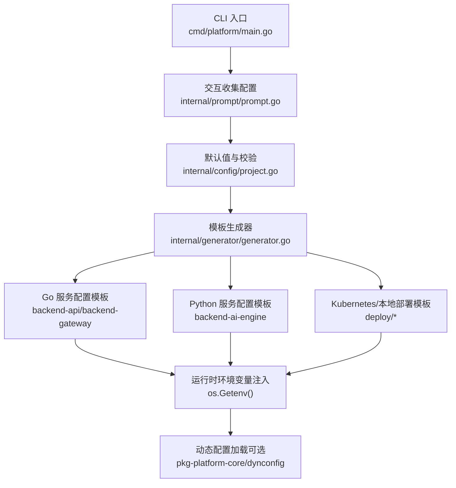
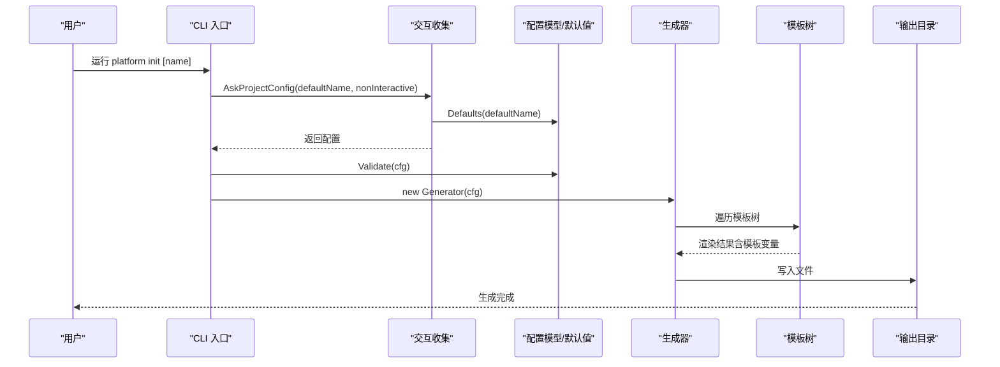
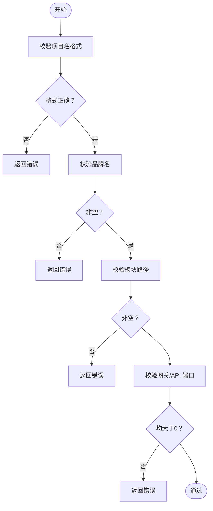
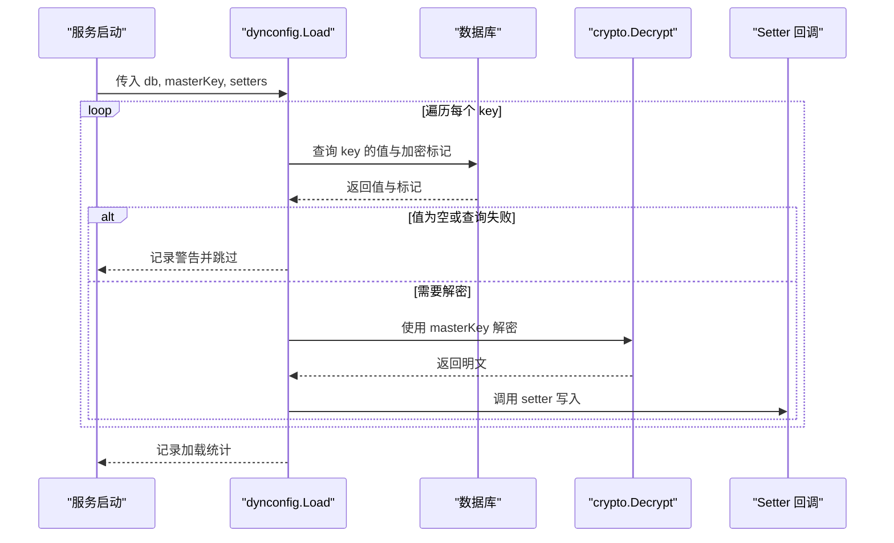
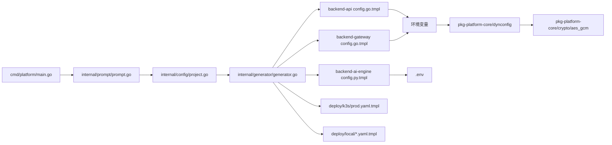

# 静态配置

<cite>
**本文引用的文件**
- [internal/config/project.go](file://internal/config/project.go)
- [cmd/platform/main.go](file://cmd/platform/main.go)
- [internal/generator/generator.go](file://internal/generator/generator.go)
- [internal/prompt/prompt.go](file://internal/prompt/prompt.go)
- [templates/files/backend-api/internal/config/config.go.tmpl](file://templates/files/backend-api/internal/config/config.go.tmpl)
- [templates/files/backend-gateway/internal/config/config.go.tmpl](file://templates/files/backend-gateway/internal/config/config.go.tmpl)
- [templates/files/backend-ai-engine/app/config.py.tmpl](file://templates/files/backend-ai-engine/app/config.py.tmpl)
- [templates/files/pkg-platform-core/dynconfig/loader.go.tmpl](file://templates/files/pkg-platform-core/dynconfig/loader.go.tmpl)
- [templates/files/pkg-platform-core/crypto/aes_gcm.go.tmpl](file://templates/files/pkg-platform-core/crypto/aes_gcm.go.tmpl)
- [templates/files/deploy/k3s/prod.yaml.tmpl](file://templates/files/deploy/k3s/prod.yaml.tmpl)
- [templates/files/deploy/local/docker-compose-all.yaml.tmpl](file://templates/files/deploy/local/docker-compose-all.yaml.tmpl)
- [templates/files/deploy/local/start.sh.tmpl](file://templates/files/deploy/local/start.sh.tmpl)
- [templates/files/pkg-platform-core/docs/dynconfig.md](file://templates/files/pkg-platform-core/docs/dynconfig.md)
</cite>

## 目录
1. [简介](#简介)
2. [项目结构](#项目结构)
3. [核心组件](#核心组件)
4. [架构总览](#架构总览)
5. [详细组件分析](#详细组件分析)
6. [依赖分析](#依赖分析)
7. [性能考量](#性能考量)
8. [故障排查指南](#故障排查指南)
9. [结论](#结论)
10. [附录](#附录)

## 简介
本文件系统性阐述平台脚手架的“静态配置”体系，覆盖以下方面：
- 配置结构与组织：以脚手架入口配置为中心，贯穿模板渲染、服务配置、部署与安全策略。
- 配置文件格式与字段：Go/Python/Kubernetes/Shell 等多形态配置的字段定义与默认值来源。
- 验证规则与默认值：CLI 交互、默认值推导与格式校验。
- 层次结构与继承：通过模板变量传递与环境变量注入实现“静态配置”的分层与复用。
- 服务差异化：API 服务、网关服务、AI 引擎的配置差异与适配点。
- 定制指南与最佳实践：如何在不同环境（本地/生产）中安全地定制与部署。
- 安全性与敏感信息保护：动态配置的加密存储与解密流程。

## 项目结构
静态配置系统围绕“脚手架配置 → 模板渲染 → 服务配置 → 部署与运行时注入”的链路展开。下图给出概览：

图表来源
- [cmd/platform/main.go:40-86](file://cmd/platform/main.go#L40-L86)
- [internal/prompt/prompt.go:14-87](file://internal/prompt/prompt.go#L14-L87)
- [internal/config/project.go:62-106](file://internal/config/project.go#L62-L106)
- [internal/generator/generator.go:34-120](file://internal/generator/generator.go#L34-L120)
- [templates/files/backend-api/internal/config/config.go.tmpl:43-65](file://templates/files/backend-api/internal/config/config.go.tmpl#L43-L65)
- [templates/files/backend-gateway/internal/config/config.go.tmpl:53-85](file://templates/files/backend-gateway/internal/config/config.go.tmpl#L53-L85)
- [templates/files/backend-ai-engine/app/config.py.tmpl:28-31](file://templates/files/backend-ai-engine/app/config.py.tmpl#L28-L31)
- [templates/files/pkg-platform-core/dynconfig/loader.go.tmpl:66-116](file://templates/files/pkg-platform-core/dynconfig/loader.go.tmpl#L66-L116)

章节来源
- [cmd/platform/main.go:40-86](file://cmd/platform/main.go#L40-L86)
- [internal/prompt/prompt.go:14-87](file://internal/prompt/prompt.go#L14-L87)
- [internal/config/project.go:62-106](file://internal/config/project.go#L62-L106)
- [internal/generator/generator.go:34-120](file://internal/generator/generator.go#L34-L120)

## 核心组件
- 脚手架配置模型与默认值
  - 结构体包含项目名、品牌名、域名、Go 模块路径、端口集合、功能开关、是否使用公共库、是否初始化 Git、输出目录等。
  - 默认值集中于 Defaults 函数，提供合理的初始提示与端口分配。
  - 校验逻辑集中在 Validate，确保关键字段格式正确且必要端口有效。
- 交互式收集与校验
  - 通过交互式表单收集用户输入，支持非交互模式直接采用默认值。
  - 校验通过后进入模板渲染阶段。
- 模板渲染与生成
  - 生成器遍历模板树，按 Features 与 UseCoreLib 控制子树渲染，路径与内容均支持模板变量替换。
  - 输出目录预先创建，生成文件写入磁盘。
- 服务配置模板
  - Go API 与网关：从环境变量装配配置，提供默认值与类型转换。
  - Python AI 引擎：使用 Pydantic Settings 从 .env 读取配置，支持别名映射。
- 动态配置加载（可选）
  - 应用启动时从数据库表 system_config 拉取配置，加密项使用 MasterKey 解密，优雅降级不阻断启动。
- 部署与运行时注入
  - 本地：通过 .env 与启动脚本注入；K3s：通过 ConfigMap/Secret 注入。
  - 端口与服务发现通过模板变量统一管理。

章节来源
- [internal/config/project.go:13-41](file://internal/config/project.go#L13-L41)
- [internal/config/project.go:62-106](file://internal/config/project.go#L62-L106)
- [internal/prompt/prompt.go:14-87](file://internal/prompt/prompt.go#L14-L87)
- [internal/generator/generator.go:34-120](file://internal/generator/generator.go#L34-L120)
- [templates/files/backend-api/internal/config/config.go.tmpl:9-16](file://templates/files/backend-api/internal/config/config.go.tmpl#L9-L16)
- [templates/files/backend-gateway/internal/config/config.go.tmpl:10-17](file://templates/files/backend-gateway/internal/config/config.go.tmpl#L10-L17)
- [templates/files/backend-ai-engine/app/config.py.tmpl:9-31](file://templates/files/backend-ai-engine/app/config.py.tmpl#L9-L31)
- [templates/files/pkg-platform-core/dynconfig/loader.go.tmpl:66-116](file://templates/files/pkg-platform-core/dynconfig/loader.go.tmpl#L66-L116)

## 架构总览
静态配置的生命周期如下：

图表来源
- [cmd/platform/main.go:54-81](file://cmd/platform/main.go#L54-L81)
- [internal/prompt/prompt.go:14-87](file://internal/prompt/prompt.go#L14-L87)
- [internal/config/project.go:62-106](file://internal/config/project.go#L62-L106)
- [internal/generator/generator.go:34-120](file://internal/generator/generator.go#L34-L120)

## 详细组件分析

### 脚手架配置模型与默认值
- 字段定义与用途
  - 项目名、品牌名、域名、Go 模块路径：用于模板渲染与模块化构建。
  - 端口集合：统一管理各服务监听端口，避免分散配置。
  - 功能开关：控制是否渲染 AI 引擎、Web、Admin 与公共库。
  - UseCoreLib、InitGit、OutputDir：影响模板选择与初始化行为。
- 默认值与推导
  - Defaults 提供合理的初始值，如端口、功能开关、模块路径等。
  - toBrand 将 kebab-case 项目名转为展示用品牌名。
- 校验规则
  - 项目名必须符合 kebab-case 正则。
  - 品牌名与模块路径不可为空。
  - 网关与 API 端口必须大于 0。

图表来源
- [internal/config/project.go:92-106](file://internal/config/project.go#L92-L106)
- [internal/config/project.go:108-120](file://internal/config/project.go#L108-L120)

章节来源
- [internal/config/project.go:13-41](file://internal/config/project.go#L13-L41)
- [internal/config/project.go:62-106](file://internal/config/project.go#L62-L106)
- [internal/config/project.go:108-120](file://internal/config/project.go#L108-L120)

### 交互式收集与非交互模式
- 交互模式：通过表单收集项目名、品牌名、域名、模块路径、端口、功能开关、是否初始化 Git。
- 非交互模式：直接使用默认值，但要求显式提供项目名。
- 交互收集与默认值来源一致，保证一致性。

章节来源
- [internal/prompt/prompt.go:14-87](file://internal/prompt/prompt.go#L14-L87)

### 模板渲染与生成
- 生成器职责
  - 创建输出目录，遍历模板树，按 Features 与 UseCoreLib 决定是否渲染某子树。
  - 路径与内容均支持模板变量替换，.tmpl 后缀自动去除。
  - 可执行文件（.sh）自动赋予执行权限。
- 特性开关
  - AI 引擎、Web、Admin、Core Lib 子树受对应开关控制。

章节来源
- [internal/generator/generator.go:34-120](file://internal/generator/generator.go#L34-L120)

### 服务配置模板对比

#### Go API 服务配置
- 配置结构
  - Server、DB、Redis、Internal、MasterKey。
- 环境变量注入
  - 优先读取环境变量，否则回退到模板中的默认值。
  - 类型转换：整数型通过字符串解析，字符串型直接回退。
- 关键字段
  - API_PORT、MYSQL_*、REDIS_*、INTERNAL_API_SECRET、CONFIG_MASTER_KEY。

章节来源
- [templates/files/backend-api/internal/config/config.go.tmpl:9-16](file://templates/files/backend-api/internal/config/config.go.tmpl#L9-L16)
- [templates/files/backend-api/internal/config/config.go.tmpl:43-65](file://templates/files/backend-api/internal/config/config.go.tmpl#L43-L65)

#### 网关服务配置
- 配置结构
  - Server、JWT、Redis、Services、Internal、CORS。
- 环境变量注入
  - JWT_SECRET 为必需项，缺失将导致致命错误。
  - CORS_ORIGINS 支持逗号分隔的切片解析。
  - API/AI 引擎上游服务地址通过环境变量注入。
- 关键字段
  - GATEWAY_PORT、JWT_SECRET、API_SERVICE_URL、AI_ENGINE_SERVICE_URL、CORS_ORIGINS、REDIS_*、INTERNAL_API_SECRET。

章节来源
- [templates/files/backend-gateway/internal/config/config.go.tmpl:10-17](file://templates/files/backend-gateway/internal/config/config.go.tmpl#L10-L17)
- [templates/files/backend-gateway/internal/config/config.go.tmpl:53-85](file://templates/files/backend-gateway/internal/config/config.go.tmpl#L53-L85)

#### Python AI 引擎配置
- 配置结构
  - server（port、env）、internal secret、upstream API 基础地址、CORS origins。
- 配置来源
  - 通过 pydantic-settings 从 .env 读取，支持别名映射。
- 关键字段
  - AI_ENGINE_PORT、APP_ENV、INTERNAL_API_SECRET、API_BASE_URL、CORS_ORIGINS。

章节来源
- [templates/files/backend-ai-engine/app/config.py.tmpl:9-31](file://templates/files/backend-ai-engine/app/config.py.tmpl#L9-L31)

### 动态配置加载（可选）
- 目标
  - 应用启动时从 system_config 表加载配置项，加密项使用 MasterKey 解密，通过回调写入业务配置。
- 行为特性
  - 仅启动时加载，不支持热更新。
  - 优雅降级：masterKey 为空、查询失败、解密失败、key 不存在均不阻断启动。
- 接口与选项
  - 默认表名与列名可自定义。
  - 日志前缀可自定义。
- 与 Python 端对齐
  - 两端使用相同表结构与 MasterKey 解密，保证一致性。

图表来源
- [templates/files/pkg-platform-core/dynconfig/loader.go.tmpl:66-116](file://templates/files/pkg-platform-core/dynconfig/loader.go.tmpl#L66-L116)
- [templates/files/pkg-platform-core/crypto/aes_gcm.go.tmpl:25-71](file://templates/files/pkg-platform-core/crypto/aes_gcm.go.tmpl#L25-L71)

章节来源
- [templates/files/pkg-platform-core/dynconfig/loader.go.tmpl:66-116](file://templates/files/pkg-platform-core/dynconfig/loader.go.tmpl#L66-L116)
- [templates/files/pkg-platform-core/crypto/aes_gcm.go.tmpl:25-71](file://templates/files/pkg-platform-core/crypto/aes_gcm.go.tmpl#L25-L71)
- [templates/files/pkg-platform-core/docs/dynconfig.md:34-43](file://templates/files/pkg-platform-core/docs/dynconfig.md#L34-L43)

### 部署与运行时注入

#### 本地开发
- 依赖编排
  - docker-compose 启动 MySQL 与 Redis，应用服务通过宿主机直接运行，便于热重载与调试。
- 启动脚本
  - 支持一键启动/停止/查看状态/查看日志，按 Features 控制是否启用 AI/Web/Admin。
  - 通过 .env 注入环境变量，端口与服务映射来自模板变量。

章节来源
- [templates/files/deploy/local/docker-compose-all.yaml.tmpl:9-48](file://templates/files/deploy/local/docker-compose-all.yaml.tmpl#L9-L48)
- [templates/files/deploy/local/start.sh.tmpl:110-146](file://templates/files/deploy/local/start.sh.tmpl#L110-L146)
- [templates/files/deploy/local/start.sh.tmpl:185-202](file://templates/files/deploy/local/start.sh.tmpl#L185-L202)

#### 生产部署（K3s）
- ConfigMap
  - 注入非敏感配置：环境、端口、服务地址、CORS 来源等。
- Secret
  - 注入敏感配置：JWT_SECRET、INTERNAL_API_SECRET、CONFIG_MASTER_KEY、数据库密码等。
- 部署清单
  - 网关、API、AI 引擎、Web、Admin 的 Deployment，按 Features 控制渲染。

章节来源
- [templates/files/deploy/k3s/prod.yaml.tmpl:8-41](file://templates/files/deploy/k3s/prod.yaml.tmpl#L8-L41)
- [templates/files/deploy/k3s/prod.yaml.tmpl:42-151](file://templates/files/deploy/k3s/prod.yaml.tmpl#L42-L151)

## 依赖分析
- 组件耦合
  - CLI 依赖交互收集与配置校验；生成器依赖配置模型与模板树；服务配置模板依赖环境变量注入；动态配置依赖数据库与加密库。
- 外部依赖
  - Go 服务：os、strconv、strings。
  - Python 服务：pydantic-settings。
  - 部署：Kubernetes ConfigMap/Secret、Docker Compose。
- 循环依赖
  - 未见循环依赖迹象，结构清晰。

图表来源
- [cmd/platform/main.go:54-81](file://cmd/platform/main.go#L54-L81)
- [internal/prompt/prompt.go:14-87](file://internal/prompt/prompt.go#L14-L87)
- [internal/config/project.go:62-106](file://internal/config/project.go#L62-L106)
- [internal/generator/generator.go:34-120](file://internal/generator/generator.go#L34-L120)
- [templates/files/backend-api/internal/config/config.go.tmpl:43-65](file://templates/files/backend-api/internal/config/config.go.tmpl#L43-L65)
- [templates/files/backend-gateway/internal/config/config.go.tmpl:53-85](file://templates/files/backend-gateway/internal/config/config.go.tmpl#L53-L85)
- [templates/files/backend-ai-engine/app/config.py.tmpl:28-31](file://templates/files/backend-ai-engine/app/config.py.tmpl#L28-L31)
- [templates/files/pkg-platform-core/dynconfig/loader.go.tmpl:66-116](file://templates/files/pkg-platform-core/dynconfig/loader.go.tmpl#L66-L116)
- [templates/files/pkg-platform-core/crypto/aes_gcm.go.tmpl:25-71](file://templates/files/pkg-platform-core/crypto/aes_gcm.go.tmpl#L25-L71)
- [templates/files/deploy/k3s/prod.yaml.tmpl:8-41](file://templates/files/deploy/k3s/prod.yaml.tmpl#L8-L41)
- [templates/files/deploy/local/docker-compose-all.yaml.tmpl:9-48](file://templates/files/deploy/local/docker-compose-all.yaml.tmpl#L9-L48)

## 性能考量
- 动态配置加载
  - 仅启动时加载，避免运行时开销；解密与数据库查询为同步阻塞，Setter 中避免耗时操作。
- 环境变量读取
  - Go 侧通过 os.Getenv 与类型转换，Python 侧通过 pydantic-settings 读取 .env，均为轻量级操作。
- 部署注入
  - ConfigMap/Secret 注入为容器启动阶段完成，对运行时无额外开销。

## 故障排查指南
- 交互与校验
  - 项目名不符合 kebab-case、品牌名或模块路径为空、网关/API 端口无效会导致校验失败。
- 网关启动失败
  - JWT_SECRET 未设置会导致致命错误；检查 Secret 是否正确注入。
- 动态配置加载失败
  - masterKey 为空：跳过加密项；数据库查询失败/解密失败：记录警告并跳过；key 不存在：不调用 setter。
- 本地启动问题
  - 确认 .env 已复制并配置；端口占用可通过脚本清理；查看对应服务日志定位问题。

章节来源
- [internal/config/project.go:92-106](file://internal/config/project.go#L92-L106)
- [templates/files/backend-gateway/internal/config/config.go.tmpl:95-101](file://templates/files/backend-gateway/internal/config/config.go.tmpl#L95-L101)
- [templates/files/pkg-platform-core/dynconfig/loader.go.tmpl:78-116](file://templates/files/pkg-platform-core/dynconfig/loader.go.tmpl#L78-L116)
- [templates/files/deploy/local/start.sh.tmpl:60-66](file://templates/files/deploy/local/start.sh.tmpl#L60-L66)

## 结论
静态配置系统通过“脚手架配置模型 + 模板渲染 + 环境变量注入 + 可选动态配置”的组合，实现了跨语言、跨环境的一致性与可维护性。其关键优势在于：
- 统一的默认值与校验，降低初始配置成本。
- 模板化的端口与服务管理，提升一致性。
- 环境变量与部署注入的分离，兼顾灵活性与安全性。
- 动态配置的优雅降级，保障生产可用性。

## 附录

### 配置字段与默认值一览（摘要）
- 项目与模块
  - ProjectName、Brand、Domain、GoModulePath
- 端口集合
  - Gateway、API、AIEngine、Web、Admin、MySQL、Redis
- 功能开关
  - AIEngine、Web、Admin、UseCoreLib
- 默认值来源
  - Defaults 函数与模板中的默认值（如 {{.Ports.*}}、{{.ProjectName}} 等）。

章节来源
- [internal/config/project.go:62-89](file://internal/config/project.go#L62-L89)
- [templates/files/backend-api/internal/config/config.go.tmpl:43-65](file://templates/files/backend-api/internal/config/config.go.tmpl#L43-L65)
- [templates/files/backend-gateway/internal/config/config.go.tmpl:53-85](file://templates/files/backend-gateway/internal/config/config.go.tmpl#L53-L85)
- [templates/files/backend-ai-engine/app/config.py.tmpl:14-25](file://templates/files/backend-ai-engine/app/config.py.tmpl#L14-L25)

### 配置定制指南
- 本地开发
  - 复制 .env.example 为 .env，按需调整端口与上游服务地址；通过 ./deploy/local/start.sh 控制启停。
- 生产部署
  - 先创建 Secret（JWT_SECRET、INTERNAL_API_SECRET、CONFIG_MASTER_KEY、MYSQL_PASSWORD），再应用 ConfigMap 与部署清单。
- 动态配置
  - 在 system_config 表中写入明文或加密项，确保 MasterKey 一致；服务启动后自动加载。

章节来源
- [templates/files/deploy/local/start.sh.tmpl:60-66](file://templates/files/deploy/local/start.sh.tmpl#L60-L66)
- [templates/files/deploy/k3s/prod.yaml.tmpl:25-41](file://templates/files/deploy/k3s/prod.yaml.tmpl#L25-L41)
- [templates/files/pkg-platform-core/dynconfig/loader.go.tmpl:66-116](file://templates/files/pkg-platform-core/dynconfig/loader.go.tmpl#L66-L116)

### 安全性与敏感信息保护
- 敏感信息注入
  - 通过 Kubernetes Secret 或本地 .env 注入，避免硬编码在代码或镜像中。
- 动态配置加密
  - 使用 AES-256-GCM 加密存储，解密依赖 MasterKey；未设置 masterKey 时跳过加密项加载。
- 最佳实践
  - 严格区分 ConfigMap（非敏感）与 Secret（敏感）。
  - 为不同环境维护独立的 Secret。
  - 定期轮换密钥与令牌，限制最小权限。

章节来源
- [templates/files/deploy/k3s/prod.yaml.tmpl:4-5](file://templates/files/deploy/k3s/prod.yaml.tmpl#L4-L5)
- [templates/files/pkg-platform-core/crypto/aes_gcm.go.tmpl:25-71](file://templates/files/pkg-platform-core/crypto/aes_gcm.go.tmpl#L25-L71)
- [templates/files/pkg-platform-core/dynconfig/loader.go.tmpl:78-116](file://templates/files/pkg-platform-core/dynconfig/loader.go.tmpl#L78-L116)